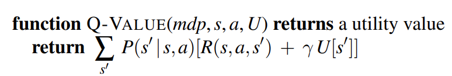
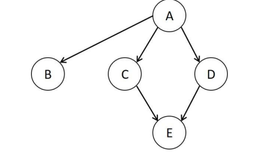

# מבוא לבינה מלאכותית - סיכום

עמודים חשובים בספר: 91,95,129,171,196,199,200,558,559,560,563,567,678,680

## בעיות חיפוש

- תיאור העולם
  - מצב (בפועל קבוצת משתנים)
- בעיה
  - מצב התחלתי
  - פעולות אפשריות (בהינתן מצב)
  - מודל מעברים (בהינתן מצב ופעולה)
  - מבחן סיום (בהינתן מצב)
  - מחיר צעד, מחיר מסלול (בהינתן מצב ופעולה)
  - מצב התחלתי, פעולות ומודל מעברים מגדירים את מרחב המצבים
- פתרון
  - סדרת פעולות מהמצב ההתחלתי למצב מטרה כלשהו
  - פתרון אופטימלי הוא בעל מחיר מינימלי מבין כל הפתרונות האפשריים
- הפשטה - התייחסות רק לפרטים המעניינים אותנו.
  - טובה אם לכל פתרון מופשט יש פתרון מפורט (כלומר באמת לא פספסנו פרטים חשובים בתהליך). הפשטה טובה מורידה פרטים רבים ושומרת על תקפות

### חיפוש פתרונות

- עץ חיפוש - כל קודקוד הוא מצב, מכל קודקוד יוצאות קשתות כאשר כל קשת היא פעולה אפשרית, השורש הוא המצב ההתחלתי.
- פיתוח צומת - פעולה שמקבלת צומת ומייצרת את הצמתים העוקבים לו
- סדר הפיתוח - אסטרטגיית החיפוש
- כדי להימנע מלולאות אפשר לשמור ב-set את כל הצמתים שכבר עברנו בהם (=חיפוש גרף)
- מחיר מסלול - מחיר המסלול מהמצב ההתחלתי עד צומת פתרון כלשהו.
- מצב מול צומת - צומת הוא שלב בחיפוש, ייתכנו צמתים עם מצבים זהים.
- חזית - קבוצת הצמתים שעדיין לא פותחו.

\

### אסטרטגיות חיפוש חסרות ידע

- חיפוש לרוחב (BFS)
  - צמתים רדודים לפני צמתים עמוקים
  - מעבר על צמתי החזית - תור
  - שלם ואופטימלי אם המחיר אי שלילי
  - לרוב הבעיה היא המקום
- חיפוש מונחה מחיר (Uniform-cost search)
  - נפתח את הצומת בעל המחיר המינימלי (מהשורש)
  - מעבר על צמתי החזית - תור קדימויות לפי $`g(n)`$
  - שלם ואופטימלי אם המחיר אי שלילי
  - הבדל עם BFS - מבחן מטרה מתבצע כאשר מפתחים צומת ולא ביצירה כי הצומת הראשון יכול להיות לא אופטימלי, וגם עושים בדיקה נוספת עבור מקרה שבו נמצא מסלול טוב יותר לצומת הנמצא כעת בחזית
  - אם מחירי כל הצעדים זהים אז הוא זהה ל-BFS רק ש-BFS עוצר כאשר צומת המטרה נוצר.
- חיפוש לעומק (DFS)
  - מפתחים את הצומת העמוק ביותר שלא פותח ואז עולים לרמות רדודות
  - מעבר על צמתי החזית - מחסנית או רקורסיה
  - 2 מימושים
    - חיפוש גרף - מוסיף למבנה נתונים את כל הבנים שלא נמצאים במבנה נתונים ולא פותחו
    - חיפוש עץ - מוסיף את כל הבנים
  - חיפוש-גרף שלם במרחבים סופיים, חיפוש-עץ אינו שלם כי יכול להיכנס למעגל אינסופי, לא אופטימלי
  - סיבוכיות זמן בעייתית אם עומק העץ גדול
  - חיפוש מוגבל עומק (DLS)
    - DFS רק שלא בודקים אחרי עומק $`l`$
    - מבטיחה שהאלגוריתם יעצור במצבים אינסופיים
  - חיפוש הולך וגדל (IDS)
    - חיפוש מוגבל עומק עם עומק התחלתי 0, אם לא מוצא מטרה מגדיל
    - שילוב של לעומק ולרוחב
    - שללם ואופטימלי
- חיפוש דו כיווני
  - מבצעים במקביל חיפושי BFS ממצב ההתחלתי אל מצב המטרה ולהפך עד שנפגשים, העיקרון הוא $`b^{\frac{d}{2}} + b^{\frac{d}{2}} < < b^{d}`$.
- חסרונות חיפוש חסר ידע: לא מנצלים את מבנה הבעיה, תלוי ברמה בלבד, אין התייחסות למידע שלומדים בזמן החיפוש, לא מסתכלים על המצב הרצוי ובכך לא יעילים.

\

### אסטרטגיית חיפוש עם ידע

- יוריסטיקה - כלל אצבע העוזר לפתור בעיה, לא מדויק
  - פונקציה יוריסטית $`h(n)`$ - פונקציה של מצב למספר שנותנת מחיר משוער של הדרך מהמצב למטרה
  - עוזרת למצוא את הפתרון **הרבה** יותר מהר
  - יוריסטיקה קבילה - תמיד נותנת הערכה קטנה או שווה למחיר האמיתי
  - יוריסטיקה עקבית (מונוטונית) - מפתחת צמתים אופטימליים מוקדם יותר $`h(n) \leq c(n,a,n') + h(n')`$
    - תנאי חזק יותר מקבילות אבל קשה למצוא יוריסטיקה עקבית לא קבילה
- גישת best-first search - הצומת הבא נבחר עם תור קדימויות לפי פונקציית הערכה $`f(n)`$
  - חיפוש מונחה מחיר הוא גם best-first עם $`f(n) = g(n)`$
- חיפוש BF חמדני - משתמשים רק בפונקציה היוריסטית - עלולים להגיע למבוי סתום ואם לא בודקים כפילויות אפילו לרוץ לנצח
- אלגוריתם $`A^{*}`$
  - שלם
  - המחיר המשוער הוא המחיר מההתחלה ועוד יוריסטיקה עד הסוף $`f(n) = g(n) + h(n)`$
  - הפונקציה היוריסטית
  - חיפוש נעצר כשמפתחים צומת מטרה, ככה מגיעים למסלול אופטימלי (כי ייתכן שהפעם הראשונה שניתקל בו תהיה דרך מסלול לא אופטימלי)
  - האלגוריתם עצמו - כמו מונחה מחיר רק שבו $`cost = g + h`$
  - חיפוש עץ - אופטימלי אם היוריסטיקה קבילה
  - חיפוש-גרף - אופטימלי אם היוריסטיקה עקבית (אחרת עשוי לא לפתח צומת שכבר פותח בעבר, גם אם פעם הדרך הייתה לא אופטימלי ועכשיו היא כן)
  - לא מפתח צמתים שהמחיר שלהם גדול ממחיר הפתרון המינימלי
  - חזק אבל לא תמיד בשימוש בגלל סיבוכיות זיכרון גבוהה, לפעמים עדיף למצוא פתרון פחות אופטימלי אבל בזמן ומקום סבירים
- חיפוש יוריסטי חסום זיכרון
  - אלגוריתם IDA (חיפוש A\* + DLS)
    - מגבילים את ערכי $`f`$ (מפסיקים לפתח אחרי החסם)
    - מתחילים עם החסם שהוא ערך היוריסטיקה על הצומת ההתחלתי
    - כל פעם שלא מוצאים פתרון מגדילים את הערך באחד
    - עוזר לצמצום סיבוכיות מקום
  - אלגוריתם RBFS (חיפוש BF + רקורסיה)
    - דומה לחיפוש לעומק רק שבמקום לרדת עד הסוף שומרים את ערך $`f`$ של המסלול החלופי הטוב ביותר בכל האבות של הצומת הנוכחי.
    - אם הצומת עבר את הגבול נסוגים ומעדכנים את הערכים באבות.
    - יעיל יותר מ-IDA אבל חוזר פעמים רבות על צמתים\
  - אלגוריתם SMA (חיפוש A\* + חסם זיכרון)
    - כמו A\*, מפתח את העלה הטוב ביותר עד שאין מקום בזיכרון
    - כשאין זיכרון זורק את העלה הגרוע ביותר מהתור ושומר את ערך הצומת אצל האבא כדי שאפשר יהיה לזכור את המסלול הכי טוב בתת עץ
    - אם לכל העלים יש אותו ערך יש סכנה שגם נפתח וגם נמחק, אז מפתחים את העלה הטוב ביותר החדש ביותר ומוחקים את העלה הגרוע ביותר הישן ביותר.
    - שלם ואופטימלי, אם הבעיה גדולה מאוד עלול לרוץ זמן רב בגלל פתיחה וסגירה של צמתים
- השפעת יוריסטיקה על הביצועים
  - ככל שהיוריסטיקה נותנת ערכים גדולים יותר עבור צמתים "טובים" יותר נגיע לפתרון מהר יותר
- בעיה מוחלשת
  - אפשר לקחת את הבעיה המקורית ולהוריד בה אילוצים, הפתרון בה הוא יוריסטיקה קבילה לבעיה המקורית.
  - צריכה להיות מחושבת ללא חיפוש אחרת יהיה קשה לפתור את הבעיה המקורית.
- מסדי נתונים זרים של תבניות (pattern databases)
  - שומרים את המחירים של תתי בעיות ומשתמשים בהם בתור פונקציה יוריסטית.
  - צריכים להיות זרים כדי שנוכל להניח שפותרים את תתי הבעיות בלי שהן ישפיעו אחת על השניה.
  - כדי להגיע למטרה אפשר לבצע חיפוש לאחור ממצב המטרה עד הנוכחי
- למידה מניסיון
  - אפשר לנסות לייצר פונקציות יוריסטיות על ידי בחינה של פתרונות אופטימליים והכללה.
  - בפועל יוצרים חוקים "שרירותיים" אבל שעוזרים מאוד להגיע לפתרון.

## חיפוש מקומי

- ניסוח מצב מלא (complete state formation) - "כל הכלים על הלוח" רק אולי לא במיקום המתאים
- בוחרים את הפעולה לפי פונקציית מטרה, לרוב מתכנסת לערך מינימלי
  - גישות עיקריות - $`|x - y|,\ \frac{x}{x + y}`$, אפשר גם: $`\frac{|\prod_{}^{}x_{i} - 448|}{448} + \frac{|\Sigma y_{i} - 33|}{33}`$
  - לשים לב שאם יש כמה רכיבים כדאי שלשניהם יהיה משקל שווה, שיהיה כדאי לשנות ערכים בגלל שני הרכיבים. אם אחד ממש גדול יותר מהשני אז אף פעם לא יסתכלו על השני - לדוגמה $`|x - 10| + |x! - 20|`$
- טיפוס גבעה - מפתחים את הצומת הערכי ביותר
  - יכול להיתקע במקסימום מקומי, מישור…
- טיפוס גבעה סטוכסטי - לבחור צעדים גם לא אופטימליים ולהקטין בהדרגה (לא שלם)
- טיפוס גבעה עם בחירה ראשונה - אם יש הרבה אפשרויות פעולה, בוחר קבוצת עוקבים אקראית וממשיך עם הראשון שמהווה שיפור על הקיים (לא שלם)
- טיפוס גבעה עם התחלה אקראית - כדי למצוא מקסימום גלובלי (שלם בהסתברות שואפת ל-1)

>

## חיפוש בתנאי יריבות

- משחק כבעיית חיפוש
  - מצב התחלתי
  - תור השחקן הבא (בהינתן מצב)
  - פעולות (בהינתן מצב)
  - מודל מעברים (בהינתן מצב ופעולה)
  - מבחן סיום (בהינתן מצב)
  - פונקציית תועלת (בהינתן מצב ושחקן)
  - משחק סכום אפס: סכום התועלות של כל השחקנים שווה לכל משחק
- אלגוריתם MINIMAX
  - פונקציית תועלת בהנחה ששני השחקנים משחקים באופן אופטימלי
  - לוקחים את המקסימום אם זה תורי ואת המינימום אם זה תור היריב (כי זה מה שהוא יבחר)
  - סיבוכיות מקום בעייתית עבור משחקים אמיתיים
- במשחקים רבי משתתפים - וקטור של ערכים
- גיזום אלפא-ביתא
  - שומרים ערכי מינימום ומקסימום לכל צומת, במצב זה אפשר לדעת בוודאות שיש מסלולים שהם לא אופטימליים ובכך לצמצם את מרחב החיפוש.
  - דוגמה: לשורש יש שני בנים (תתי עצים).\
    סרקנו את התת עץ הראשון והתגלו הערכים 3,8,12. זהו תורו של MIN ולכן ילקח ערך 3.\
    התחלנו לסרוק תת עץ שני וגילינו ערך 2. זהו תורו של MIN לכן המקסימום יהיה 2. אבל אם המקסימום הוא 2 אז אף פעם לא נגיע לתת עץ הזה כי המקסימום בתת עץ הראשון הוא 3. לכן אפשר להפסיק לסרוק את אותו תת עץ.
  - אלגוריתם:\
    כאשר תור MAX אנו מעדכנים את ערך אלפא - עוד אי אפשר לדעת מה המקסימום (בטא) אבל אנו יודעים מה החסם התחתון שלו.\
    אם הבנו שקיים בתת עץ ערך מקסימום גדול מבטא אז אפשר לגזום כי בתור הקודם MIN בטוח לא יבחר בתת עץ הזה.\
    כאשר תור MIN אנו מעדכנים את ערך בטא - עוד אי אפשר לדעת מה המינימום (אלפא) אבל יודעים מה החסם העליון שלו.\
    אם הבנו שקיים בתת עץ ערך מינימום קטן מאלפא אז אפשר לגזום כי בתור הקודם MAX בטוח לא יבחר בתת עץ הזה.
  - אבחנה: ערכי אלפא ובטא מעודכנים עבור עץ מסוים רק אחרי הענף הראשון שנסרק, ואז הערך מועבר לשאר הענפים. אחרי שנסרק תת עץ שלם של תור MAX ערך אלפא מעודכן, אחרי שנסרק תת-תת עץ שלם של MIN ערך בטא מעודכן.
  - אבחנה: גוזמים כאשר יש מצב שאלפא גדול מבטא או בטא קטן מאלפא\
    כאשר סורקים: לכתוב לכל צומת אלפא, v, בטא
  - אבחנה: אלפא מכילה את הערך הכי טוב כרגע עבור MAX
  - גיזום אופטימלי כאשר סדר הסריקה הוא מהטובים ביותר לגרועים ביותר
  - קיימת אפשרות לשמור מצבים חוזרים בטבלה (מקבילה ל-explored set)
  - יכולים לשאול "האם תוספת ידע הייתה עוזרת?" - יש תשובות שאומרות שאם לדוגמה MAX היה יודע שהוא לא יכול לנצח יכול היה לבחור תוצאת תיקו ולגזום את שאר התוצאות

## בעיות אילוץ סיפוקים

- בעיית אילוץ סיפוקים (CSP)
  - בעיה
    - קבוצת משתנים
    - קבוצת תחומים לכל משתנה
    - קבוצת אילוצים
  - מצב
    - השמה לחלק מהמשתנים
    - השמה עקבית אם היא לא מפרה אף אילוץ
    - השמה שלמה מופיעים בה כל המשתנים
  - פתרון
    - השמה שלמה ועקבית
  - אילוצים - אונרי, בינארי, n-ארי, אפשר לתת קדימות לאילוצים עי" מחיר
  - טוב כי אפשר לבטל חלקים גדולים של מרחב החיפוש, ולהבין מדוע הם נפסלו
- עקביות קשת
  - $`X \rightarrow Y`$ עקבית אם לכל ערך X יש ערך Y מתאים שמקיים את האילוץ של הקשת
  - כאשר תחום משתנה אז צריך לבדוק את כל הקשתות שהובילו לתחום (חוץ מהקשת שהגיעה מ-Y).
  - אם אף תחום לא משתנה סימן שהבעיה עקבית ואפשר לבחור ערכים מהתחומים
- הפצת אילוצים - אלגוריתם AC-3
  - כתיבת תחומים
  - כתיבת אילוצים וקשתות
  - הורדת ערכים עם אילוצים אונריים
  - ביצוע AC-3 לפי הטבלה
    - אם צריך - הצבת ערכים ספציפיים ושימוש בעוד קשתות באלגוריתם

| \# | Arc | X domain | Y domain | Constraint | Removed values | Remaining values | Arcs into the queue |
|----|----|----|----|----|----|----|----|
| 1a | $`(X_{1},X_{2})`$ | 7,8,9 | 6,7,8 | $`X_{1} > X_{2}`$ | 7,8 | 9 | 2b |

- עקביות מסלול - לפעמים צריך לבדוק כמה משתנים ביחד (לדוגמה מסלול מX לY שעובר בZ)
- k עקביות
  - אם נתנו השמה עקבית לכל קבוצת משתנים בגודל $`k - 1`$ האם אפשר לתת ערך למשתנה k
  - k עקביות חזקה - אם הוא k עקבי מ-1 ועד k
  - סיבוכיות זמן ומקום בעייתית
- אילוצים גלובליים
  - אפשר ליצור אילוצים גלובליים בהתאם לבעיה (לדוגמה "כולם שונים")\
- חיפוש עם נסיגה (backtracking)
  - בצורה הבסיסית הוא חסר ידע
  - אפשר להפוך לבעיית חיפוש כאשר פעולה היא השמה למשתנה
  - אם נשארו 0 ערכים עבור משתנה מסוים - פוסלים את הענף
  - נוח אם לא רוצים לכתוב ניסוח מיוחד לבעיה
  - אפשר לייעל את זמן החיפוש על ידי יוריסטיקות
    - בחירת משתנה
      - יוריסטיקת MRV - משתנה עם מינימום ערכים (דוגמה: קודם לבחור ערך לזמן טיסה כאשר יש רק 2 אופציות)
      - יוריסטיקת הדרגה - משתנה הכי מאלץ (דוגמה: לבדוק מתי פנוי האדם שהכי עסוק)
    - בחירת ערך
      - ערך LCV - ערך הכי פחות מאלץ (דוגמה: לקבוע זמן לחופשה בחורף כשאין עומס)
  - תוך כדי הסריקה בעץ אפשר לצמצם ערכים באמצעות עקביות קשתות (בדיקה קדימה)
    - עושים את אלגוריתם AC-3
    - אם נשאר ערך 1 עבור משתנה מסוים - אפשר לתת לו את הערך
    - אם נשארו 0 ערכים עבור משתנה מסוים - פוסלים את הענף
    - דוגמה חשובה: 2026א מועד א1
- חיפוש מקומי
  - מתחילים מהשמת משתנים במצב "ממוצע" וכל פעם משנים משתנה אחד
  - יוריסטיקת מינימום סתירת אילוצים - בוחרים משתנה לשינוי וערך באופן שיביא למצב עם מינימום סתירות אילוצים
  - הבדל מול בעיות חיפוש: שם מחפשים פתרון אופטימלי וגם דרך אליו, פה מחפשים את הפתרון

## הנמקה הסתברותית

### מבוא

- הסתברות משותפת - מה ההסתברות שיקרה X כפונקציה של ערכים ספציפיים של Y,Z
- הסתברות שולית - מה ההסתברות שיקרה X כסכום של כל האפשרויות של Y
- הסתברות מותנית - מה ההסתברות שיקרה X כאשר ידוע כבר שקרה Y
- אפשר לחשב את השולית והמותנית בהינתן המשותפת.
  - השיטה הקלאסית - להחזיק טבלה של כל המשותפות - לפחות $`2^{n}`$ מקום בזיכרון - יקר
  - מטרה: מעדיפים להגיע ל-$`O(n^{2})`$ ועדיין שנוכל לשלוף באופן יעיל

<!-- -->

- הסיפור: אנו מקבלים נתונים מסוימים על הסביבה וצריכים לחשוב מה ההסתברות שיקרו תנאים אחרים בה.
- כלל השרשרת ונוסחת בייס - בהינתן הסתברות מותנית אפשר לחשב משותפת
- מאורעות בלתי תלויים - הסתברות שווה למכפלת ההסתברויות

### רשת בייסיאנית

- גרף מכוון ללא מעגלים (DAG), לכל צומת מטריצת שכנויות
  - כמה עולה להחזיק גרף כזה? -$`n^{2}`$ כי יש n צמתים ומחזיקים מטריצת שכנויות שחסומה ב-n
- ייצוג שלם וקומפקטי של נתוני הבעיה
- בניית הרשת
  - עבור כל משתנה בודקים מתי הוא T, עבור הראשון רק סוכמים מהטבלה ועבור המשתנים האחרים בודקים מתי הם T בהינתן שהאבא שלהם הוא T
- כמות הערכים
  - כמה ערכים צריך - $`2^{p}`$ (p מספר ההורים)
  - נקודת התחלה שומרים ערך 1 - ההסתברות ל-T\
    אם יש הורה אחד שומרים 2 ערכים - הסתברות ל-T בהינתן שההורה T ושההורה F.\
    אם יש שני הורים אז שומרים 4 - הסתברות ל-T בהינתן טבלת ההתפלגות המשותפת של ההורים (4 אפשרויות)
- סדר בניית הרשת
  - אפשר להתחיל מכל מקום שרוצים, כל הרשתות מייצגות את אותו המידע.
  - בחירת הסדר משפיע על כמות הערכים, נרצה שלכל צומת יהיו כמה שפחות הורים.
  - נעדיף להתחיל מהמשתנים הכי "גולמיים" שמשפיעים על השאר.\
- הסקת מסקנות
  - כלל השרשרת, לפי הסדר מהמשתנים הגולמיים למושפעים. בכלל השרשרת כל הסתברות נוספת תלויה בכל השאר.
  - אם יש משתנים לא תלויים ובנוסחה יש תלות אז אפשר להוריד אותה
  - דוגמה: שואלים מה ההסתברות $`P(A,B,C,D,E)`$:

```math
P(A,B,C,D,E) = P(A)*P(B|A)*P(C|A \cap B)*P(D|A \cap B \cap C)*P(E|A \cap B \cap C \cap D) =
```

```math
= P(A)*P(B|A)*P(C|A)*P(D|A)*P(E|C \cap D)
```

- בכל הסתברות מותנית אפשר לשים רק את ההורים כי זה הערך ששמור בטבלה.\
  בסוף להגיע למשתנים שכולם נמצאים בטבלאות הרשת
- אם חסר לנו ערך של אחד ההורים, אפשר להשתמש בשולית + מותנית.
- דוגמה טובה:

```math
P(A = 1,E = 1|C = 1) = \frac{P(A = 1,E = 1,C = 1)}{P(C = 1)} = \frac{P(A = 1)P(C = 1|A = 1)P(E = 1|C = 1,A = 1)}{P(A = 1)P(C = 1|A = 1) + P(A = 0)P(C = 1|A = 0)} =
```

```math
\frac{P(A = 1)P(C = 1|A = 1)\lbrack P(E = 1|C = 1,D = 1)P(D = 1|A = 1)\  + \ P(E = 1|C = 1,D = 0)P(D = 0|A = 1)\rbrack}{P(A = 1)P(C = 1|A = 1) + P(A = 0)P(C = 1|A = 0)}
```

- אפשר גם "להפוך" הסתברות מותנית, לדוגמה למרות שקור משפיע על תחלואה לשאול מה ההסתברות שקר בהינתן שמישהו חולה. עושים באמצעות נוסחת בייס - $`P(A|B)\  = \ \frac{P(A \cap B)}{P(B)}\frac{P(A)*P(B|A)}{P(B)}`$

<!-- -->

- אי תלות
  - האם משתנים בלתי תלויים - צריך לבדוק לפי כלל המכפלה
  - אלגוריתם:
    - 1. נסמן רק את הצמתים המוזכרים ואת ההורים הקדמונים שלהם.
    - 2. נוסיף קשתות בין כל שני הורים שיש להם צאצא משותף.
    - 3. נהפוך את הגרף ללא מכוון.
    - 4. נמחק את הצמתים שתנאיהם מתקיימים (בהינתן)\
      נבדוק האם יש מסלול בין הצמתים שבניהם אנו בודקים תלות
      - לא - בלתי תלויים
      - כן - אי אפשר לדעת

## קבלת החלטות מורכבות

- בעיית MDP
  - צריך מדיניות לכל מצב ולא סדרת פעולות כי לא תמיד סדרת הפעולות תוביל לאותו המצב
  - אופק סופי ואינסופי
  - חישוב תועלת מתבצע עם מקדם הפליית עתיד שמשפיע על תגמול מיידי או עתידי
- ערך Qvalue (נוסחה למטה) - מביא את הערך של פעולה אחת (משקלל תוצאות אפשריות)
- אלגוריתם Value Iteration
  - מתחילים מערכי 0, עבור מצבי סיום מגדירים תמיד $`U(s) = 0`$
  - בכל איטרציה עבור כל מצב עוברים על הפעולות שלו, מחשבים Qvalue לכל אחת ובוחרים את הפעולה עם המקסימלי. שומרים את הערך החדש והפעולה.
  - כשמעדכנים ערך שומרים את השינוי המקסימלי (משווים למקסימום ומעדכנים אם צריך)
  - מפסיקים כאשר עברנו על כל המצבים והשינוי המקסימלי היה קטן מדלתא נתון
  - אפשר לחשוב עליו כעל התפשטות המידע במרחב, הערכים המתאימים מתחילים מהמצבים הסופיים ומגיעים למצב ההתחלה
- אלגוריתם Policy Iteration
  - מתחילים ממדיניות ברירת מחדל (חוקית - אי אפשר ללכת למעלה אם אין למעלה)
  - הערכת מדיניות - עבור כל מצב מחשבים Qvalue לפי הפעולה שהיא המדיניות הנוכחית
  - עדכון מדיניות - עבור כל מצב מחשבים Qvalue לכל פעולה ובוחרים את הפעולה עם ערך מקסימלי (כמו VI)



- השוואה
  - ב-PI אין חסם על מספר האיטרציות אבל לרוב יתכנס יותר מהר
  - PI יעיל יותר כאשר $`|S|`$ קטן או כאשר יש הרבה פעולות

<!-- -->

- שינוי מדיניות
  - האם מדיניות של מצב מסוים יכולה להשתנות הלוך-חזור? כן - ככל שערכי ההסתברות והתגמול קרובים יותר זה לזה כך כמות המעברים הלוך ושוב יכולה לגדול, כאשר כל איטרציה מייצרת ערך טיפה יותר טוב עבור מדיניות מסוימת מאשר הקודמת.
  - אם הרכב המדיניות של כל המצבים יכול להשנות הלוך-חזור? לא - כאשר האיטרציות באלגוריתמים השונים מתקדמות, ה"מידע" עבור המצב הערכי ביותר מפעפע בין המצבים השונים. המצבים הקרובים ביותר למצבי הסיום מקבלים את המידע ראשונים, ולאחר מכן המדיניות שלהם תבחר בפעולה העדיפה ביותר ותישאר איתה.
- כאשר שואלים מה צריך להיות R כדי שיהיה שינוי מדיניות: לשים לב שלרוב לא צריך לבדוק את כל המצבים אחורה אלא בשתי הפעולות הרכיב שתלוי במיקום הנוכחי זהה ולכן בודקים רק את ההבדל בין הפעולות באיטרציה האחרונה

## למידה מדוגמאות

- חשוב שסוכן ידע ללמוד מניסיון
- דוגמה ללמידה - מתוך אוסף $`(x,f(x))`$ ליצור פונקציה $`h(x)`$ המייצרת קלט חדש
- כאשר יוצרים השערה נשתמש בעיקרון התער של אוקם - נעדיף את ההשערה הפשוטה ביותר
- סוגי למידה
  - מפוקחת
  - לא מפוקחת
  - דרך חיזוקים (כמו MDP)
- עץ החלטה - פונקציה מוקטור תכונות לערך החלטה
- בניית עץ החלטה
  - כל פעם מחפשים את ההחלטה שתביא להפרדה הגדולה ביותר בדוגמאות
  - מצבי סיום
    - 1 - לכל הדגימות אותו הערך
    - 3 - אין עוד דגימות - הערך הנבחר הוא הערך שיש לו רוב אצל האבא
    - 4 - אין עוד תכונות - הערך הנבחר הוא הערך שיש לו רוב באותו צומת
- בחירת תכונות
  - נוסחת אנטרופיה למשתנה בוליאני\
    $`B(q) = - q\log_{2}q + (1 - q)\log_{2}(1 - q)`$
  - זהות שימושית: $`B(q) = B(1 - q)`$
  - נוסחת אנטרופיה לקבלת T עבור תכונה - $`B(\frac{p}{n + p})\`$
  - נוסחת שארית המידע $`Reminder(A) = \sum_{}^{}{{}^{d}}_{k = 1}\frac{p_{k} + n_{k}}{p + n}B(\frac{p_{k}}{p_{k} + n_{k})}`$
  - נוסחת רווח המידע - $`Gain(A) = B(\frac{p}{p + n}) - Reminder(A)`$
  - אנו נעדיף את התכונה עם שארית מידע מינימלית (רווח מקסימלי)
  - בכל פעם שבוחרים תכונה ובוחרים את הבאה מסתכלים רק על חלק מהדגימות
  - כשמציבים בנוסחאות עדיף קודם לרשום את כל הביטויים ורק אחר כך לחשב במחשבון, לפעמים רק מלהסתכל על ערכי האנטרופיה אפשר לדעת איזו תכונה עדיפה
- overfitting
  - מתייחס לחלקים לא רלוונטיים במידע (לדוגמה לבחור מספר אנשים מאוד ספציפי)
  - מניעה - להפסיק לבנות מתישהו או לבנות ואז לגזום כאשר אין תוספת אינפורמציה
- אומדן שגיאה
  - אפשר לחלק את הדגימות לקבוצת אימון ומידע
  - k-fold cross-validation - לומדים כל פעם על k דגימות ומתאמנים על האחרות

## הערות שימושיות

- עמודים חשובים בספר: 91,95,129,171,196,199,200,558,559,560,563,567,678,680
- בעיות חיפוש
  - מונחה מחיר
    - הבדל עם BFS - מבחן מטרה מתבצע כאשר מפתחים צומת ולא ביצירה כי הצומת הראשון יכול להיות לא אופטימלי, וגם עושים בדיקה נוספת עבור מקרה שבו נמצא מסלול טוב יותר לצומת הנמצא כעת בחזית
    - אם מחירי כל הצעדים זהים אז הוא זהה ל-BFS רק שהוא עוצר כאשר צומת המטרה נוצר.

<!-- -->

- A\*
  - חיפוש נעצר כשמפתחים צומת מטרה, ככה מגיעים למסלול אופטימלי (כי ייתכן שהפעם הראשונה שניתקל בו תהיה דרך מסלול לא אופטימלי)
  - חיפוש עץ - אופטימלי אם היוריסטיקה קבילה
  - חיפוש-גרף - אופטימלי אם היוריסטיקה עקבית

<!-- -->

- חיפוש מקומי - בניית פונקציית מטרה:
  - גישות עיקריות - $`|x - y|,\ \frac{x}{x + y}`$, אפשר גם: $`\frac{|\prod_{}^{}x_{i} - 448|}{448} + \frac{|\Sigma y_{i} - 33|}{33}`$
  - אם יש כמה רכיבים כדאי שלשניהם יהיה משקל שווה
- CSP
  - יוריסטיקות - מינימום ערכים, דרגה (משתנה מאלץ), ערך הכי פחות מאלץ
  - סריקה קדימה - נהוג לתת ערך למשתנים שיש להם רק אופציה אחת

<!-- -->

- הנמקה הסתברותית
  - דוגמה טובה:

```math
P(A = 1,E = 1|C = 1) = \frac{P(A = 1,E = 1,C = 1)}{P(C = 1)} = \frac{P(A = 1)P(C = 1|A = 1)P(E = 1|C = 1,A = 1)}{P(A = 1)P(C = 1|A = 1) + P(A = 0)P(C = 1|A = 0)} =
```

```math
\frac{P(A = 1)P(C = 1|A = 1)\lbrack P(E = 1|C = 1,D = 1)P(D = 1|A = 1)\  + \ P(E = 1|C = 1,D = 0)P(D = 0|A = 1)\rbrack}{P(A = 1)P(C = 1|A = 1) + P(A = 0)P(C = 1|A = 0)}
```

- אלגוריתם אי תלות
  - 1. נסמן רק את הצמתים המוזכרים ואת ההורים הקדמונים שלהם.
  - 2. נוסיף קשתות בין כל שני הורים שיש להם צאצא משותף.
  - 3. נהפוך את הגרף ללא מכוון.
  - 4. נמחק את הצמתים שתנאיהם מתקיימים (בהינתן)\
    נבדוק האם יש מסלול בין הצמתים שבניהם אנו בודקים תלות
    - לא - בלתי תלויים
    - כן - אי אפשר לדעת

<!-- -->

- MDP
  - כששואלים מה צריך להיות R כדי שיהיה שינוי: לרוב לא צריך לבדוק אחורה אלא יש רכיב זהה
