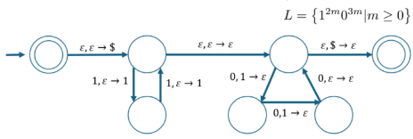

# מודלים חישוביים

מקרא - e - אפסילון, s - סיגמא,U - איחוד, N - חיתוך, co - משלים

## שפות רגולריות

### אוטומט סופי דטרמיניסטי (DFA)

- הגדרה - מצבים, אותיות, פונקציית מעברים, מצב התחלתי, מצבים מקבלים
- מצב מקבל, מצב לא מקבל

### שפות רגולריות

- הגדרה - קיים אוטומט סופי שמזהה אותה
- כל שפה היא קבוצת מילים.
- איחוד - איחוד בין שתי הקבוצות.
- שרשור - לוקחים כל מילה בקבוצה הראשונה ומוסיפים לקבוצה השנייה.
- כוכב קלין / סגור קלין - כל מילה בשפה יכולה להופיע 0 או יותר פעמים אחת אחרי השניה.
- פעולת המשלים - כל שאר המילים שהן לא בשפה
- חיסור - שקול לחיתוך עם משלים
- ביטויים רגולריים (צורת הכתיבה של השפות הרגולריות) - כל ביטוי הוא תו, אפסילון, קבוצה ריקה, איחוד, שרשור או סגור קלין
- כשרוצים להתייחס ל-b הראשון בשפה מעל a,b אפשר לכתוב a\*b.
- שפה שלא נגמרת באותה אות - eUaUbUs\*(abUba)

### אוטומט סופי לא דטרמיניסטי (NFA)

- ייתכנו כמה "ענפי חישוב" מקבילים, אם אחד מקבל האוטומט מקבל
- היפוך מצבים מקבלים לא שקול למשלים - אם יש מצב התחלתי לא מקבל עם חץ לעצמו, היפוך יוביל לאוטומט שמקבל הכל

### אוטומט סופי לא דטרמיניסטי מוכלל (GNFA)

- על כל מעבר יכול להיות ביטוי רגולרי
- המצב ההתחלתי מוביל לכל מצב אחר ואף מצב לא מוביל אליו
- יש רק מצב מקבל אחד, והוא שונה מההתחלתי, יש חצים אליו מכל שאר המצבים, אין חצים שיוצאים ממנו
- יש חץ מכל מצב לכל שאר המצבים כולל לעצמו
- (בפועל לא מציירים חיצים שהביטוי הרגולרי שלהם הוא הקבוצה הריקה)

### שקילות: DFA \<-\> NFA (משפט 1.39)

- DFA -\> NFA: טריוויאלי
- NFA -\> DFA:
  - מצבים: כל הקבוצות החלקיות של מצבי ה-NFA
  - מצב התחלתי: המצב שמתאים לצומת ההתחלתי ב-NFA בשילוב הצמתים שנגישים ממנו עם חץ אפסילון
  - מצבים מקבלים: כל המצבים ב-DFA שמכילים צומת מקבל ב-NFA
  - מעברים: עוברים על המצבים ב-NFA שמוכלים בקבוצה של מצב כלשהו ב-DFA, לדוגמה {A,C}. עבור כל אות בנפרד, אם יש ב-NFA את המעברים A-\>B,C-\>D ויש מעבר אפסילון D-\>E אז יהיה ב-DFA את המעבר AC-\>BDE.
  - סידור: נוריד את כל המצבים שלא נגישים מהמצב ההתחלתי

### שקילות: שפה רגולרית \<-\> DFA (משפטים 1.54, 1.60)

- DFA -\> שפה רגולרית:
  - DFA -\> GNFA:
    - מוסיפים מצב התחלתי עם חץ אפסילון למצב הקודם
    - מצב מקבל עם חצי אפסילון מהמצבים המקבלים הקודמים
    - אם יש כמה חצים (או כמה אותיות על אותו חץ) מחליפים אותם בביטוי רגולרי
    - מוסיפים חצים של קבוצה ריקה בין מצבים שאין ביניהם חצים
  - GNFA -\> שפה רגולרית: בכל פעם מורידים מצב ומחליפים בביטויים רגולריים מתאימים עד שמגיעים למצב מקבל ומצב התחלתי.
- שפה רגולרית -\> DFA:
  - בונים את האוטומט בצורה רקורסיבית.
  - אוטומטים טריוויאליים: מילה בעלת אות אחת, אפסילון, קבוצה ריקה.
  - איחוד (יצירת שני מסלולים מקבילים עם חצי אפסילון)
  - שרשור (מתיחת חצים בין מצבים מקבלים למצב התחלתי)
  - סגור קלין (הוספת מצב התחלתי חדש עם חץ אפסילון לישן ומתיחת חצי אפסילון בין מצבים מקבלים למצב ההתחלתי)

### סגירות

- כן איחוד - יוצרים מצב התחלתי חדש עם חיצי אפסילון למצבים ההתחלתיים של כל אוטומט
- כן חיתוך - בונים אוטומט מכפלה של שני האוטומטים והמצבים המקבלים שלו הם המכפלה של שני מצבים מקבלים מקוריים
- כן משלים - היפוך מצבים מקבלים
- כן סגור קליני - מותחים חיצי אפסילון ממצבים מקבלים ומצבים התחלתיים
- כן חיסור - חיתוך עם משלים
- כן ניתן לבצע פילוג במצב (L1 U L2)L3 - נובע מההגדרה
- לא ניתן לבצע פילוג במצב (L1 N L2)L3 - דוגמה נגדית היא L1={a},L2={aa},L3={a,aa} - אחד הוא קבוצה ריקה והשני {aa}

### שפות לא רגולריות

- באמצעות למת הניפוח: לכל שפה רגולרית קיים מספר טבעי p כך שאם מילה בשפה ארוכה מ-p אז היא מהצורה xyz כך שמתקיים:\
  xy^iz בשפה (i טבעי או אפס), y לא ריקה, xy קטן מ-p
- לפעמים בהוכחה צריך להגדיל את i ולפעמים צריך להקטין
- סגירות
  - כן תחת משלים - אם המשלימה שלה רגולרית אז המשלימה של המשלימה (היא) גם רגולרית - סתירה
  - לא תחת איחוד - איחוד לא רגולרית והמשלימה שלה (לא רגולרית) היא שפת כל המילים והיא רגולרית (מצב יחיד התחלתי מקבל).
- קיימת קבוצה אינסופית של שפות לא רגולריות השונות זו מזו שאיחודן היא רגולרית - לדוגמה השפה Lm={a^nb^n+m}, האיחוד של כל ה-Lm (כל ה-m-ים האפשריים) יוצא השפה a\*b\*.
- שפה שיש בה מספר שונה או גדול של a לעומת b לא רגולריות - מוכיחים את הראשונה כהיפוך של L=a^nb^n והשנייה כאיחוד של L והשפה הראשונה.
- לא כל שפה שמקיימת את למת הניפוח היא רגולרית, לדוגמה {(a^i)(b^j)(c^k) \| i,j,j \>=0, if i=1 then j=k}

### שונות

- אם R שפה רגולרית ו-F שפה סופית אז F\R שפה רגולרית - אפשר לבנות DFA ל-F על ידי מעין עץ שבו מילים שמתחילות באותה הצורה עוברות באותם הענפים. כיוון שהשפה סופית גם תת הקבוצה שהיא החיתוך שלה עם R היא סופית, נוציא את כל אותן המילים ונקבל DFA שמקבל את F\R, כלומר היא רגולרית.

## שפות חסרות הקשר

- דקדוק חסר הקשר (CFG) - משתנים, אותיות, חוקי גזירה, משתנה התחלתי
- שפה חסרת הקשר (CFL) - כל מה שאפשר ליצור מהחוקים
- מיפוי: DFA -\> CFG: כל מצב הופך למשתנה, כל מעבר בין מצבים הופך לחוק גזירה (מכניסים למחרוזת התוצאה את האות שמובילה ממצב א' לב')
- עץ יצירה - הצגה ויזואלית של המקור של כל תו במחרוזת. אחרי שמצאנו גזירה של מחרוזת: כותבים את המחרוזת הסופית למטה. כותבים מלמעלה למטה את המשתנים שבהם השתמשנו. מחברים בחצים כל משתנה לאות שהוא הוסיף למחרוזת.
- גזירה שמאלית ביותר - בכל שלב מחליפים את האיבר השמאלי ביותר.

### דו משמעות

- מילה היא דו משמעית אם יש לה גזירה שמאלית ביותר אחת. למילה דו משמעית יהיו שני עצי יצירה שונים.
- דקדוק הוא דו משמעי אם הוא מייצר מחרוזת אחת בצורה דו משמעית.
- לפעמים ניתן למצוא דקדוק שקול שהוא לא דו משמעי, לפעמים זה לא אפשרי ואז השפה דו משמעית מיסודה.

### צורה נורמלית של חומסקי

- הגדרה - כל חוק הוא מהצורה A-\>BC או A-\>a, רק המשתנה ההתחלתי יכול להוביל ל-e, B,C לא יכולים להיות המשתנה ההתחלתי.
- לכל CFG קיים דקדוק יוצר שקול בצורה הנורמלית של חומסקי

שיטת המרה:

- יוצרים משתנה התחלתי חדש S0-\>S - כדי לוודא שהמשתנה ההתחלתי מופיע רק פעם אחת בצד שמאל.
- מעלימים חוקי אפסילון - אם משתנה A מוביל לאפסילון מעלימים את האפסילון מחפשים איפה A נמצא בחוקים אחרים ומוסיפים אפשרות שבה A לא נמצא (לדוגמה אם B-\>Aa אז עכשיו B-\>a\|Aa).
- מעלימים חוקי יחידה - אם A-\>B\|Bc וגם B-\>u אז עכשיו A-\>u\|Bc
- מקצרים חוקים - אם A-\>BCD אז עכשיו A-\>BX ו-X-\>CD (לרוב משתמשים ב-A0,A1...)
- החלפת אותיות - מחליפים את האותיות a,b בכל חוק ב-A-\>a ו-B-\>b

## דוגמאות

- שפה שבה יש מספר שווה של 1,0 - S-\>0S1S\|1S0S\|e
- a^nb^m, n!=m - S-\>A\|AE\|B\|EB, E-\>aEb\|ab, A-\>aA\|A, B-\>Bb\|b

דרך נוספת: S -\> S1\|S2\|S3, S1-\>aS1b\|aS1\|a, S2-\>aS2b\|aS2\|b, S3-\>XbXaX\| X-\>aX\|bX\|es

- לא ww - S-\>O\|N\|ON\|NO, O-\>B0B\|0, N-\>B1B\|1, B-\>1\|0

### אוטומט מחסנית (PDA)

- הגדרה - מצבים, אותיות קלט, אותיות מחסנית, פונקציית מעברים, מצב התחלתי, מצבים מקבלים. לא דטרמיניסטי.
  - תנאי כולל אות קלט ואות במחסנית, פלט אות לדחוף למחסנית: char,pop-\>push
- מעבר ריק בין מצבים נראה כך: e,e-\>e וניתן להשתמש בו אם רוצים לפצל לכמה מצבים.
- כדי לדעת מתי הגענו לסוף המחסנית דוחפים \$ בהתחלה ובסוף משווים לזה (pop=\$).

### שקילות: CFG \<-\> PDA

- CFG -\> PDA: המטרה היא לראות אם יש סדרת גזירה שמייצרת את הקלט. עושים זאת על ידי דחיפת S ואז \$ למחסנית, ואז בלולאה הוצאת משתנה מהמחסנית והחלפתו באחד מכללי הגזירה בצורה לא דטרמיניסטית, עד שאולי מגיעים למילה הנתונה. אם במחסנית יש אות אז קוראים אותה ומשווים לקלט, אם אין התאמה אז פוסלים ואם יש התאמה ממשיכים בלולאה.
- PDA -\> CFG: לכל שני מצבים p,q יוצרים משתנה Apq שמייצר את כל המחרוזות שלוקחות את האוטומט ממצב ראשון לשני כששניהם עם מחסנית ריקה. אם מתישהו באמצע המחסנית נהיית ריקה אפשר לפצל לשני משתנים, אם לא אז אפשר להקטין את המחרוזת מההתחלה ומהסוף עם התו הראשון והתו האחרון (Apq=aAmnb)
- מיפוי: שפה רגולרית -\> CFG: CFG -\> PDA -\>(טריוויאלי) DFA

### סגירות

- כן תחת איחוד - מוודאים שאין משתנים משותפים, יוצרים משתנה התחלתי חדש S-\>S1\|S2
- כן תחת שרשור - מוודאים שאין משתנים משותפים, יוצרים משתנה התחלתי חדש S-\>S1S2
- לא תחת חיתוך - לדוגמה (a^\*)(b^n)(c^n) ו (a^n)(b^n)(c^\*), החיתוך הוא (a^n)(b^n)(c^n).\
  דוגמה לחיתוך שכן מוביל ל-CFL: שתי שפות זרות והחיתוך הוא השפה הריקה.
- כן תחת חיתוך אם אחת השפות היא רגולרית (תרגיל 2.27) - באמצעות מכפלה בונים אוטומט מחסנית המשלב את ה-PDA והאוטומט הסופי. לא אפשרי עם שני PDA כי אי אפשר לדמות במקביל שתי מחסניות. (אוטומט המכפלה - בונים אוטומט שהמצבים שלו הם המכפלה הקרטזית של המצבים של שני האוטומטים, מצבים מקבלים הם החיתוך של המצבים המקבלים של שני האוטומטים. האוטומט מבצע את המצבים של אוטומט אחר ובמקביל עוקב אחר המצב של האוטומט השני).
- לא תחת משלים - אחרת אפשר להוכיח שהחיתוך כן - co((coA)N(coB))
- לא תחת חיסור - נבחר A=s^\* אז A\B=coB, אבל זה סתירה עם ההוכחה שפעולת המשלים לא סגורה (למעלה).
- לא תחת סגור קלין - לדוגמה a^nb^nUaUb, הסגור הקליני שלה הוא s^\*

### שפות שאינן חסרות הקשר

- באמצעות למת הניפוח - לכל CFL קיים מספר טבעי p כך שאם אורך מילה בשפה גדול מ-p אז היא מהצורה uvxyz ומתקיים:
  - u(v^i)x(y^i)z גם בשפה (i טבעי או אפס)
  - vy לא ריקה
  - vxy קטן מ-p
- לפעמים בהוכחה צריך להגדיל את i ולפעמים צריך להקטין.
- דוגמה - a^ib^jc^k והגדלים הם בסדר עולה - ניקח לדוגמה (a^p)(b^p)(c^p)
  - אם v או y מכילים יותר מאות אחת אז ניפוח למעלה בטוח יהרוס את הסדר
  - אם לא אז בהכרח אות כלשהי לא מופיעה ב-v או y, אם a לא מופיעה אז אפשר לנפח למטה ואז יהיו יותר a מ-b או c, אם b לא מופיעה ב-v אפשר לנפח למעלה ואז יהיו יותר a מ-b, אם b לא מופיעה ב-y אז אפשר לנפח למטה ואז יהיו יותר b מ-c, אם c לא מופיעה אז אפשר לנפח למעלה ואז יהיו יותר b מ-c.
- דוגמה - ww - לוקחים לדוגמה w=0^p1^p, vxy חייב לעבור באמצע המחרוזת כי אחרת אפשר לנפח ולשבור את הסדר (לשים 1ים בתחילת החצי השני של המילה או ההפך), אם הוא עובר באמצע אז אפשר לנפח למטה ולהרוס את הספירה
- השפה (a^i)(b^j)(c^max(i,j) היא לא CFL - ניקח לדוגמה (a^p)(b^2p)(c^2p), ניפוח מוביל לשבירת הסדר או שבירת הכמויות
- סגירות
  - לא תחת איחוד - לדוגמה L1=L2=(a^n)(b^n)(c^k) ובמקרה אחד k\<n ובשני n\<k והאיחוד הוא (a^n)(b^n)(c^\*)
  - לא תחת חיתוך - לדוגמה a^nb^nc^n ו-ww, האיחוד הוא המילה הריקה

### אוטומט מחסנית דטרמיניסטי (DPDA) ושפות חסרות הקשר דטרמניסטיות (DCFL)

- ההבדל הוא שפונקציית המעברים חייבת להתחשב בכל אותיות הקלט וכל אותיות המחסנית
- משפט 2.41 - לכל DPDA יש DPDA שקול שקורא את כל הקלט
- משפט 2.42 - קבוצת ה-DFCL סגורה תחת המשלים
- שקילות: DCFG \<-\> DPDA
- שפות LR(k) - דרך לכתוב CFG בצורה שניתן להבין מה הסיומת של המילה

## מכונות טיורינג

- הגדרה - מצבים, אותיות קלט, אותיות סרט, פונקציית מעברים (אות קלט, אות סרט -\> מצב, אות סרט, ימינה או שמאלה) , מצב התחלתי, מצב מקבל, מצב דוחה
- קונפיגורציה - דרך לרשום את המצב הנוכחי, רושמים את הקלט, כותבים את המצב הנוכחי איפה שהראש - לדוגמה q0abcdU זה מצב התחלתי (U זה סוף המחרוזת).
- שפה מזוהה טיורינג (מח' RE) - אמ"מ יש מכונה שיכולה לעצור ולקבל עבור כל מילה בשפה, עבור כל השאר דוחה או רצה לנצח.
- שפה כריעה (מח' R) - אמ"מ יש מכונה שיכולה לעצור ולקבל עבור כל מילה בשפה ואחרת לעצור ולדחות. סימון: L={w\|M(w)}, M עוצרת.
- כל מכונת טיורינג אפשר לרשום כאוטומט אבל זה ארוך אז לרוב רושמים במילים.
- כדי לשמור כמה מילים על הסרט אפשר להפריד ביניהם באמצעות סימן מיוחד. כדי לזכור איפה אנחנו בכל מילה אפשר לשים נקודה מעל האות.
- כדי לקבל קלט צריך מחרוזת וכל אובייקט אפשר לקודד כמחרוזת
- מה זה אלגוריתם? - אפשר לומר שאלגוריתם פורמלי הוא שימוש במכונת טיורינג

### סוגים (שקולים לרגילה)

- מכונה עם כמה סרטים
- מכונה לא דטרמיניסטית (3.16)
- מונה (enumerator) - מכונה עם מדפסת שיכולה להדפיס בכל זמן נתון, יכולה לרוץ לנצח. הוכחה - כיוון אחד טריוואלי, בכיוון השני אנחנו עוברים על כל המחרוזות האפשריות ומדפיסים כל פעם שאנחנו מקבלים, כמעט תמיד המכונה לא תעצור אבל זה בסדר.
- מכונה עם סרט אינסופי משני הכיוונים - שקולה למכונה רגילה כי אפשר לפעול באותה הצורה בצד ימין לחלק לשני אזורים, בכל פעם שרוצים לכתוב בצד שמאל להעתיק את כל החלק הימני מקום אחד ימינה ולכתוב את התו
- PDA עם שתי מחסניות - שקול למכונת טיורינג כי ניתן לחלק את הסרט לשני חלקים וכל אחד מהם לשים במחסנית
- מודל RAM (גישה לפי כתובת) - אפשר לכתוב לסירוגין כתובות ומידע וכך לחפש את הכתובת המתאימה, וגם מכונת טיורינג יכולה להדפיס כל מכונה אחרת וגם את עצמה (על ידי שכפול של עצמה, לא בחומר)

## כריעות

### שפות כריעות

- שפה היא איזושהי תת קבוצה של s^\* (כל המילים). מקבלים מילה שהיא קידוד של קבוצת פרמטרים וצריך לבדוק תנאי.
- A_DFA - מילה, האם מקבל? - נריץ את האוטומט ובהכרח נגיע לסוף הקלט ונבדוק באיזה מצב אנחנו
- A_NFA - NFA, מילה, האם מקבל? - נמיר ל-DFA ונריץ
- A_REX - ביטוי רגולרי, מילה, האם בשפה? - נמיר ל-NFA ונריץ
- E_DFA - DFA, האם לא מקבל אף מילה? - נסרוק את כל הגרף, אם נסיים ולא נגיע למצב מקבל נחזיר שלא
- EQ_DFA - שני DFA, האם השפות זהות? - הפרש סימטרי - בודקים האם האוטומט הבא הוא השפה הריקה - ((A משלים חיתוך B) איחוד (A חיתוך B משלים))
- A_CFG - CFG, מילה, האם בשפה? - בודקים את כל המילים שמיוצרות על ידי 2n-1 צעדים (n אורך הקלט) והאם הקלט נמצא
- E_CFG - CFG, האם השפה ריקה? - מסמנים את כל האותיות ואת כל המשתנים שגוזרים ביטויים שכבר ראינו באופן רקורסיבי ובודקים האם מגיעים למשתנה ההתחלתי
- EQ_CFG - שני CFG, האם השפות זהות? - לא כריע (מוכח בהמשך)
- A_CFL, קלט, האם בשפה? - נמיר ל-CFG ונריץ
- משפט רייס - אם מנסים להכריע שמכונה שייכת לשפה X על סמך תכונה כלשהי של השפה Y שהמכונה מקבלת (כמו לדוגמה לומר שהשפה Y היא כל המילים שיש בהן ab) אז השפה X איננה כריעה. (הוכחה: רדוקציה ל-A_TM)
  - איך משתמשים? - מראים ש-X לא טריוויאלית (לא ריקה ולא מכילה את כל המכונות) ושהתכונה תלויה רק בשפה הפנימית.
  - INFINITE_TM - כל המכונות שמקבלת שפה אינסופית - לא כריעה בגלל משפט רייס.

### שפות לא כריעות

- A_TM - מכונת טיורינג, קלט, האם מקבל? - מזוהה-טיורינג אבל לא כריעה.\
  הוכחה - נניח שקיימת מכונה שיכולה להריץ מכונה ולהחליט האם היא בשפה, אם נבנה מכונה שמקבלת על כל מילה שהמכונה דוחה ונריץ אותה על עצמה אז נקבל סתירה (המכונה תקבל את המילה? אבל היא עצמה דחתה אותה?...).

### שפות לא מזוהות טיורינג

- הגדרה - שפה בקבוצה אם המשלימה שלהן היא מזוהה טיורינג
- הגדרה נוספת - אם המילה בשפה המכונה עוצרת ומקבלת או לא עוצרת. אם לא אז המכונה עוצרת ודוחה.
- כל שפה כריעה היא גם לא מזוהה טיורינג - כי עבור שפה כריעה המכונה בהכרח עוצרת.
- אם שפה וגם המשלימה שלה הן מזוהות-טיורינג אז השפה כריעה - כל מילה חייבת להיות באחת מהן ולכן אחת מהמכונות בהכרח תעצור.
- השפה המשלימה של A_TM היא לא מזוהה טיורינג - אחרת שתי השפות (זו והמקורית) הן מזוהות-טיורינג והשפה המקורית כריעה.
- באופן כללי - אם שפה מזוהה אבל לא כריעה אז המשלימה שלה בטוח לא מזוהה

### סגירות

- שפות מזוהות טיורינג + כריעות
  - כן תחת איחוד/חיתוך - נבנה מכונה שתריץ את המכונה של כל שפה ותקבל אם אחת מהן / שתיהן מקבלות
  - כן תחת שרשור - עבור קלט w נחלק לשני קטעים בצורה לא דטרמיניסטית וניתן לכל מכונה לרוץ על כל חלק (אפשר עם מכונה מרובת סרטים וזה שקול), נקבל רק מילים שיתקבלו משתי המכונות, מספר החלוקות הוא סופי לכן בהכרח תהיה הכרעה.
  - כן תחת סגור קלין - נחתוך כל פעם חלק בצורה לא דטרמיניסטית ונריץ על המכונה של L
- מזוהות טיורינג
  - לא תחת משלים - כי אחרת כל שפה הייתה כריעה
  - כן לתת קבוצה - מריצים על המכונה המקורית
- כריעות
  - כן תחת משלים - מחזירים את ההפך מהמכונה המקורית (והיא בטוח עוצרת)
  - לא לתת קבוצה - לדוגמה s^\* כריעה אבל A_TM לא
- לא מזוהות טיורינג
  - כן תחת חיתוך - ממירים את השפות למזוהות טיורינג ומשתמשים בכלל דה מורגן.
  - לא תחת משלים - E_TM (הוכחה בהמשך)
  - לא תחת איחוד? (TODO)
  - לא תחת שרשור? - (TODO: מוכיחים דרך שרשור s^\* עם coA_TM?)
  - כן תחת סגור קליני? (TODO)
- לא כריעות
  - לא תחת איחוד - A_TM U coA_TM = s^\*
  - לא תחת חיתוך - A_TM N coA_TM = {}
  - כן תחת משלים - נניח שלא -\> המשלימה היא כריעה (הנחה) -\> המקורית כריעה (סגירות בשפות כריעות) וזו סתירה
  - לא תחת שרשור - אם ניקח את A_TM,coA_TM ונאחד אותן עם המילה הריקה נקבל שפות שאינן כריעות אבל השרשור הוא s^\*.

## רדוקציה

- הגדרה - המרה של בעיה אחת לאחרת
- HALT_TM - בעיית העצירה - מקבלים מכונה וקלט, האם המכונה עוצרת על הקלט? - לא כריעה, רדוקציה ל-A_TM. אם היא קיימת אז נוכל לבנות את A_TM על ידי כך שנריץ את מכונת העצירה, אם היא מחזירה אמת אז נריץ את מכונת הקלט על המילה, ואם לא נחזיר שלא
- E_TM - מקבלים מכונה, האם המכונה לא מקבלת אף מילה? - לא כריעה, רדוקציה ל-A_TM. נבנה מכונת עזר מ-M,w הנתונות כך שמקבלת את השפה הריקה אמ"מ M מקבלת את w (אם הקלט הוא לא w אז המכונה דוחה, אם הקלט הוא w אז מקבלת את המילה אמ"מ M מקבלת). נריץ את המכונה בהנחה הזו על מכונת העזר ונקבל אמ"מ היא דחתה אותה (סימן שמכונת העזר לא מקבלת את השפה הריקה ולכן M מקבלת את w)
- coE_TM - מקבלים מכונה, האם מקבלת מילה כלשהי? - מזוהה טיורינג כי אפשר לעבור כל כל המילים האפשריות, בהכרח נעצור כי מתישהו המכונה תקבל.
  - מכך נובע ש-E_TM לא מזוהה טיורינג (אחרת E_TM כריעה)
- REGULAR_TM - מקבלים מכונה, האם השפה שהיא מקבלת רגולרית? - לא כריעה, רדוקציה ל-A_TM. נבנה מכונת עזר ש-M מקבלת את w אמ"מ היא מחזירה שפה רגולרית (לדוגמה מקבלת בהכרח את השפה 0^n1^n אבל גם את שאר המילים אם M מקבלת את w), נריץ את המכונה בהנחה זו על מכונת העזר ונקבל אמ"מ היא קיבלה
- EQ_TM - מקבלים שתי מכונות, האם השפות זהות? - לא כריעה, רדוקציה ל-E_TM. נריץ את המכונה בהנחה זו עם מכונת הקלט ומכונה שלא מקבלת אף מילה, אם שתיהן מקבלות את אותה השפה נקבל.

### היסטוריות חישוב

- היסטוריית חישוב - סדרה של קונפיגורציות שמובילה לקבלה או דחייה.
- אוטומט חסום-לינארית (LBA) - הזיכרון של המכונה לינארי באורך הקלט. בעלת כוח רב למרות ההגבלה. אם הראש ינסה לזוז עוד ימינה אחרי סוף הקלט הוא יישאר במקום.
- אם ל-LBA יש q מצבים, g אותיות אפשריות בסרט, ו-n מקומות בסרט אז יש qng^n קונפיגורציות שונות.
- A_LBA - מקבלים LBA, מילה, האם המכונה מקבלת את המילה? כריעה, הקונפיגורציות סופיות ולכן נוכל להריץ ולעצור אם המכונה עצרה או שעברנו qng^n צעדים, במקרה זה המכונה בלופ.
- E_LBA - מקבלים LBA, האם לא מקבלת אף מילה? - לא כריעה, רדוקציה לA_TM. נבנה LBA שמקבל את כל היסטוריות החישוב המקבלות של המכונה M על המילה w (המכונה תבדוק האם זו היסטוריה חוקית של M על w). נריץ את המכונה בהנחה זו על מכונת העזר, אם השפה ריקה אז סימן ש-M לא מקבלת את w ולכן נקבל את המילה, אחרת לא.
- ALL_CFG - מקבלים CFG, האם הוא מקבל את כל המילים? - לא כריעה, רדוקציה ל-A_TM. ניצור PDA שמקבל את כל המילים בשפה אמ"מ M לא מקבל את w, לדוגמה מקבל את כל המילים בשפה חוץ מהיסטוריית חישוב מקבלת של M עבור w (בפועל, ה-PDA בודק האם המצב ההתחלתי הוא של M, כל המעברים חוקיים והמצב האחרון מקבל, כדי לעשות זאת עם מחסנית אנו הופכים את הסדר של כל קונפיגורציית חישוב שניה בסדרה).

### PCP

- הבעיה - מקבלים אבני דומינו כך שבכל צד יש מחרוזת, האם ניתן לסדר אותן בשורה כך שבשני הצדדים יהיו מילים זהות.
- משפט 5.15 - PCP לא כריעה

### רדוקציה על ידי מיפוי

- פונקציה ניתנת לחישוב - פונקציה שיש מכונת טיורינג שבהינתן w עוצרת עם f(w)
- רדוקציית מיפוי - אם קיימת פונקציה ניתנת לחישוב שכל w הוא ב-A אמ"מ f(w) ב-B (מסמנים A \<=M B).
  - אם נתון A\<=B גם המשלימות שלהן מקיימות (כי זה אמ"מ)
  - אינטואיציה:
    - נניח שמישהו רוצה לפתור את הבעיה הידועה. הוא ממלא פרמטרים מתאימים. אם אקבל את הפרמטרים אני יכול להמיר אותם לפרמטרים של בעיה אחרת ולפתור אותה.
    - A "קלה יותר" מ-B כי היא מוכלת בה - כל מקרה ב-A אפשר לפתור עם B אבל לא בהכרח להפך
  - (פירוט איך מוכיחים כתוב בהגדרת NP)
- משפט 5.22 - אם B כריעה ו-A\<=B אז A כריעה - כשצריך לבדוק את w על A נמיר אותו ל-f(w) ונראה אם B עוצרת.
- משפט 5.23 - אם A לא כריעה אז ו-A\<=B אז B לא כריעה - הוכחה בשלילה על 5.22
- משפט 5.28 - אם B מזוהה טיורינג ו-A\<=B אז A מזוהה טיורינג - הוכחה כמו 5.22
- משפט 5.29 - אם A לא מזוהה-טיורינג אז ו-A\<=B אז B לא מזוהה-טיורינג - הוכחה בשלילה על 5.28
- טריק עם משפט 5.28 - כדי להוכיח ש-B לא מזוהה טיורינג אפשר להראות מיפוי בין A_TM למשלימה של B ואז תכונת המשלים + 5.28.
- משפט 5.30 - EQ_TM לא מזוהה וגם המשלימה לא\
  EQ_TM - מקבלים שתי מכונות, האם מקבלות את אותה שפה? - רדוקציה של coEQ_TM ל-A_TM (טריק משפט 5.28). בונים שתי מכונות, אחת לא מקבלת כלום והשניה מקבלת הכל אמ"מ M מקבלת את w ולהריץ את המכונה בהנחה על שתי המכונות. אם M מקבלת את w שתי המכונות שונות ואם M לא מקבלת את w שתי המכונות זהות. coEQ_TM האם מקבלות שפות שונות? - הוכחה דומה
- אם A\<=B אז coA\<=coB - מוכיחים לפי ההגדרה, מראים שאם מילה שייכת ל-A אז היא לא שייכת ל-coA וכן הלאה.\
  לכל שפה A מתקיים A\<=coA - מוכיחים לפי הגדרה
- (לא בטוח) קיימת רדוקציית מיפוי בין כל שתי שפות כריעות - בודקים האם המילה בשפה A ואם כן נחזיר מילה בשפה B (וההפך\
  (לא בטוח) קיימת רדוקציית מיפוי בין כל שפה כריעה לשפה לא כריעה - הוכחה דומה\
  (לא בטוח) אם קיימת רדוקציית מיפוי בין שפה לשפה רגולרית לא בהכרח השפה המקורית רגולרית - הוכחה דומה\
  (לא בטוח) לא קיימת רדוקציית מיפוי בין שפה לא כריעה לשפה כריעה - אחרת היה אפשר להמיר ולהכריע\
  אם A \<=P B וA בP ייתכן שבB לא בP - נכון כי ייתכן שA כריעה וB לא\

## סיבוכיות

- זמן ריצה - פונקציה בין אורך הקלט לכמות צעדים מקסימלית על קלט באורך הזה
- הפונקציות O (גבול עליון גדול שווה(, o (גבול עליון גדול ממש)
- ניתוח זמן ריצה - מעבר על חלקים שונים האלגוריתם ומציאת גבול עליון לכולו
- TIME(t(n) - כל השפות שניתנות להכרעה ב- O(t(n)).
- אפשר למצוא מימושים מהירים יותר לאלגוריתמים - לדוגמה 0^n1^n - במקום להוריד כל פעם אחד אפשר כל פעם להוריד בחצי ולהגיע לO(nlgn). בעיות שניתנות לחישוב במודלים שונים לא בהכרח ירוצו באותו הזמן.
- משפט 7.8 - כל בעיה שנפתרת ב-t(n) במכונת מרובת סרטים נפתרת ברגילה ב-O(t^2(n))
- משפט 7.11 - כל בעיה שנפתרת ב-t(n) במכונה דטרמיניסטית נפתרת ברגילה ב-2^(O(t(n))

### המחלקה P

- הגדרה - כל הבעיות הכריעות בזמן פולינומיאלי
- כל סוגי המודלים של החישוב נמצאים ב-P (גם לא מכונות טיורינג?)
- מרמז שהבעיה פתירה גם במחשב, בזמן "סביר"
- קידוד - לשים לב שמשפיע על הסיבוכיות, לדוגמה קידוד אונרי (5=11111) יגרום לבעיה להיות בסיבוכיות נמוכה אבל בפועל הזמן יהיה ארוך
- מציאת מסלול פשוט מ-A ל-B (PATH)\
  דרך 1: אלגוריתם צביעה, מתחיל מקבוצה שמכילה רק את צומת המקור, כל פעם בוחר צומת בקבוצה ומוסיף את השכנים שלה.\
  דרך 2: אלגוריתם דומה אבל מגדירים מונה לולאה חיצוני מ-0, כל פעם גדל ב-1, כאשר קודקוד צבוע ב-n ויש קשת שמובילה לקודקוד לא צבוע אז צובעים אותו ב-n+1.\
  כדי למצוא מרחק: אפשר לשמור עבור כל צומת את המרחק שלו, כשמוצאים אותו אז לעדכן לפי הקשת ממנה הגענו\
  קידוד: אם יש בגרף n צמתים אז יש עד n^2 קשתות, אפשר לקבל אותם כרשימת קודקודים ורשימת קשתות (זוגות קודקודים). באלגוריתם פשוט במקרה הכי גרוע הסיבוכיות היא n^3
- האם מספר ראשוני (או פריק)
- RELPRIME - נתונים שני מספרים האם המחלק הגדול ביותר של שני מספרים הוא 1
- 2SAT (הגדרה בהמשך)
- 2-COLORING (הגדרה בהמשך)
- 2-SET-PACKING (הגדרה בהמשך)
- משפט 7.16 - כל CFL הוא ב-P - כבר הוכח שהשפה כריעה, האלגוריתם רקורסיבי (מציאת כל המילים האפשריות ב-2n-1 צעדים), כדי ליצור מימוש יעיל אפשר להשתמש בתכנון דינמי
- מציאת מסלול אוילר ומעגל אוילר (EULER-PATH, EULER-CYCLE)\
  הבעיה: מסלול אוילר הוא מסלול שמבקר בכל קשת פעם אחת. במעגל אוילר נקודת ההתחלה והסיום זהות.\
  פתרון: כיוון שנכנסים ויוצאים מכל קודקוד צריך שהדרגות של כל קודקוד (מספר קשתות מחוברות) במסלול יהיו זוגיות\
  מסלול אוילר - קיים אמ"מ יש 0 או 2 קוקודים עם דרגה אי זוגית (ואם יש 2 הם ההתחלה והסיום)\
  מעגל אוילר - קיים אמ"מ לכל הקודקודים יש דרגה זוגית

## סגירות

- כן תחת איחוד, חיתוך, משלים, כוכב קלין - הוכחה דומה למכונת טיורינג.
- שרשור - חותכים לשני חלקים בצורה דטרמיניסטית (מ-0 עד n) וזה בסדר כי זה עדיין פולינומיאלי
- כוכב קלין - חותכים ב-1,2,3... ושומרים את התוצאות באמצעות תכנון דינמי - זמן פולינומיאלי O((n^2)p(n))

### המחלקה NP

- מאמת - אלגוריתם שמקבל עבור שפה מסוימת מילה ואישור c ויודע לוודא שהמילה אכן בשפה (לדוגמה האם מספר פריק: מקבל את המספר ומחלק כלשהו). אם המאמת דוחה את המילה, אין זה הכרח שהיא לא בשפה.
- NP - המחלקה שיש לה מוודאים שרצים בזמן פולינומיאלי
- משפט 7.20 - שפה היא ב-NP אמ"מ NTM מזהה אותה (אפשר לבנות NTM שמנחש את ההוכחה, שהיא פולינימיאלית באורך הקלט)
- הגדרה 7.21 - NTIME(t(n)) - כל השפות שמוכרעות בזמן O(t(n)) על ידי NTM
- מסקנה - NP=NTIME(n^k)
- אפשר לתת הוכחה שבעיה היא ב-NP על ידי מתן פתרון ב-NTM
- סגירות
  - כן תחת שרשור, איחוד, חיתוך, כוכב קלין - הוכחה דומה למכונת טיורינג. משלים - לא ידוע
- coNP - המשלימה של NP, לא יודעים אם NP=coNP, מניחים שלא
  - אם הופכים מצבים מקבלים ב-NTM לא מקבלים את השפה המשלימה כי ייתכנו שני מסלולי חישוב, אחד מקבל ואחד לא מקבל עבור אותו קלט. אם נהפוך הקלט עדיין יתקבל.

דוגמאות - בהמשך

### P מול NP ובעיות NP-שלמות

- P מוכל ב-NP - אם אפשר לפתור את הבעיה בזמן פולינומיאלי אפשר גם לוודא אותה בזמן פולינומיאלי\
  P מוכל ב-coNP - שפה היא ב-P -\> שפה היא ב-NP -\> המשלים שלה השפה ב-NP (סגירות ב-P) -\> המקורית ב-coNP (הגדרת coNP)
- NP בטוח מוכל בזמן אקספונציאלי (EXPTIME) אבל אולי מוכלת בקבוצה קטנה יותר
- סוגי בעיות:\
  בעיית ההכרעה - מקבלים מילה וצריכים להכריע האם היא בשפה.\
  בעיית חישוב - מקבלים מילה ומחזירים תוצאה כלשהי (לדוגמה פירוק לגורמים).
- סוגי רדוקציות:\
  רדוקציה רגילה - יוצרים מכונה שמכריעה בעיה ידועה באמצעות מכונה שמכריעה בעיה אחרת.\
  צריך להוכיח: אם הרצת המכונה הידועה על הקלט צריכה להיות מקבלת אז אז המכונה תקבל, ואם לא אז לא.\
  דוגמה: רדוקציה ב-ATM מקבלים M,w וצריך להחזיר האם M מקבלת את w.\
  רדוקציית מיפוי - לוקחים קלט של בעיה ידועה וממירים לקלט של בעיה אחרת. לא פותרים את הבעיה.\
  צריך להוכיח: אם קלט המקור פותר את הבעיה הראשונה קלט התוצאה פותר את השנייה, ואם המקור לא פותר גם היעד לא.\
  דוגמה: מראים למה אם phi היא נוסחה ב-3SAT אז G,k ב-VERTEX-COVER
- טיפים:\
  כדי לבנות את המכונה, עדיף להתחיל בהוכחה (אם M,w ב-ATM אז... אם לא...) כי זה יעזור להבין מה התוצאה צריכה להיות

## רדוקציה בזמן פולינומיאלי

- רדוקציה שהסיבוכיות שלה היא פולינומיאלית באורך הקלט
- תכונות: רפלקסיבי (אפשר לבחור f(w)=w), טרנזיטיבי (אפשר להפעיל f(g(w))), לא סימטרי (אין מיפוי בין s\* ל-HALT_TM)
- אם ניתן לבצע לבעיה רדוקציה בזמן פולינומיאלי לבעיה ב-P אז הבעיה המקורית פתירה בזמן פולינומיאלי
- משפט 7.34 - שפה B היא NP-שלמה אם היא ב-NP וכל שפה A ב-NP רדוקטיבית בזמן פולינומיאלי ל-B (A \<=P B)
- משפט 7.35 - אם שפה B היא NP-שלמה וגם ב-P אז P=NP
- משפט 7.37 (משפט קוק-לוין) - SAT היא NP-שלמה
- משפט 7.42 - 3SAT היא NP-שלמה
- לא יודעים למה אבל רוב הבעיות שעוסקים בהן הן P או NP
- למה טוב לדעת ששפה היא NP-שלמה? - לא צריך לחפש לה אלגוריתם יעיל, בנוסף אם תימצא רדוקציה לאחד אז נדע שזה תקף גם לשאר.

## איך מוכיחים ששפה B היא NP-שלמה?

- מוכיחים ש-B היא ב-NP - על ידי מתן מוודא בזמן פולינומיאלי או NTM שפותר אותה
- מוצאים שפה A שידוע שהיא NP-שלמה ומראים ש-A \<=P B על ידי הצגת רדוקציה פולינומיאלית\
  מגדירים פונקציה מ-A ל-B (מהבעיה הקשה המוכרת לחדשה), ממירה קלט אחד לאחר, לא פותרת.\
  w ב-A אמ"מ f(w) ב-B (שתי הוכחות) - לדג' שאם w ב-A אז f(w) ב-B ואם w לא ב-A אז f(w) לא ב-B.\
  פולינומיאלית - מוכיחים ש-f רצה בזמן פולינומיאלי באורך הקלט
- איך מוכיחים ששפה היא NP-שלמה באמצעות 3SAT\
  עזרים (gadgets) - מבנים שמדמים את המשתנים או הביטויים בנוסחת 3SAT\
  צריך עזר למשתנים - יהיו לו שני מאפיינים (לפי הליטרלים של כל משתנה - אחד אמת ואחד שקר)\
  צריך עזר לשלשות - יהיו לו שלושה מאפיינים (כי יש 3 ליטרלים בכל שלשה)
- קליקה (CLIQUE) - NP-שלמה
- הבעיה: נתון גרף וגודל k, הם יש קבוצת קודקודים בגודל k שכולם מחוברים ביניהם?
- משפט 7.32 - 3SAT \<=P CLIQUE:\
  ניצור גרף שהצמתים שלו הם כל הליטרלים (כל משתנה נמצא פעמיים - הוא ומנוגד שלו). כל הקשתות בגרף נמצאות חוץ מקשתות של ליטרלים באותה שלשה וקשתות של ליטרלים מנוגדים. אם הנוסחה ב-3SAT ספיקה אז אפשר למצוא משתנה אחד מכל שלשה שהוא T, נמצא את הצמתים המתאימים בגרף ונגלה שבהכרח יש קשתות ביניהם. מהצד השני, אם יש קשתות שמחברות k צמתים בגרף אז נוכל ליצור נוסחה ספיקה (כל אחד מהמשתנים בקליקה יהיה בשלשה אחת) וכך נוכל לשים בכולם T ולקבל נוסחה ספיקה.
- ממ"ן 17 שאלה 4 - רדוקציה מ-VERTEX-COVER -\
  ניקח את הקלט (G,k) ל-VC וניצור קלט עבור CLIQUE שהוא (coG,\|V\|-k).\
  אם יש כיסוי בצמתים לגרף בגודל k אז שאר הקודקודים הם קבוצה בלתי תלויה אז בגרף המשלים הם קליקה\
  אם אין כיסוי בצמתים לגרף בגודל k אז בכל תת קבוצה של n-k קודקודים הם קבוצה תלויה לכן בגרף המשלים הם לא קליקה
- בצירוף עם 7.24 נקבל שקליקה היא NP-שלמה

## כיסוי בקודקודים (VERTEX-COVER) - NP-שלמה

- הבעיה: מקבלים גרף וגודל k, השאלה אם יש קבוצה בגודל k כך שלכל קשת יש לפחות קצה אחד בקבוצה
- משפט 7.44 - הבעיה היא NP-שלמה, 3SAT \<=P VERTEX-COVER :\
  בכיוון אחד אפשר לקחת נוסחה ספיקה, ליצור גרף שבו כל משתנה מקבל 2 צמתים (הוא והיפוכו) וכל שלשה מקבלת 3 צמתים (עבור כל ליטרל), הקשתות מחברות בין המשתנים למופעים שלהם בנוסחה, בין שני צמתי המשתנים ובין שלושת צמתי השלשות. אם הנוסחה ספיקה אז נבחר את צומת המשתנה שעבורו יש T ואת שני הצמתים האחרים שאיתו באותה השלשה. זה כיסוי בצמתים כי אנחנו מכסים את הקשת שבין המשתנים, הקשתות שבין המופעים שלהם וגם הקשתות שבין המשתנים למופעים. הכיוון ההפוך דומה.
- תרגיל 10 - הבעיה NP-שלמה כי היא ב-NP ויש רדוקציה מ-INDEPENDENT-SET - כי קבוצה היא בלתי תלויה אמ"מ הקבוצה המשלימה היא כיסוי בקודקודים
- לפי הפתרון של ממן 17: יש בספר מיפוי בין VERTEX-COVER ל-3SAT

## קבוצה בלתי תלויה (INDEPENDENT-SET) - NP-שלמה

- הבעיה - בהינתן גרף לא מכוון ומספר טבעי, האם יש בגרף קבוצה בלתי תלויה בגודל זה? (קבוצה בלתי תלויה היא קבוצה שאין בה שני קודקודים שהם שכנים)
- תרגיל 10 - הבעיה NP שלמה - רדוקציה מ-CLIQUE\
  ממ"ן 17 שאלה 4 - רדוקציה מ-VERTEX-COVER (הוכחה בחלק של CLIQUE)
- הערה: אם מוסיפים לגרף משולש (3 צמתים ו3 קשתות) אז כל כיסוי בצמתים יהיה צריך להכיל לפחות 2 צמתים מהמשולש

## כיסוי בקבוצות (SET-COVER) - NP-שלמה

- הבעיה: בהינתן קבוצה סופית, משפחת תת קבוצות שלה ומספר טבעי k, האם ניתן לבחור k תת קבוצות מתוך המשפחה הנתונה כך שאיחודן הוא הקבוצה המקורית?
- שאלה 7.11 - רדוקציה מ-VERTEX-COVER

## מסלול המילטוני בגרף מכוון (HAMPATH) - NP-שלמה

- הבעיה - מעבר בכל צומת פעם אחת
- משפט 7.47 - הבעיה היא NP-שלמה, 3SAT \<=P HAMPATH :\
  יוצרים מבנה דמוי יהלום עבור כל משתנה ויוצרים צומת עבור כל שלשה. המסלול ההמילטוני עובר בכל יהלום בכיוון שמאל-אמצע-ימין או ימין-אמצע-שמאל, ואפשר לעבור גם בצמתי השלשות ולחזור (מתאים לאיך שהגרף נבנה).
- משפט 7.48 - מציאת מסלול המילטוני בגרף לא מכוון (UHAMPATH) היא NP-שלמה -\
  HAMPATH \<= UHAMPATH : הופכים את הגרף הלא מכוון למכוון על ידי פיצול צמתים

## סכום תת קבוצה (SUBSET-SUM) - NP-שלמה

- הבעיה: נתונה קבוצת מספרים ומספר טבעי t, האם יש תת קבוצה שסכומה t?
- משפט 7.56 - הבעיה היא NP-שלמה, 3SAT \<=P SUBSET-SUM

## k-צביעה של גרף (k-COLORING) - NP-שלמה עבור k\>=3

- הבעיה: בהינתן גרף לא מכוון האם ניתן לצבוע אותו ב-k צבעים כך שכל שני שכנים יהיו צבועים בצבעים שונים?
- עבור k=2 הבעיה ב-P

## אריזה של קבוצות בגודל k (k-SET-PACKING) - NP-שלמה עבור k\>=3

- הבעיה: בהינתן אוסף קבוצות של תת קבוצות של U שכל אחת בגודל k ומספר טבעי t, האם יש באוסף t תת-קבוצות שהן זרות בזוגות?
- מציאת מסלול ארוך (LPATH) - NP-שלמה
- הבעיה: בהינתן גרף, שני צמתים ומספר k, האם יש מסלול שאורכו לפחות k?
- תרגיל 7.21 בספר: רדוקציה מ-UHAMPATH: הרדוקציה היא המרה מ-UHAMPATH כאשר k=\|V\|, אם יש מסלול המילטוני אז גם יש מסלול שאורכו לפחות \|V\|, אם אין מסלול המילטוני אז אין כזה.

## חצי קליקה (HALF-CLIQUE) - NP-שלמה

- הבעיה: בהינתן גרף עם n קודקודים האם יש קליקה בגדול n/2
- תרגיל 7.22 בספר: רדוקציה מ-CLIQUE: מקבלים G,k עם v קודקודים ומחזירים גרף חדש. בכל מקרה בודקים האם צריכים להוסיף j צמתים לגרף ואם כן הם יהיו בקליקה או לא. אם k=v/2 אנחנו יכולים להחזיר את G כמו שהוא.\
  אם k\<n/2 אז "חסר" לנו קודקודים בקליקה, נוסיף קודקודים ומחברים לכל השאר, לכן k+j=(n+j)/2 ואז j=n-2k.\
  אם k\>n/2 אז יש לנו יותר מדי קודקודים בקליקה, נוסיף קודקודים בלי קשתות, לכן k=(n+j)/2 ואז j=2k-n.

## פיצול קבוצות (SET-SPLITTING) - NP-שלמה

- הבעיה: בהינתן קבוצת על ואוסף של תת קבוצות מתוך קבוצת העל, האם אפשר לצבוע את כל האיברים בשני צבעים כך שאין תת קבוצה שכל איבריה צבועים באותו הצבע?
- תרגיל 7.30 בספר: רדוקציה מ-3SAT:\
  מקבלים משתנים Xi, יוצרים קבוצת על של כל הליטרלים (משתנה ושלילה שלו) ואיבר y.\
  אוסף תת הקבוצות הוא איחוד של שני אוספים: אחד הוא אוסף תת קבוצות של שני איברים - משתנה והשלילה שלו.\
  השני הוא אוסף תת קבוצות של הליטרלים של כל פסוקית בנוסף לאיבר y.\
  אם יש השמה לנוסחה אז אפשר לצבוע את כל הליטרלים שהם T בצבע אחד והליטרלים שערכם F וגם את y בצבע אחר.\
  אם אפשר לצבוע את כל הליטרלים לפי התנאים אז נבחר את כל הליטרלים שצבעם שונה מ-y ונשים בהם T ונשים F באחרים.

## חלוקה לקבוצות זרות (SET-PARTITION) - NP-שלמה

- הבעיה: נתונה קבוצת מספרים, האם ניתן לחלק את כולם לשתי קבוצות כך שלשתיהן יהיו אותו סכום?
- 2024 94ב שאלה 4 - רדוקציה מ-SUBSET-SUM: אנו מקבלים קבוצת מספרים ומספר t. ניצור קבוצת מספרים חדשה עם כל המספרים הישנים (נניח שסכומם S) ונצרף את S-2t. אם הקלט ב-SUBSET-SUM אז יש קבוצה שסכומה t, ולכן הסכום של השאר S-t, לכן יש קבוצה שסכומה הוא S-t ושאר המספרים סכומם S-2t+t=S-t. הכיוון ההפוך דומה.

## 3-צביעה כמעט תקינה

- הבעיה: נתון גרף, האם אפשר לצבוע אותו ב-3 צבעים כך שמקסימום קשת אחת תכיל שני קודקודים באותו צבע?
- 2024 94ב שאלה 5 - רדוקציה מ- 3COLOR: נתון גרף, נאחד אותו עם K_4 (גרף מלא עם 4 קודקודים). אם הגרף המקורי 3-צביע אז גם הגרף החדש 3-צביע (כי אין צלעות בין הגרף ל-K_4). אם לא אז ייתכן כמעט-צביע, אבל K_4 יפר את זה.

## סיכום בעיות ב-NP - שרשראות הרדוקציות

- SAT \<=P 3SAT
- 3SAT \<=P CLIQUE \<=P INDEPENDENT-SET \<=P VERTEX-COVER \<= SET-COVER (משפט 7.32 ושאלות 10,11)
- VETEX-COVER \<=P INDEPENDENT-SET \<=P CLIQUE (ממן 17 שאלה 4, הוכחה דומה לכיוון ההפוך)
- 3SAT \<=P HAMPATH \<=P UHAMPATH (משפטים 7.47,7.48)
- 3SAT \<=P SUBSET-SUM (משפט 7.56)

## סיכום

**יחסי הכלה בין השפות** (עם דוגמה שאינה מוכלת בקודם):

- רגולריות (a^n) (בדקדוק: מותרים רק הכללים S-\>e, A-\>a, A-\>aB)
- חסרות הקשר (a^nb^n)
- כריעות (a^nb^nc^n)\
  \[דקדוק תלויי הקשר - אפשריים כללים רק מהצורה aAb-\>aBb - כלומר אפשר להחליף משתנה רק כשהוא בהקשר מסוים, יש כלל אפסילון וגם המחרוזות a,b יכולות להיות ריקות. מזהה אותם LBA, לדוגמה (a^n)(b^n)(c^n)\]
- מזוהות-טיורינג (A_TM) (בדקדוק: אפשר להחליף כל מחרוזת בכל מחרוזת)
- לא מזוהות-טיורינג (coA_TM)
- תרגול
- למת הניפוח - לרוב נותנים מילה ספציפית ומראים שאין לה פירוק כנדרש (לדוגמה: ניקח את ערך ה-p עבורו של השפה עבורו למת הניפוח נכונה ונסתכל על המילה (a^p)(b^p)).
- 2024ב 65
- האם דקדוק X יכול לגזור את המילה Y?
  - כדי להוכיח שכן - להראות שלבי גזירה. בזמן החישוב לשים לב אם יש אותיות שיש להן רק כלל אחד ואז בהכרח חייבים להשתמש בו.
  - כדי להוכיח שלא - לשים לב האם בהכרח כל מילה בדקדוק מתחילה או מסתיימת באות מסוימת
- 4א - נתון L1,L2 כריעות וL ביניהן, האם L כריעה? - לא לדוגמה L1 ריקה ו-L2 שפת כל המילים ו-L=A_TM
- 2024ב 94
- 1א - להוכיח ששפה רגולרית - אפשר לבנות אוטומט או ביטוי רגולרי
  - אפשר להשתמש בתכונות הסגירות, כולל בסגירות של משלים והחיסור (שהוא חיתוך עם משלים)
- 2ג - להוכיח שהשפה 0^j1^k כאשר k\>j^2 היא לא חסרת הקשר: בוחרים לדוגמה s=0^p1^(p^2+1)=uvxyz
- ממן 13, 5 - ww^Rw לא חסרת הקשר - ניקח w=0^p1^p, אם vxy מכילה סימן אחד אפשר לנפח למעלה. אם vxy נמצא בשליש הראשון אפשר לנפח ככה שהשליש השני יתחיל באפסים (וכנ"ל לשאר השלישים). אם vxy עוברת את השליש הראשון והשני היא מהצורה 0\*1\*0\* או 1\*0\*. ניתן לנפח אותה כך שכל חלוקה לשלישים תיצור מבנה שהוא לא כנדרש, לדוגמה חזרות רבות של 1\*0\* (וכנ"ל לשלישים אחרים)
- 3א - שפת המכונות שמקבלות לפחות פלינדרום אחד - ניתנת לזיהוי כי אפשר לעבור על כל הפלינדרומים האפשריים ומתישהו נעצור
- 4א - שפה מצב שאין בו שימוש לא כריעה, רדוקציה מ-E_TM עם מכונת שמקבלת את מה ש-E_TM מקבלת (מצב מקבל אולי לא שימושי)
- ממן 15, 2 - כדי לבדוק האם מכונה היא CFG שיכול לייצר את המילה הריקה - ממירים לחומסקי ובודקים האם בכלל הראשון יש בתוצאה מילה ריקה
- ממן 16
- 1 - שפת המכונות שעבור כל מילה בשפה שלהן הן מקבלות גם את המילה ההופכית לא כריעה. ההוכחה היא עם רדוקציה ל-A_TM, נבנה מכונת עזר שמקבלת את 123 ואם M מקבלת את w אז גם את 321. נבדוק האם מכונת העזר בשפה ונחזיר את התוצאה.
- 2 - שפת כל המכונות שיכולות לבדוק ש-CFGים שווים - אפשר לעשות רדוקציה למכונה ידועה ולהשוות למכונה שזהה לה (לדוגמה אנחנו יודעים ALL_CFG היא לא כריעה לכן נוכיח שאפשר לבנות מכונה שמקבלת אותה ומשווה אותה ל-ALL_CFG שאנחנו הגדרנו בעצמנו. ככה אנחנו מכריעים את ALL_CFG וזו בעיה לא כריעה לכן גם השפה בשאלה).
- שפת כל המכונות שיכולות לבדוק אם CFGים לא שווים - איחוד של שתי מכונות - אחד שמוודאת תקינות ואחד שבאמת מריצה על ה-CFGים. איך בונים את השנייה? - נמיר את שניהם לחומסקי, נעבור לפי הסדר על כל המילים ששתיהן מייצרות ונבדוק האם כולן שוות.
- 3 - להוכיח ש-HALT_EMPTY לא כריעה - רדוקציה מ-HALT. ניצור מכונה שמריצה את M(w) ואז מקבלת הכל. נריץ את HALT_EMPTY עליה ונחזיר מה שיוצא. אם M עוצר על w אז בהכרח M' תעצור (גם על הקלט הריק) ואם M לא עוצר על w אז HALT_EMPTY לא תעצור (גם על הקלט הריק).
- 4 - רדוקציית מיפוי מ-A_TM לשפת כל המכונות שמקבלות שפות שמכילות מילים ואת ההיפוך שלהם.
- A_TM -\> A_R - אנו מקבלים מכונה M ומילה w, נחזיר מכונת עזר שמקבלת את המילה 01 תמיד ומקבלת כל מילה אמ"מ M מקבלת את w. אם M מקבלת את w אז המכונה מקבלת כל מילה ולכן היא ב-AR. אם M לא מקבלת את w אז המכונה מקבלת רק את 01 ולכן לא ב-AR.
- coA_TM -\> A_R - אנו מקבלים מכונה M ומילה w, נחזיר מכונת עזר שמקבלת את המילה 01 תמיד ומקבלת כל מילה אמ"מ M **לא** מקבלת את w. אם M **לא** מקבלת את w אז המכונה מקבלת כל מילה ולכן היא ב-AR. אם M מקבלת את w אז המכונה מקבלת רק את 01 ולכן לא ב-AR.

- ממן 17
- 1 - האם יש משולש בגרף - בוחרים את כל הקבוצות בגודל 3 (יש nC3 קבוצות כאלה)
- שפת כל המספרים הפריקים - קשה להוכיח שהיא ב-P כי לדוגמה לבדוק את כל המספרים מ-1 עד sqrt(n) זה לא פולינומי אם הייצוג הוא בינארי
- 2 - רדוקציה מ-SAT ל- DOUBLE-SAT (נוסחה עם שתי השמות ספיקות) - בהינתן נוסחה x שהיא ב-SAT (יש לה השמה) ניצור נוסחה x and (y or ~y) ולה יש שתי השמות (המקורית עם x=F והמקורית עם x=T).

## מבחן לדוגמה 1

- 1ב - אם נחסיר מ-CFL אינסוף מילים נקבל שפה רגולרית - לא נכון ודוגמה נגדית s^\* ו-a^nb^n, לא רגולרית בגלל סגירות שפות רגולריות
- 2א - שתי שפות לא חסרות הקשר שהחיתוך חסר הקשר - (c^nb^na^n)N(a^nb^nc^n)=empty language
- 3א - שפה שבה המכונות צריכות לעצור תוך \<M\> צעדים - כריעה בדיוק כי יש תנאי עצירה
- 3ב - בשפה הפנימית יש יותר מ3 מילים - ניתנת לזיהוי כי בטוח המכונה הפנימית תעצור אם יש 3 מילים, ניתן לספור על הסרט

## מבחן לדוגמה 2

- 1א - שתי שפות רגולריות שלא מוכלות בשניה אבל מתקיים (L1UL2)\*=L1\*UL2\* - {a,b,ba},{a,b,ab}
- 1ב - שפה רגולרית ושפה לא רגולרית שהאיחוד לא רגולרי אבל החיתוך רגולרי - a\*b\*,a^nb^n
- 1ג - סדרת שפות רגולריות שהאיחוד שלהן לא רגולרי - Ln={a^nb^n}
- 2א - יצירת A^\* מתוך דקדוק של A (משתנה התחלתי של A הוא S): R-\>SR\|e
- 3א - שפה שבה המכונות עושות לפחות 5 צעדים - כריעה כי בהכרח היא משתמשת רק ב5 האותיות הראשונות, נריץ על כל האפשרויות ואם המכונה עוצרת נחזיר שהיא לא בשפה.

## 2025ב 66

- 1א - אם L\* רגולרית לא בהכרח L רגולרית, דוגמה נגדית aUbUa^nb^n
- 1ב-אם שפה שונה משפה לא רגולרית במספר סופי של מילים היא רגולרית-הוכחה בשלילה,יש סגירות חיתוך ואיחוד אז המקורית רגולרית
- דקדוק עבור a^nb^m (n\>m): S-\>aSb\|A, A-\>aA\|a
- 3א - 2t-clique היא ב-NP - רדוקציה מקליקה, מקבלים G,k ואם k זוגי אז t=k/2, אם לא מוסיפים צומת ומחברים לכל הגרף ו-t=(k+1)/2
- 4א - רדוקציית מיפוי בין שפה כריעה A ל-a\*b\* - נניח ש-M מכריעה את A, מחשבים את M(w), אם מקבל מחזירים ab ואם לא ba.
- 4ב - רדוקציית מיפוי לא בהכרח סימטרית. דוגמה - {0},HALT_TM. בכיוון אחד יש מיפוי שמגדיר מכונה שעוצרת אם w=0, ההפך לא אפשרי
- שפת מכונות שאם מקבלת מילה ריקה כותבת משהו על הסרט: אפשר לפתור עם LBA עם סרט באורך 1 ונוכל לזהות מתי יש לופ

## 2025 א1

- 1ג - אם AB רגולרית לא בהכרח A רגולרית - לדוגמה B=s^\* ו-A=a^nb^n,n\>=0, AB=s^\* (בפועל השרשור יוצא כל מילה)
- 2ב - PDA לשפה a^nb^mc^k, k=floor((n+m)/2) - על שתי האותיות הראשונות דוחפים Xים ואז מוציאים, מקבלים גם אם יש X אחד
- 2ג - CFG שבו כמות ה0ים היא פי 2 מה1ים - S-\>S0S0S1S\|S0S1S0\|S1S0S0\|e (כל הקומבינציות)

## 2025 ב1

- (0^k)w(0^k) רגולרית כי היא בעצם 0w0, (0^k)1w(0^k) לא רגולרית (למת הניפוח)
- 2HAMPATH - רדוקציית מיפוי מ-HAMPATH, יוצרים קודקוד מקור s' ושני קודקודי ביניים c1,c2 שמובילים ל-s (שני מסלולים שונים)
- תרגילים
- אם A מזוהה ו-A\<=coA אז A כריעה - מוציאים משלים על שני הצדדים (לפי הגדרה) -\> coA מזוהה - A כריעה
- אם B ח"ה ו-A,B לא טריוויאליות ו-B חלקית ל-A לא בהכרח A ח"ה, דוגמה נגדית s^\*,a^nb^nc^n
