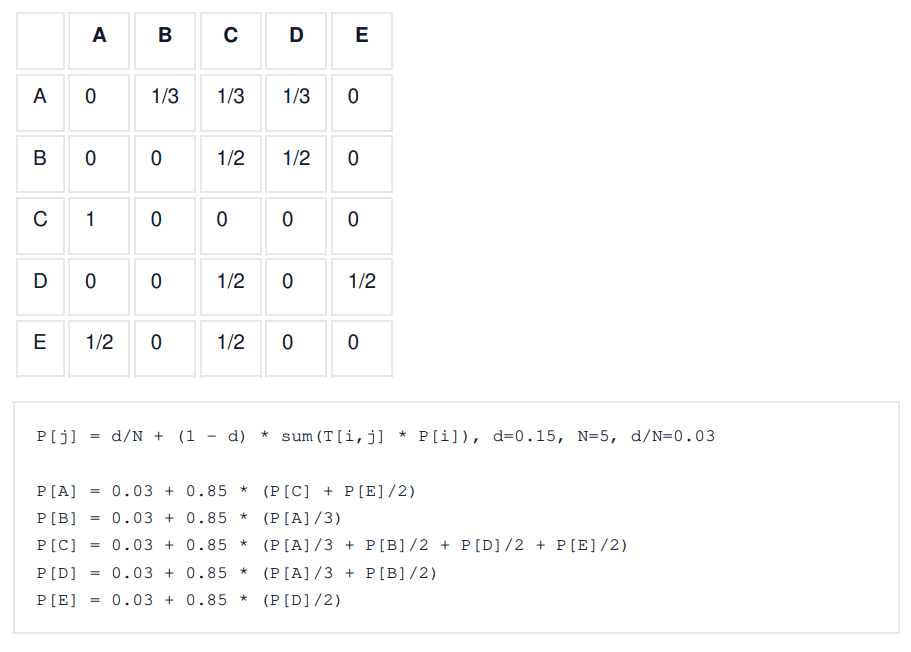

# מערכות בסיסי נתונים - סיכום

הערה: הסיכום משלים [לסיכום](https://click-go-easy.click/summaries/%d7%9e%d7%a2%d7%a8%d7%9b%d7%95%d7%aa-%d7%91%d7%a1%d7%99%d7%a1%d7%99-%d7%a0%d7%aa%d7%95%d7%a0%d7%99%d7%9d-%d7%a1%d7%99%d7%9b%d7%95%d7%9d-2-2/?playlist=56caabb8&video=2565939) [של אתר קליק](https://click-go-easy.click/summaries/%d7%9e%d7%a2%d7%a8%d7%9b%d7%95%d7%aa-%d7%91%d7%a1%d7%99%d7%a1%d7%99-%d7%a0%d7%aa%d7%95%d7%a0%d7%99%d7%9d-%d7%a1%d7%99%d7%9b%d7%95%d7%9d-2-2/?playlist=56caabb8&video=2565939)

## פרק 1 - מבוא

- שמירת מידע בצורה נוחה על ידי משתמשים בלי שיצטרכו להתעסק במימוש.
  - רמת המשתמש - ממשק, משתנה בין משתמש אחד לאחד (לדוגמה עובד ומנהל)
  - רמה תפיסתית - לוגיקה
  - רמה פיזית - מימוש
- תבנית - המבנה של המידע, מופע - הנתונים כרגע. יש תבנית לוגית ותבנית פיזית.
- מרכיבים - מושגים (סוגי המידע, עצמים וכו'), שפה, ביטוי אילוצים
- מודל היחסים - מתוך תורת הקבוצות - שימוש בקבוצות ויחסים (קבוצה של קבוצות המקיימות אותו)
- מודל ישויות קשרים - תיאור עצמים והמאפיינים שלהם
- מודל מובנה למחצה - תיאור מידע באופן גמיש (לדוגמה XML)

## פרק 2 - מודל היחסים

- בסיס נתונים יחסי (RDBMS)
  - טיפוס - סוג מידע, יש לו תחום ערכים (מספר, מחרוזת…)
  - עמודה - מבטאת תכונה, לכל אחת יש שם וטיפוס
  - טבלה - אוסף ערכים בעלי אותו מבנה (שהוא אוסף העמודות)
- יחס - קבוצה חלקית של מכפלה קרטזית
  - דרגה - מספר האיברים בכל שורה (מספר העמודות)
  - התכונות מוגדרות מעל תחומי הטיפוסים, קבוצת העל היא המכפלה הקרטזית של התחומים $`relation\ (prop1,\ prop2,\ prop3)`$

<!-- -->

- מפתח על - קבוצת תכונות כך שאין שתי שורות שונות שערכיהן זהים בכל התכונות בקבוצה, כלומר זהו מזהה של שורה.
- מפתח קביל - מפתח שאין בו תכונות מיותרות
- מפתח ראשי - מפתח קביל ספציפי שנבחר להיות המפתח העיקרי ביחס / טבלה.
- מפתח זר - תכונה של יחס שהיא מפתח של יחס אחר, "מצביעה" על השורה המקורית.
- דיאגרמת יחסים - משרטטים את כל היחסים ואם יש מפתחות זרים מוסיפים חצים בין המפתח למפתח הזר.
- ערך יכול להיות ריק (null)

### אלגברה של יחסים

- שאילתה - ביטוי של יחסים ופעולות שתוצאתו היא יחס
- עצמים - יחסים, תכונות
- פעולות
  - חיתוך, הפרש, איחוד
  - הטלה ($`\pi`$) - בחירת עמודות
  - בחירה ($`\sigma`$) - בחירת שורות
  - מכפלה קרטזית - יצירת יחס חדש כאשר "מכפילים" את הערכים זה בזה
  - חילוק - $`a/b`$ הוא היחס שאם נבצע פעולה קרטזית בינו $`b`$ אז נקבל יחס שהוא חלקי ל-$`a`$ (לא דרוש שיוויון מלא).
  - צירוף - מכפלה קרטזית עם בחירה, לרוב השוואת עמודות
    - צירוף טבעי - משווים את כל העמודות עם אותו השם
      - לשים לב - לפעמים יש עמודות עם אותו שם שאנו לא רוצים להשוות ושיוצרות תנאי ספציפי יותר (לדוגמה: לעשות צירוף בין אנשים לבין מקמות עבודה ובטעות נבחר רק את מי שעובד וגר באותה העיר)
      - כשהתבניות זהות - שקול לחיתוך
      - כשהתבניות זרות - שקול למכפלה קרטזית
  - שכפול ($`\rho`$) - העתקת יחס קיים, כדי להשתמש באותו היחס פעמיים
    - דוגמה - למצוא מוצר שנמכר ב-3 חנויות שונות
    - אין פתרון גנרי למוצר שנמכיר ב-n חנויות שונות כי אין לולאה.
  - השמה - לתת שם ליחס תוצאה של פעולה מסוימת
- האם התוצאה היא תמיד יחס? - אם אין הגבלה על אגרומנטים לא כי יחס הוא בהכרח במבנה אחיד ואפשר לשנות את מבנה הקבוצה
  - יחסים תואמים - בעלי אותה דרגה (מבנה) ותחומי ערכים

## פרקים 3-5 - שפת SQL

- אפשר להשתמש בפעולות $`+ , - ,*,/`$ ביחד עם התכונות בשאילתת select
- Like - דוגמה ל-regex, % זה מחרוזת כלשהי, \_ זה תו כלשהו (אחד)

select \* from products where name like %pants%

- $`order\ by\  < prop > \ \{ desc,asc\}`$ - סידור שורות לפי עמודה, לא מאוד שימושי
- $`create\ view\ v1\ as\  < query >`$ - טבלה "דינמית", הערכים שבה מחושבים מתוך טבלאות אחרות. מאפשר לוודא שהנתונים עדכניים ויש גישה רק למידע הכרחי.
  - עדכון ערכים הוא מורכב - כיצד יש לבצע בטבלה המקורית? (TODO: להרחיב)
- ביצוע פעולות כתנועה אחת: $`being\ atomic\  < queries > ;\ end;`$

### אילוצים

- פעפוע שינויים במפתח זר\
  $`foreign\ key\ p1\ references\ p2\ on\ \{ update,delete\}\ \{ cascade,set\ null,set\ default\}`$
- יצירת אילוץ תקינות עם שם - $`constraint\ c1\ check\ (query)`$

<!-- -->

- בדיקת אילוץ בסיום התנועה - $`initially\ deferred`$ \| תוך כדי תנועה - $`deferrable`$
- יצירת אילוץ כללי - $`create\ assertion\ a1\ check\ (query);`$
  - לא ממומש בכל מערכת, קשה לומר מתי לבצע כי הבדיקה היא על כל בסיס הנתונים.

### טיפוסי נתונים

- יצירת enum בשפה - $`create\ type\ answer\ as\ enum\ ('yes',\ 'no',\ 'maybe');`$

<!-- -->

- טיפוסי נתונים לאובייקטים גדולים - blob (מידע בינארי), clob (מידע טקסטואלי)
  - ניתן להגדיר עבורם גודל מקסימלי.
- הגדרת ברירת מחדל לעמודה - $`column1\ numeric(2,0)\ \ default\ 1,`$
- תבנית בסיס נתונים - ברמה הכללית מכילה את תבניות היחסים, האילוצים, משתמשים, הגדרות

### הרשאות

- הרשאות - $`all\ privileges,select,insert,update,delete`$
- תפקיד - משתמשים בו כדי להגדיר סט הרשאות למשתמשים. יצירה - $`create\ role\ r1;`$
  - תפקיד יכול לשמש כהרשאה
- הענקה - $`grant\ p1\ on\ t1\ to\ user1,user2;`$
- המשתמש יכול להיות public (כולם) או תפקיד
- למנהלן בסיס הנתונים (DBA) יש את כל ההרשאות על כל היחסים.
- $`with\ check\ option`$ - אם מוסיפים להגדרה של מבט שאומר שבכל עדכון שורות חייב התנאי של ה-$`where`$ חייב להתקיים.
- הרשאות גישה לתבניות
  - יש הרשאת $`references`$ שמאפשרת להגדיר מפתח זר מתוך מפתח של יחס. זה מכיוון שפעולות על עמודת מפתח משפיעות על עמודות של מפתח זר שמצביעות אליה.
- העברת הרשאות
  - כברירת מחדל אין אפשרות להעביר הרשאות, אם ב-$`grant`$ מציינים $`with\ grant\ option`$ אז אפשר להעביר אותה הלאה.
  - ככה נוצר גרף הענקת הרשאות שמראה מי יכול להעניק, השורש הוא ה-DBA.
- שלילת הרשאות
  - $`revoke\ p1\ on\ t1\ from\ user1`$.
  - פעפוע - כברירת מחדל אם שוללים הרשאה ממשתמש, ההרשאה תישלל גם מהמשתמשים שקיבלו את ההרשאה מאותו משתמש.
    - ההרשאה לא תישלל אם משתמשים קיבלו את אותה ההרשאה ממקורות נוספים.
  - אפשר לשלול זכות להעניק הרשאה בלי לשלול את ההרשאה - $`revoke\ grant\ option\ for\ p1\ on\ t1\ from\ user1`$
- הרשאות ברמת השורה
  - $`alter\ table\ t1\ enable\ row\ level\ security`$
  - $`create\ policy\ p1\ on\ t1\ using\ (condition)`$

### גישה ל-SQL משפת תכנות

- שיבוץ (Embedded) - ביצוע פקודות בתוך פקודות השפה, הקומפיילר מחליף בפקודות מתאימות.\
  דוגמה משפת $`C`$: $`EXEC\ SQL\ BEGIN....select\ *\ from\ t1;...\ EXEC\ SQL\ END...`$
- מנוע דינמי (מנוע ODBC) - התכנית שולחת הוראת SQL כמחרוזת\
  דוגמה משפת $`Java`$: $`statement.executeQuery("select\ *\ from\ t1;")`$

## כלים

- פונקציות
- פקודות בקרה
  - $`if,then,end\ if`$
  - $`if,\ then,\ else,\ end\ if`$
  - $`if,\ then,\ elseif,\ then,\ end\ if`$
  - $`case\ when,\ then,\ else,\ end\ case`$ - מחזיר ערך
- לולאות
  - $`while\ expression\ loop\ statements\ end\ loop;`$
  - $`for\ variable\ in\ expression\ ..\ expression\ \lbrack by\ expression\rbrack\ loop\ statements\ end\ loop;`$
    - דוגמה: $`for\ i\ in\ 5\ ..\ 15\ by\ 3`$
- סמן - $`cursor`$ - סריקת שורות תוצאה של שאילתה
  - $`variable\ cursor\ for\ query;`$
  - או: $`variable\ refcursor;`$ ואז שימוש ב- $`open\ variable\ for\ query\ loop\ statements\ end\ loop;`$
- טריגרים - בהינתן אירוע כמו הוספה, עדכון או מחיקה, אפשרות לשנות או למנוע את הפעולה.
  - בהתאם לפעולה מוגדרים המשתנים $`old,new`$ המכילים את הערך הישן והערך החדש
  - ערכי חזרה - $`null,\ new,\ old`$
  - שגיאה - $`raise\ exception`$ \| הודעה - $`raise\ notice`$

## פרק 6 - דיאגרמת ישויות קשרים

- ישות - סוג עצם, בפועל קבוצה של אובייקטים
- קשר - קיימים שני אובייקטים מתוך כל קבוצה שעבורם היחס מתקיים, בעל משמעות לוגית
  - לכן זוג סדור מופיע פעם אחת בקשר
  - דרגה - מספר ישויות בקשר
  - קשר רקורסיבי - קשר בין ישות לעצמה (לדוגמה: מורה שמלמד מורים אחרים)
  - תפקיד ישות - ניתן לציין מה תפקיד הישות בקשר עם תווית קטנה על הקו בתרשים
  - קשרים שונים בין אותן ישויות - אפשרי
- תכונה - מידע הקשור לישות או קשר. יש לה תחום ערכים.
  - תכונה מורכבת - צירוף תכונות פשוטות (struct), מציינים עם הזחה (לדוגמה: כתובת)
  - תכונה מרובת ערכים - קבוצה של ערכים (רשימה), (לדוגמה: "{שמות}")
  - תכונה ריקה (null) - אפשרית, אין ביטוי בדיאגרמה. (לדוגמה: ציון מועד ב)
  - תכונה מחושבת - ניתנת להסקה מתכונות אחרות (לדוגמה: חישוב ממוצע מתוך ציונים)

### אילוצים

- ריבוי
  - רבים לרבים (לדוגמה: תלמידים לספרים)
  - רבים ליחיד (לדוגמה: תלמידים למורה)
  - יחיד לרבים (לדוגמה: מורה לתלמידים)
  - יחיד ליחיד (לדוגמה: בני זוג)
  - סימון רבים עם קו רגיל, סימון יחיד עם חץ לכיוון הישות
  - לכל ישות בקשר יש את הריבוי שלה (לדוגמה: תלמיד, מורה, בחינה)
- אילוץ השתתפות
  - מלאה - כל ישות מהטיפוס חייבת להשתתף בקשר, סימון עם קו כפול (לדוגמה: תלמיד ומועד א')
  - חלקית - לא מלאה, סימון עם קו רגיל (לדוגמה: תלמיד ומועד ב')
- מפתחות -
  - ישות - סימון עם קו תחתון מתחת לתכונות (כמו מודל יחסים)
  - קשר -
    - צריך למצוא את על פי הישויות
    - יחיד ליחיד - מפתח של אחת הישויות
    - יחיד לרבים - צריך את המפתחות של מי שמשתתף כ"רבים" (כי אם נקבל רק את המפתח של ה"יחיד" אי אפשר להסיק באופן חד-חד ערכי את הקשר)
- טיפוס ישות חלש - התכונות שלו הן לא מפתח על, כדי לזהות נעזרים בטיפוס אחר שאיתו הוא בקשר רבים ליחיד. ניתן שיהיה לו גם מזהה פנימי ואז המפתח יהיה צירוף של המפתח הזר והפנימי. סימון עם מעויין עם קו כפול, קו כפול לישות החלשה (רבים) וחץ לצד השני (יחיד)
  - ניתן ליצור מפתח שרירותי אבל המטרה היא לייצג את המציאות
  - מתאים להיות תכונה מורכבת או מרובת ערכים של הטיפוס החזק
  - קו מקווקוו מתחת לתכונה שהיא מזהה הפנימי

\

### פירוט והכללה

- קשר IS A (סוג של), ירושה
- סימון ע"י חץ עם ראש חלול
- אם יצירת הקשר הייתה חלוקת טיפוס קיים - פירוט.\
  אם הייתה זיהוי תכונות משותפות - הכללה.
- אילוצים
  - אילוץ שלמות - האם כל ישות ברמה הגבוהה חייבת להיות גם מופע ברמה הנמוכה?
    - מלא - כל ישות. סימון על ידי חץ מקווקוו עם total
    - חלקי - לא כל ישות
  - השתייכות ישויות ברמה הנמוכה - האם ישות ברמה הנמוכה יכולה להיות מופע של יותר מישות אחת ברמה הנמוכה?
    - חפיפה - מורה יכול להיות גם מטופל, ושניהם בני אדם. סימון עם חצים נפרדים מהרמה הנמוכה. במצב כזה למופע יכול להיות את התכונות של כל הישויות ברמה הנמוכה.
    - קבוצות זרות - לא תיתכן חפיפה, סימון עם קו שמחבר בין טיפוסי הישויות ברמה הנמוכה ויוצא חץ חלול אחד לרמה הגבוהה.
- קיבוץ
  - המרת פירוט והכללה לתבניות יחסים
    - המרת שתי הרמות - היחס ברמה הנמוכה מכיל מפתח זר לרמה הגבוהה
    - המרת רמה נמוכה - נשים את תכונות הרמה הגבוהה בכל יחס ברמה הנמוכה. מתאים כאשר הפירוט מלא ומחלק לקבוצות זרות שאין ביניהם קשרים.
    - המרת הרמה העליונה - היחס יכיל גם תכונה הממיינת לסוגים השונים. מתאים כאשר לטיפוסים ברמה הנמוכה אין תכונות מיוחדות.

### המרת יחסים לתרשים

- ישות - רגילה / חלשה / יורשת
- קשר -
  - רגיל - עבור כל ישות ריבוי יחיד/רבים, השתתפות חלקית/מלאה
  - הורשה - עבור כל ישות שלמות מלאה/חלקית (האם כל ישות גבוהה חייבת להיות גם מופע ברמה הנמוכה? סימון עם total), קבוצות חופפות/זרות (האם ישות נמוכה יכולה להיות מופע של יותר מישות אחת ברמה נמוכה?, סימון עם חצים נפרדים או מאוחדים)

\

### המרת תרשים ליחסים

- ישות -\> יחס
- תכונה מרובת ערכים, תכונה מורכבת -\> ישות חלשה -\> יחס עם מפתח זר ומפתח פנימי
  - ניתן להפוך לתכונה אחת רגילה או לפרק למרכיבים
- קשר רבים לרבים -\> יחס עם עמודה לכל מפתח של ישות ועמודה לכל תכונה
- קשר רבים ליחיד -\> כמו רבים לרבים וגם אפשר להכניס את הקשר ליחס הישות שהיא "רבים"
- שיקולים
  - נאמנות למציאות
  - רלוונטיות (שימושיות)
  - ייצוג יחיד (כדי למנוע באגים ולחסוך מקום)
  - פשטות

### אילוץ ריבוי

- בקשר בין A,B,C כדי לקבוע את ריבוי ישות A: אם בחרתי כבר ערכים עבור B,C האם ייתכן רק ערך יחיד עבור A?
- אם A,B הם המפתח, גם אם B,C קבועים אז עבור A ייתכנו ערכים שונים - עמודה של מפתח היא "רבים"
- אם A היא מפתח זר (עמודה שהיא לא חלק מהמפתח של הקשר אבל היא מפתח של ישות) ו-B,C מפתח, אם B,C קבועים אז עבור A ייתכן ערך יחיד - עמודה של מפתח זר היא יחיד.

\

## פרק 7 - תיכון במודל היחסים

- תלות - פונקציה של קבוצת תלויות לקבוצת תלויות אחרת
- יחס יכול לקיים תלות לפי הנתונים שנמצאים כרגע, אבל לא נגיד שהתלות חלה עליו. ייתכן שבהמשך יגיע נתון שיסתור את התלות.
- באמצעות התלויות אפשר להסיק את צורות הריבוי בין התכונות (יחיד-רבים)
- תלות טריוויאלית - נובעת ישירות מההגדרה, לדוגמה $`A \rightarrow A`$
- סגור של קבוצת תלויות - כל התלויות שנובעות ממנה לוגית.
- כלל האיחוד / פירוק - אפשר לאחד / לפרק תלויות לפי צד שמאל
- סגור של קבוצת תכונות - כל התכונות שנובעות לוגית מקבוצת התכונות הנתונה ומהתלויות
  - מכיל את הקבוצה עצמה (תלות טריוויאלית)
  - טרנזיטיבי
  - מפתח - קבוצת תכונות שהסגור שלה היא התבנית (כל התכונות)
- חישוב סגור - מתחילים מקבוצת התכונות, עוברים על התלויות שוב ושוב וכל פעם מוסיפים עוד תכונות עד אין עוד תלויות שיוסיפו עוד תכונות
- מציאת מפתחות קבילים
  - עקרונית צריך לעבור על כל תתי הקבוצות אבל זה חישוב כבד מאוד
  - שיקולים
    - תכונה שלא תלויה באף תכונה אחרת צריכה להיות בכל מפתח
    - אם קבוצת תכונת היא מפתח אין צורך לבדוק אותה בעוד קבוצות
    - אם סגור של קבוצה מכיל מפתח אז גם היא מפתח
- בדיקת שייכות של תלות לסגור $`F^{+}`$ - כדי לבדוק אם $`X \rightarrow Y`$ ב-$`F`$ בודקים אם הסגור של $`X`$ ב-$`F`$ מכיל את $`Y`$.
- כיסוי קנוני $`F_{c}`$
  - קבוצת תלויות שהסגור שלה הוא $`F^{+}`$ אבל אין בה תכונות עודפות ואין תלויות עם אגף שמאל זהה. נניח ש-$`F`$ מכילה את $`AB \rightarrow CD`$
  - בדיקת עודפות בצד ימין: $`D`$ עודפת אם היא בסגור של $`ABC`$
  - בדיקת עודפות בצד שמאל: $`B`$ עודפת אם היא בסגור של $`A`$
  - אלגוריתם: מתחילים עם $`F`$, עוברים על כל התלויות ועל כל התכונות שלהן ובודקים עודפות, מסיימים אם עוברים על הכל ואין יותר תכונה עודפת.

\

### פירוק תבנית

- שיקולים
  - ייצוג יחיד
  - שימור מידע
  - שימור אילוצים
- אפשר למנוע כפילות על ידי פירוק תבניות ובו איחוד כל החלקים שווה לקבוצה המקורית.
- פירוק משמר מידע - אמ"מ מתקיים $`(R_{1} \cap R_{2} \rightarrow R_{2}) \cup {(R}_{1} \cap R_{2} \rightarrow R_{1})`$
  - במילים: החיתוך של היחסים הוא מפתח של אחד מהם.
  - אינטואיציה: אם התנאי מתקיים אז אפשר לבצע צירוף טבעי ולשחזר את המקורית.
- שימור תלויות - אמ"מ $`(F_{1} \cup ... \cup F_{n})^{+} = F^{+}`$, כלומר לא איבדנו תלויות לוגיות.
  - כדי להוכיח: צריך לעבור על כל קבוצת תכונות ולראות שהסגור שווה בשני המקרים
- צורת BCNF
  - כל תלות ב-$`F^{+}`$ בה היא טריוויאלית או שהקבוצה בצד שמאל היא מפתח
    - מספיק לבדוק את $`F`$ ואת $`F_{c}`$ כי לפי טרנזיטיביות גם $`F^{+}`$ תהיה בBCNF
  - פירוק משמר מידע
    - מוצאים תלות $`X \rightarrow Y`$ שמפרה את BCNF, מפרקים לשתי תבניות $`(X,Y),R - Y`$
    - יש הרבה פירוקים
    - חלקם משמרים תלויות וחלקם לא. לא לכל תבנית יש פירוק משמר תלויות.
- צורת 3NF
  - כל תלות ב-$`F^{+}`$ בה היא טריוויאלית או שהקבוצה בצד שמאל היא מפתח או שכל תכונה בצד שמאל מוכלת במפתח קביל כלשהו.
  - מכילה ממש את BCNF
  - פירוק משמר מידע ותלויות
    - אלגוריתם: לוקחים את הכיסוי הקנוני, יוצרים יחס לכל תלות ודואגים שקיים יחס שמכיל את כל התכונות של אחד המפתחות.

נוח לבדוק תלויות עודפות על ידי טבלה:

| תלות | תכונה | סגור | האם תכונה עודפת? | עדכון |
|----|----|----|----|----|
| $`E \rightarrow ECG`$ | E | $`E^{+} = EGC`$ | כן | $`E \rightarrow CG`$ |

## פרק 8 - טיפוסי נתונים מורכבים

- מידע מובנה למחצה - אינו בעל תבניות מוגדרות במו ב-SQL
- מידע מילולי
  - חיפוש לפי מילות מפתח - TF-IDF
  - דירוג דפים לפי חשיבות - PageRank
    - ממלאים טבלה מתוך הגרף, אם A מצביע ל-k קודקודים אז בשורה של A ממלאים $`\frac{1}{k}`$ עבור כל קודקוד יעד.
    - מתחילים עם $`P\lbrack V_{i}\rbrack = \frac{1}{n}`$, יוצרים מערכת משוואות של משוואות PageRank מבצעים איטרציות עד שאין עוד שינוי עד כדי דלתא (לדוגמה 0.02)

דוגמה:\

- מידע מרחבי
  - ייצוג באמצעות פרמטרים גיאומטריים - כמו מעגל באמצעות מרכז רדיוס
  - ייצוג באמצעות קודקודים - שימושי לייצוג פוליגון
  - ייצוג באמצעות משולשים - אפשר לחלק את הפוליגון למשולשים
  - גם צורות שאינן פוליגונים אפשר לייצג בקירוב עם פוליגונים
  - ייצוג באמצעות מפות סיביות / מפות פיקסלים - לפעמים יותר נוח ויזואלית
  - אפשר לייצג סוגים שונים של מידע באמצעות שכבות מידע, כל אחת תכיל מידע שונה
- JSON
- XML\
- RDF
  - כל שורה היא שלשה - נושא, יחס, מושא
  - ניתן לייצוג באמצעות גרף
  - SPARQL - כתיבת שאילתות, ב-WHERE כותבים תנאי שהוא רשימה של שלשות כמו ב-RDF, ניתן להשתמש בו בשמות של משתנים ואז לבחור אותם ב-SELECT.
  - בסוף כל שורה יש נקודה

volunteer1 instanceof volunteer .

volunteer1 vid "1" .

volunteer1 vname "ruth cohen" .

select ?shelter-name, ?supply-name

where {

?shelter instance-of shelter .

?supply instance-of supplies .

?request instance-of request .

?request hasShelter ?shelter .

?request requestedSupply ?supply .

?shelter name ?shelter-name .

?supply name ?supply-name .

}

## פרק 9 - אחסון ומבני קבצים

- התקן נדיף - המידע נמחק כאשר מנותק ממתח חשמלי
- אחסון ראשי - זיכרון של תכניות המחשב, נדיף, קטן ויקר
- אחסון משני - דיסק והתקנים חיצוניים, לא נדיף, גדול וזול
- קריאה מזיכרון נעשית בגושים (בלוקים)
- מערכת ההפעלה מתרגמת את הקריאות מהקובץ לקריאות מהזיכרון הפיזי.
- קובץ יכול להיות מאורגן בערימה (בלי סדר), מיון לפי שדה מסוים או חלוקה לגושים לפי פונקציית גיבוב.
  - הסדר תלוי מאוד בשימוש שיש במידע
- בדרך כלל כל יחס מקבל קובץ נפרד, לפעמים כמה שורות מקבצים שונים מאוגדים יחד.
- מילון הנתונים - metadata, תבניות היחסים, תחומי התכונות, אילוצים, תצפיות וכו'\

## פרק 10 - אינדקסים

- כדי להשתמש בבסיס נתונים פעמים רבות צריך לאתר מתוכו נתונים לפי תכונה אחת או יותר.

### אינדקסים ממוינים

- אינדקס - קובץ ממויין של רשומות שכל אחת מכילה ערך של מפתח החיפוש ומצביע על רשומה בקובץ הראשי. כל רשומה נקראית גם תא.
- אינדקס ראשי - אם הרשומות של בסיס הנתונים עצמו ממויינות לפי שדה של אינדקס אז הוא נקרא אינדקס ראשי
- אינדקס צפוף - מכיל כמות תאים שקרובה לקובץ הראשי, שימושי כי בכל זאת יש פחות מידע ולכן יהיו פחות קריאות מהדיסק.
- אינדקס דליל - מכיל כמות תאים נמוכה מהקובץ הראשי. בדרך כלל הקובץ הראשי צריך להיות ממויין לפי השדה ואז אפשר לשמור מצביע לתחילת הגוש. כשרוצים למצוא ערך סורקים את הגושים עד שמגיעים לשני גושים שהערך נמצא אחרי הראשון אבל לפני השני.

### אינדקס רב-רמות

- אם יש הרבה ערכים באינדקס אז כבר נהיה קשה למצוא בו את המצביע המתאים. הפתרון - אחסון בכמה רמות
- אינדקס משני - כאשר שדה החיפוש הוא לא מפתח אז ייתכנו כמה שורות עם אותו ערך, לכן האינדקס מכיל מצביע לסל של מצביעים, בדרך כלל בגודל של גוש.
  - אם צריך עוד מקום, הסל יכול להצביע על סל נוסף

#### עץ B+

- אינדקס רב רמות, יכול להיות צפוף או דליל, ראשי או משני
- מתאים את עצמו לגודל הקובץ העיקרי מבלי לאבד מיעילותו
- עץ מאוזן - כל הענפים הם באותו אורך
- מבנה של צומת - רשימה של מצביעים עם ערכים ביניהם, הערכים ממויינים
- $`\lceil\frac{n}{2}\rceil < N_{P}\  < n`$, $`\lceil\frac{n}{2}\rceil - 1 < N_{V} < n - 1`$, בשורש מותר פחות מ-$`\lceil\frac{n}{2}\rceil\`$ מצביעים\
  $`N_{V} = N_{P} - 1`$
- עלה:
  - אינדקס ראשי - מצביעים הם לקובץ העיקרי
  - אינדקס משני - מצביעים הם לסלי מצביעים
  - בכל עלה $`P_{k}`$ מצביע על אחיו הימני, בעלה הימני ביותר הוא NULL
- צומת פנימי:
  - הערכים מחלקים לתתי עצים כאשר לכל אחד יש טווח
- איתור רשומה - מתחילים בשורש, מתקדמים ימינה בצומת כל עוד הערך גדול ולמטה כל עוד הערך קטן עד שמגיעים לעלה
- כלל אצבע: $`N_{P}sizeof(P) + N_{V}sizeof(V) = (n)sizeof(P) + (n - 1)sizeof(V) = block - size`$\
  כדי שיהיה ניתן לאחסן בבלוק צומת אחד
- גודל העץ
  - אם נתון מספר הערכים:
  - אם נתון מספר הערכים:
    - מקסימום
      - עלים: לעלה יש מינימום ערכים: $`\ \lceil\frac{values}{\lceil\frac{n}{2}\rceil - 1}\rceil`$
      - רמות: להורה יש מינימום בנים: $`\lceil\log_{\lceil\frac{n}{2}\rceil}(\ \ \lceil\frac{values}{\lceil\frac{n}{2}\rceil - 1}\rceil)\rceil`$
    - מינימום
      - עלים: לעלה יש מקסימום ערכים: $`\lceil\frac{values}{n - 1}\rceil`$.
      - רמות: להורה יש מקסימום בנים: $`\lceil\log_{n}(\lceil\frac{values}{n - 1}\rceil)\rceil`$
    - רמות: אפשר גם לחלק את העלים ב-$`\lceil\frac{n}{2}\rceil`$ או ב-$`n`$ עד השורש.
  - אם נתון $`n`$ ומספר רמות $`l`$:
    - מקסימום עלים - מקסימום בנים: $`n^{l}`$
    - מינימום עלים - מינימום בנים: $`2(\frac{n}{2})^{l - 1}`$ (לשורש שני בנים)
    - סה"כ ערכים: לעלים יש מינימום/מקסימום ערכים: מכפילים עלים ב-$`\lceil\frac{n}{2}\rceil - 1`$ או ב-$`n - 1`$.
  - כמות צמתים פנימיים $`P`$ -
    - אפשר לחלק כל פעם במספר הבנים שיש לכל צומת עד שמגיעים לשורש
    - קיימת הנוסחה - $`P = \frac{L - 1}{m - 1}`$(כאשר $`L`$ מספר העלים ו-$`m`$ מספר הבנים של כל רמה, נכון בגלל הקשר בין צמתים לקשתות בעץ $`Pm = (P + L) - 1`$)
- הכנסת ערכים
  - מציאת עלה דומה לחיפוש
  - אם יש מקום בעלה - מכניסים
  - אם אין מקום
    - פיצול עלה - מחלקים ל-2 ומעתיקים את הערך הקטן ביותר בצומת הימני לצומת הורה
    - פיצול צומת פנימי - מחלקים ל-2 ומעבירים את האמצעי (הגדול ביותר בצומת השמאלי) לצומת הורה
  - שינוי מבוצע באופן מקומי - באותו עלה או בענף שלו
- מחיקת ערכים
  - אם יש בסוף יש מספר עלים מינימלי אז מוחקים רגיל
  - אם אין:
    - בודקים אם אפשר לקחת ערך מעלה אח, אם כן אז מעדכנים את הערך שנמצא בין שני העלים בצומת הורה.
    - או משלבים את העלה עם העלה האח הדליל יותר ומוחקים את המצביע בהורה

### אינדקסים מבוססי גיבוב

- יעיל אך אינו גמיש. מנוהלים סלים של מצביעים כך שאיתור הסל הוא מהיר.
- גיבוב סטטי - יש מספר קבוע של סלים, מסתכלים על הערך של פונקציית הגיבוב באותו אופן, בעייתי אם נוצר סל גדול מדי.
- גיבוב מתרחב - יש מספר משתנה של סלים
  - כל פעם כשנגמר המקום בסל מסתכלים על הביט הבא בפונקציית הגיבוב ולפי זה מחליטים את הסל. שומרים לכל הסל את מספר הביטים שהוא מסתכל עליהם.
  - מספר השורות בטבלת כתובות הסלים הוא $`2i`$.

### אינדקסים מבוססי מפת סיביות

- לוקחים את קבוצת הערכים של עמודה מסוימת, יוצרים טבלה שבה הערכים הם השורות והעמודות הן מספרי השורות בקובץ הראשי, אם ביט הוא 1 בשורה i ועמודה j סימן שהערך i בשורה j בקובץ הראשי.
- כדי לחפש כמה ערכים אפשר לבצע פעולת AND בין מחרוזות הביטים (השורות) של הערכים

>

### שימוש באינדקסים

- אם יש שדה משמעותי שלפיו שולפים ו/או הגיוני לשלוף שורות בעלות אותו ערך- למיין את השורות לפיו וליצור אינדקס ראשי
- שדות חשובים אחרים - אינדקסים משניים
- שאילתות טווח - עצי B+
- אם יש מספר גבוה של ערכים לא מתאים להשתמש במפת סיביות

\

## פרק 11 - עיבוד שאילתות

### פענוח

- בודקים את תחביר השאילתה והיא מתורגמת לייצוג פנימי, בדרך כלל באלגברה של יחסים
- נוח לייצוג באמצעות עץ ביטוי, שמגדיר את סדר הפעולות.

### אופטימיזציה

- מחפשים חלופות שונות לביצוע אותה הפעולה.
- עדיף לבצע בחירה כמה שיותר מוקדם, וכמה שיותר מצומצם.
- יעילות - בדרך כלל נמדדת בכמות הנתונים, בשורות או מספר הגושים שנקראים מהדיסק
- $`n_{r}`$ - מספר שורות ביחס\
  $`b_{r}`$ - מספר הגושים של שורות היחס\
  $`s_{r}`$ - גודל רשומה\
  $`V(A,r)`$ - מספר הערכים השונים זה מזה בתכונה A
- אופטימיזציה חשובה בעיקר כאשר יש כמה פעולות (כי בפעולה אחת צריך לגעת לרוב באותם הגושים)
- איחוד של שתי עמודות - לכל היותר של הקבוצה הגדולה ולכל הפחות הקבוצה הקטנה
- אלגוריתמים
  - הערה: במדריך יש הערכות חישוב נוספות, לא רשמתי אותן כאן
  - פעולת בחירה עם שיוויון
    - סריקה סדרתית - $`b_{r}`$ (אם מאוחסן רצוף) $`n_{r}`$ (אם לא)
    - חיפוש בינארי (אם הרשומות ממויינות ומאוחסנות רצו) - אם התכונה היא מפתח אז $`\lceil\log_{2}(b_{r})\rceil`$ואם לא אז ייתכן שנביא עוד גושים - $`\lceil\frac{b_{r}}{V(A,R)}\rceil`$
    - אינדקס (עץ B+) - גובה העץ $`\lceil\log_{\lceil\frac{n}{2}\rceil}(V(A,r))\rceil`$, היעילות משתנה (רשום במדריך)
  - בחירה עם השוואה לתחום
    - אינדקס (עץ B+) - חיפוש שני התחומים
  - בחירה עם תנאי מורכב
    - עדיף לבצע את התנאי עם הסלקטיביות הגבוהה יותר (תוצאה קטנה יותר)
  - צירוף
    - אפשר לחשב איתה את כל הפעולות הבינאריות
      - אם אין עמודות משותפות - מכפלה קרטזית
      - אם כל העמודות משותפות או נדרש שיוויון בכולן - חיתוך
      - פעולת הפרש ניתן לראות כשילוב של פעולות חיתוך
      - איחוד - לכל היותר סכום הגדלים, בעיקר צריך להוריד כפילויות וזה גם מקרה מיוחד של חיתוך
    - צירוף עם מפתח - כל שורה ביחס בלי המפתח מצטרפת לכל היותר לשורה אחת ביחס בלי - לכן מספר השורות הוא לכל היותר היחס הגדול.\
      אם שני היחסים הם מפתחות - הגודל יהיה לכל היותר היחס השני
    - בניית יחס עם לולאה מקוננת
    - שימוש באינדקס - אפשר לעבור על שורות יחס אחד ולחפש את הערכים המתאימים ביחס השני עם אינדקס
    - צירוף בין יחסים הממויינים לפי עמודה משותפת - ממזגים את שני הקבצים תוך סריקתם ותוך כדי בונים את התוצאה
    - הערכות
      - חסם עליון - אם יש יותר ערכים ייחודיים ב-S מאשר R אז הם ירדו, יש הנחה מקלה שתרד רק שורה אחת לכל ערך (בפועל יכולות לרדת יותר)
      - ממוצע - אנחנו לוקחים כל "קבוצת" שורות ב-S ומכפילים אותה בקבוצת הערכים הייחודיים של עמודת המפתח.
      - כשעושים מכפלה או צירוף עם בחירה של חלק מערכי המפתח, אפשר לעשות קודם את הצירוף בין היחסים ואז לחלק את מספר הרשומות לפי ההופעות ביחס המקורי (לדוגמה: צירוף בין 10,15 כאשר בחרנו חמישית מיחס אחד: $`\frac{10*15}{5}`$)
- חישוב ביטוי מורכב
  - אחסון תוצאות ביניים - מבצעים לפי סדר הפעולות
  - שרשור פעולות - מעבירים כל שורה ישירות לפעולה הבאה. לא תמיד זוהי עדיפה ולא תמיד אפשר להשתמש בה.
    - בעיקר נוח כאשר יש הטלה וזו הפעולה האחרונה
- שקילויות (טריוויאליות ומופיעות במדריך עמוד 294)
- האופטימיזציה קובעת תכנית ביצוע, אבל אסור לה להיות מסובכת (אחרת פספסנו את המטרה)
- יוריסטיקות
  - ביצוע מוקדם ככל האפשר של בחירה וכמה שיותר סלקטיבית
  - ביצוע מוקדם ככל האפשר של הטלה
  - ביצוע מוקדם ככל האפשר של צירופים ומכפלות שתוצאתם קטנה יותר

<!-- -->

- אחרי שמבצעים בחירה בתוך יחס אפשר להניח ש-V נשאר אותו דבר כיוון שהוא גודל הערכים הייחודיים ולא כמות אבסולוטית.
- פעולת הטלה על קבוצת עמודות שהיא מפתח - לא משנה את כמות השורות

## SQL Examples

create table if not exists supplies (

sid int primary key,

sname varchar(50),

category varchar(50),

quantity int,

location varchar(50),

area varchar(50));

create table if not exists request (

rid int unique,

id int,

sid int,

quantity int,

priority varchar(50),

status varchar(50),

rdate date,

foreign key (id) references shelter (id),

foreign key (sid) references supplies (sid),

primary key (rid, id));

insert into supplies values (1, 'mineral water', 'food', 95, 'tel aviv warehouse', 'central');

create or replace function trigf1() returns trigger as \$\$

begin

if ('done' in (select request.status

from request

where request.rid = new.rid and request.id = new.id)) then

begin

raise exception 'request already satisfied';

End;

Create function trigf1() returns trigger as \$\$

Declare tot int;

Begin

If ((new.rid, new.id) in (select rid, id From request Where status='done')) then

Begin

;'הבקשה כבר סופקה' notice Raise

Return null;

End;

End if;

Select sum(quantity) From distribution into tot Where rid=new.rid and id=new.id ;

if (tot is null) then

tot=new.quantity;

else tot=tot+new.quantity;

end if;

If (tot\>=all (select quantity From request Where rid=new.rid and id=new.id)) then

Update request Set status='done' Where rid=new.rid and i

end if;

End if;

Return new;

End;

\$\$ language plpgsql;

create trigger check_distribution

before insert on distribution

for each row

execute procedure trigf1();

– Find shelter that can hold more than 200 people.

select \* from shelter where capacity \> 200;

– Find volunteers that distributed clothing

select distinct volunteer.vname

from volunteer

join distribution on volunteer.vid = distribution.vid

join request on request.rid = distribution.rid and request.id = distribution.id

join supplies on supplies.sid = request.sid

where supplies.category = 'clothing';

– Find volunteers that distributed to over 50 shelters

select distinct volunteer.vname, volunteer.vid

from volunteer

join distribution on volunteer.vid = distribution.vid

join shelter on distribution.id = shelter.id

group by (volunteer.vid)

having count(distinct shelter.id) \> 50;

– Find shelters that have at least twitce as high as the average capacity of all shelters

select shelter.id, shelter.name, shelter.contact

from shelter

where shelter.occupancy \> (

select (avg(shelter.capacity) / 2)

from shelter

);

– Find volunteers that never distributed to shelters that requested supplies in a higher quantity then the average quantity for that supply

select volunteer.vid, volunteer.vname

from volunteer

where volunteer.vid not in

(select volunteer.vid

from request

join distribution on request.rid = distribution.rid and request.id = distribution.id

join volunteer on distribution.vid = volunteer.vid

group by request.sid, volunteer.vid

having sum(distribution.quantity) \> (sum(request.quantity) / count(request.quantity)));

– From the volunteers that are skilled in organizing find the volunteer that distributed the most supplies

select v1.vid, v1.vname, sum(d1.quantity)

from volunteer as v1

join distribution as d1 on d1.vid=v1.vid

group by (v1.vid)

having v1.skill = 'organizing' and sum(d1.quantity) \>=all(

select sum(d2.quantity)

from volunteer as v2

join distribution as d2 on d2.vid=v2.vid

group by (v2.vid)

having v2.skill = 'organizing');

– From the shelters that never requested lower than 50 blankets, find the shelter that requested the most water.

select shelter.id, shelter.name, shelter.address

from request

join supplies on request.sid = supplies.sid

join shelter on request.id = shelter.id

group by (shelter.id, supplies.sname)

having

shelter.id not in (

select request.id

from request

join supplies on request.sid = supplies.sid

where request.quantity \< 50 and sname = 'winter blanket'

)

and

supplies.sname = 'mineral water'

and

sum(request.quantity) \>= all(

select sum(request.quantity)

from request

join supplies on request.sid = supplies.sid

group by (request.id, supplies.sname)

having supplies.sname = 'mineral water'

);

## תרגול

- מבחן 1 דוגמה
  - 4 - אם רוצים למצוא מקסימום (או מינימום) אז אי אפשר לשאול ישירות, עדיף למצוא את כל מי שקטן (או גדול) מאיבר אחר כלשהו ולחסר מהקבוצה הכללית
- מבחן 4 דוגמה
  - 1 - אסור להעביר פריט ממדף למדף כי התאריך אינו חלק מהמפתח
- מבחן 5 דוגמה
  - 2 - אם מבקשים "לפחות 2 פריטים שונים מאותה קטגוריה" צריך לבצע עוד join עם תנאי מתאים
  - 5 - "ציינו מהו הפירוק הזה" - האם 3NF או BCNF
- מבחן 6 דוגמה
  - 2א - המוצר השני הכי יקר

SELECT B.cid FROM Buys B, Product P WHERE B.pid = P.Pid AND P.Price =\
ALL (SELECT MAX(P2.Price) FROM Product P2 WHERE P2.Price \<\
ALL (SELECT MAX(P3.Price) FROM Product P3))

- 2ב - לשים לב לאגריגציה, אני חשבתי שזה מוצר שקנו אותו מעל 100 לקוחות אבל זה מוצר שיצרו אותו מעל 100 יצרנים

SELECT C.cid FROM Customer C, Buys B, Product P WHERE C.cid = B.cid and B.pid = P.pid GROUP BY C.cid HAVING count(\*) \> 100

- מבחן 2022a 88
  - 4 - כשרוצים להעריך גודל ועושים צירוף ביחד עם בחירה, אפשר לעשות קודם את הצירוף ואז לחלק את מספר הרשומות לפי התדירות שלהם בכל יחס בנפרד $`500000*\frac{1}{40}*\frac{1}{500}`$
- הכנות למבחן
  - נכסים ומתווכים
    - דוגמה לפונקציה $`f(x\ varchar(9),\ y\ integer)\ returns\ void`$
    - קריאה $`select\ func('abc',10);`$
    - השוואה $`where\ A.x\  < \ (select\ sum(y)\ from\ R);\`$
  - כנסים ומרצים
    - כשעושים אגריגציה לא חייבים לבצע אותה בשאילתה המרכזית, אפשר לעשות משהו בסגנון: $`select\ *\ from\ R\ where\ 3\  < (select\ count(a)\ from\ T)`$
    - השוואת שנה - $`where\ date\_ part('year',current\_ date)\  = \ 2024`$
    - ב-if אין סוגריים סביב התנאי

## לכתוב בחוברת

### המרת יחסים לתרשים

- ישות - רגילה / חלשה / יורשת
- קשר -
  - רגיל - עבור כל ישות ריבוי יחיד/רבים, השתתפות חלקית/מלאה
  - הורשה - עבור כל ישות שלמות מלאה/חלקית (האם כל ישות גבוהה חייבת להיות גם מופע ברמה הנמוכה? סימון עם total), קבוצות חופפות/זרות (האם ישות נמוכה יכולה להיות מופע של יותר מישות אחת ברמה נמוכה?, סימון עם חצים נפרדים או מאוחדים)

<!-- -->

- קביעת n ו : $`(n)sizeof(P) + (n - 1)sizeof(V) = block - size`$
- גודל העץ
  - אם נתון מספר הערכים:
    - מינימום עלים: בעלה מינימום ערכים: $`\ \lceil\frac{values}{\lceil\frac{n}{2}\rceil - 1}\rceil`$
    - מינימום עלים: בעלה מקסימום ערכים: $`\lceil\frac{values}{n - 1}\rceil`$.
    - רמות: להורה יש מינימום/מקסימום בנים: מחלקים את העלים ב-$`\lceil\frac{n}{2}\rceil`$ או ב-$`n`$ עד השורש.
  - אם נתון $`n`$ ומספר רמות $`l`$:
    - מקסימום עלים: מקסימום בנים: $`n^{l}`$
    - מינימום עלים: מינימום בנים: $`2(\frac{n}{2})^{l - 1}`$ (לשורש שני בנים)
    - סה"כ ערכים: לעלים יש מינימום/מקסימום ערכים: מכפילים עלים ב-$`\lceil\frac{n}{2}\rceil - 1`$ או ב-$`n - 1`$.
  - כמות צמתים פנימיים $`P`$:
    - אפשר לחלק כל פעם במספר הבנים שיש לכל צומת עד שמגיעים לשורש
- צירוף
  - כשעושים מכפלה או צירוף עם בחירה של חלק מערכי המפתח, אפשר לעשות קודם את הצירוף בין היחסים ואז לחלק את מספר הרשומות לפי ההופעות ביחס המקורי (לדוגמה: צירוף בין 10,15 כאשר בחרנו חמישית מיחס אחד: $`\frac{10*15}{5}`$)
- עיבוד שאילתות - לכתוב נוסחאות שימושיות
- נכסים ומתווכים
  - דוגמה לפונקציה $`f(x\ varchar(9),\ y\ integer)\ returns\ void`$
  - קריאה $`select\ func('abc',10);`$
  - השוואה $`where\ A.x\  < \ (select\ sum(y)\ from\ R);\`$
- כנסים ומרצים
  - כשעושים אגריגציה לא חייבים לבצע אותה בשאילתה המרכזית, אפשר לעשות משהו בסגנון: $`select\ *\ from\ R\ where\ 3\  < (select\ count(a)\ from\ T)`$
  - השוואת שנה - $`where\ date\_ part('year',current\_ date)\  = \ 2024`$
  - ב-if אין סוגריים סביב התנאי
