# מערכות הפעלה - סיכום

## מבוא

- מערכת הפעלה - תוכנה שמנהלת את חומרת המחשב.
- מקשרת בין המשתמש לבין היכולות של המחשב
- בסיס להרצת אפילקציות שונות - גרעין המערכת רץ במצב מיוחס (הרשאות גבוהות) ואפליקציות לא
- נותנת לאפליקציות ממשק לגישה לחומרה
- חייבות להיות פעולות שלא דורשות התערבות מ"ה כדי לשמור על ביצועים טובים
- הפשטה - מסתירה מורכבות ונותנת ממשק נוח
- סוגים - מחשב אישי, שרתים, מערכות מבוזרות, משובצות (embedded) (לדוגמה מכונת כביסה), זמן-אמת (לדוגמה מטוס)
- קריאת מערכת -
  - בקשת שירותים ממערכת ההפעלה
  - עוברים ממצב משתמש למצב מיוחס
  - הצלחה אינה וודאית לכן מוחזר ערך הצלחה או כישלון ותוצאה אמיתית לרוב דרך אוגרים
  - לרוב תהיה עטיפה קטנה בשפה עילית כדי שיהיה נוח לכתוב קוד
- מבנים של מערכות הפעלה
  - מונוליתיות - אוסף של פונקציות שכולן רצות כיחידה אחת במצב מיוחס
  - מרובדות - אוסף של רבדים כאשר רבדים סמוכים מתקשרים ביניהם דרך ממשקים
  - מדומות - כמה מערכות הפעלה שחולקות חומרה זו לצד זו
  - Exokernel - תהליכי מערכת ההפעלה נמצאים מחוץ לגרעין, הגרעין רק מקצה משאבים ומגן עליהם
  - גרעין מינימליסטי (micro-kernel) - ביצוע פעולות מינימליות בגרעין כדי לשפר את יציבות המערכת (בלי BSOD)
  - שרת-לקוח - מבוסס על גרעין מינימליסטי, בגרעין יש כמה תוכנות עצמאיות שכל אחת אחראית על קבוצה אחרת של משאבים. ניתנות לביזור בקלות וניתן להרחבה
- TRAP
  - פעולת ה-TRAP מעבירה את המעבד למצב מיוחס )kernel\\ mode( וגורמת למעבר השליטה למערכת ההפעלה. היא מתבצעת כאשר התהליך נמצא במצב משתמש וזקוק למשאב או פעולה שרק מערכת ההפעלה יכולה לבצע. תכנית המשתמש מעבירה פרמטרים במקומות מוסכמים, כמו רגיסטרים. המעבד שומר את הקונטקסט של המעבד )מצב הרגיסטרים וכו'( ומחליף את הרשאות המעבד מהרשאות רגילות לגבוהות. מספר הפסיקה מועבר למערכת הפעלה )למשל על ידי רגיסטר(, והפסיקה המתאימה מופעלת על ידי גישה לרשימת הפסיקות. לבסוף מערכת ההפעלה מחזירה את הקונטקסט של המעבד ואת ההרשאות להרשאות רגילות, ומחזירה את ערך החזרה, גם כאן בדרך כלל על ידי דרך רגיסטר.

## תהליכים

- תהליך - ישות מופשטת לריצה של תכנית. מכיל את מצב הריצה והמשאבים שלה. משל לעוגה - תכנית היא המתכון, תהליך הוא אפיית העוגה, המעבד הוא התנור.
- מבנה מעבד -
  - אוגרים - program counter (PC, מכיל את הכתובת של ההוראה הבאה), instruction register (IR, מכיל את האופקוד הנוכחי), Program Status Word (PSW, מצב המעבד כמ לדוגמה האם במצב מיוחס או לא).
  - מחסנית - משמשת להעברת פרמטרים ושמירת משתנים מקומיים
  - פסיקות חומרה
    - תוכנית שמבצעת פעולות קלט/פלט מושהית על ידי מערכת ההפעלה עד לסיום, כאשר מסתיים המעבד מקבל איתות ומשהה את התכנית שהוא מבצע כעת, מפעיל שגרה מיוחדת לטיפול בפסיקות (interrupt handler routine) שמסמנת שאפשר לחזור לתהליך המושהה. לפעמים גם השגרה תגרום למעבד לעבור לתהליך אחר.
    - החלפת הקשר (context switch) - מעבר בין תהליכים (בפועל תהליכונים), שמירת מחסנית ואוגרים
    - ריבוי פסיקות - מה אם בעת טיפול בפסיקה מגיעה עוד פסיקה?
      - אפשרות 1 - חוסמים פסיקות נוספות כאשר מטפלים בפסיקה. יתרון - פשוט למימוש. חיסרון - יכול להשפיע לרעה על ביצועים.
      - אפשרות 2 - קביעת היררכיית פסיקות - אם פסיקה בעלת עדיפות גבוהה מגיעה היא תשהה פעולה של פסיקה בעדיפות נמוכה.
    - התהליך המלא: מכשיר יוצר פסיקה -\> מעבד מסיים הוראה נוכחית -\> מעבד מסמן שהפסיקה התקבלה -\> מעבד דוחף את PSW,PC למחסנית -\> מעבד טוען PC חדש לפי הפסיקה -\> שמירת ההקשר הנוכחי בצד -\> עיבוד הפסיקה -\> שחזור ההקשר (כולל PC,PSW)
- מקביליות
  - אמיתית - לרוץ על מעבדים שונים במקביל
  - מדומה - לרוץ על אותו המעבד חלק קטן כל פעם וכך נראה שיש ריצה במקביל
- חיי תהליך
  - יצירה - באתחול מ"ה (כמו תהליכי רקע), תהליכים קיימים יכולים ליצור אותם, עבודות אצטווה (batch) - יש מערכות שמקבלות עבודות דרך ערוץ תקשורת
  - סיום - רגיל, שגיאה מבוקרת (כמו קלט לא תקין), שגיאה פטאלית (כמו שגיאת זיכרון), הריגה חיצונית
  - מכונת המצבים -
    - 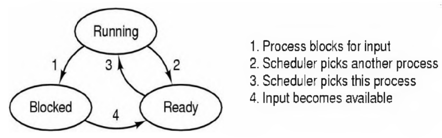
    - מימוש:
    - 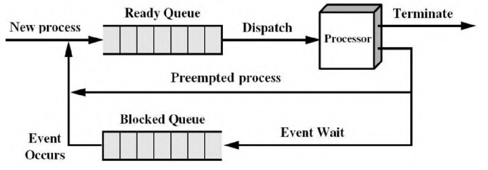
  - UNIX:
  - 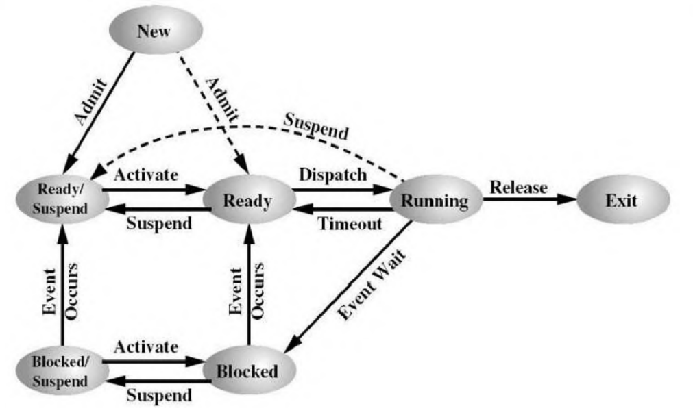

>

- מצב "חדש" - כדי שיהיה מעבר ל"מוכן" או "מוכן בדיסק" (תזמון מאוחר יותר)
- מצב "סיום" - התחלת פעולות שדורשות סיום של התכנית, ניהול משאבים וכו'
- יישום
  - טבלת תהליכים - לכל תהליך יש רשומה
- ריבוי תכניות
  - אם ההסתברות להמתנת תהליך היא p, ההסתברות שהמעבד פעיל היא 1-p^n
  - ריבוי תהליכים מגדיל ביצועים עד רמה מסוימת ואז ביצועים כי משקיעים זמן רב במעבר בין תהליך אחד לשני וכי חלקם תלויים זה בזה (אנלוגיה לכביש: אפשר להגדיל כמות מכוניות וכך תגדל כמות האנשים שיעברו, אם נגדיל ממש יהיה פקק גדול ואף אחד לא יעבור)

### תהליכונים

- תהליך - מאגד קבוצת משאבים. תהליכון - ישות הניתנת לתיזמון
- יש מערכות שהן עם תהליכון יחיד לכל תהליך - לדוגמה MSDOS
- מאפייני תהליכון - מצב ריצה, אוגרים, מחסנית
- כל תהליכון יכול לגשת למשאבים של התהליך - קבצים, מרחב זיכרון וכו'
- יתרונות - קל יותר ליצור/להרוס/לתקשר בין/להחליף תהליכון מאשר תהליך
- דורש תכנון קוד, לרוב מפשט את התכנית, בעיקר שימושי באירועים לא סינכרוניים (כי אחרת צריך לסנכרן בין תהליכונים וזה קשה)
- סוגיה על fork - האם צריך לשכפל גם את התהליכונים? אם כן, האם צריך שיהיו באותו מצב? אם תהליכון חסום, אולי בשכפול אף אחד לא יוכל לשחרר אותו? - בעייתי לדוגמה במקרה שבו התהליכונים היו באמצע משימה ושכפול שלהם יגרום לשיבוש המערכת
- תהליכוני POSIX (TBD)
- מימוש
  - תהליכון משתמש
    - מנהלים עם קוד משתמש "רגיל", לדוגמה עם טבלת תהליכונים
    - יתרונות - יעיל (לא צריך לעבור לגרעין), מאפשר התאמה לצרכי היישום, אפשרי גם במ"ע שלא תומכות בתהליכונים
    - חסרונות - אם אחד התהליכונים חסום כל התהליכונים חסומים (כי מבחינת המערכת הם אחד), אי אפשר לרוץ על כמה מעבדים במקביל, לרוב הספריות משאירות את האופציה "לישון" על התהליכונים עצמם מה שדורש התייחסות בקוד
  - תהליכון גרעין
    - יתרונות - מאפשר ריצה במקביל, על כמה מעבדים, לא דורש התייחסות בקוד
    - חסרונות - פחות יעיל (מעבר דרך הגרעין)
- יחס תהליך/תהליכון
  - 1:1 - מערכות תהליכון יחיד
  - 1:M - המצב ה"רגיל"
  - M:1 - נדידת תהליכונים מתהליך אחד לאחר (יחס M:1) - שימושי במערכות מבוזרות או מרובות מעבדים לאיזון עומסים.
  - M:N - נדידת תהליכונים כאשר אפשריים כמה לאותו תהליך
    - לדוגמה NetBSD - יש מעבדים מדומים ויש פונקציה לשליטה במצב המעבדים המדומים
- הפיכת תכנית עם תהליכון יחיד למרובת תהליכונים (סעיף 2.2.7 בספר) -
  - מה עושים עם משתנים גלובליים? - אפשר ליצור עבור כל תהליכון וליצור פונקציה ליצירת משתנה גלובלי לתהליך
  - איך מוודאים שפונקציות שתלויות זו בזו רצות בסדר מסוים?
- תקשורת בין תהליכים
  - שיתוף פעולה - החלפת מידע, סנכרון פעולות
  - מרוץ קריטי - מצב שבו התוצאה תלויה בסדר הרצת התהליכונים. לדוגמה העלאת ערך למשתנה במקביל יכולה להעלות רק ב-1
  - קטעים קריטיים -
    - תנאים לפתרון:
      - 1 - מניעה הדדית (שני תהליכים/תהליכונים לא יהיו בו ביחד)
      - 2 - אסור להסתמך על מהירות או מספר מעבדים.
      - 3 - תהליך מחוץ לקטע לא ימנע מתהליך אחר להיכנס לקטע.
      - 4 - תהליך לא ימתין נצח כדי להיכנס. (הערה: זמן שהייה בקטע קריטי הוא סופי)
  - מניעה הדדית הכוללת המתנה פעילה
    - מניעת פסיקות
      - יתרון - פשוט
      - חיסרון - יותר מדי כוח למתכנת ומאפשר קוד זדוני, פגיעה בתגובתיות, תקף רק לגבי מעבד אחד
    - משתני נעילה
      - מאתחלים משתנה ל-0, לפני שנכנסים לקטע קריטי בודקים האם הוא 1 ב-while, אחר כך שמים בו את הערך 1 ונכנסים לקטע הקריטי, בסוף שמים בו 0.
      - לא עובד כי אין את תנאי המניעה ההדדית
    - פתרון התור
      - אחד בודק האם turn!=0 השני האם turn!=1 ורק אז נכנסים לקטע הקריטי,
      - מפר את התנאי השלישי - אם תהליך אחד סיים חייבים לחכות שהוא יעדכן את turn עד שהתהליך השני יכול להיכנס
      - מבצע המתנה פעילה - רע, יכול לגרום להרעבה של תהליכונים אחרים
    - דקר ופטרסון
      - פתרון סביר (עונה על התנאים)
      - דקר - מתעדף תמיד את אחד התהליכונים
      - פיטרסון - מבטיח הגינות - מי שתפס ראשון ייכנס ראשון
      - במקרה של כמה תהליכים יכול לגרום להרעבה
      - 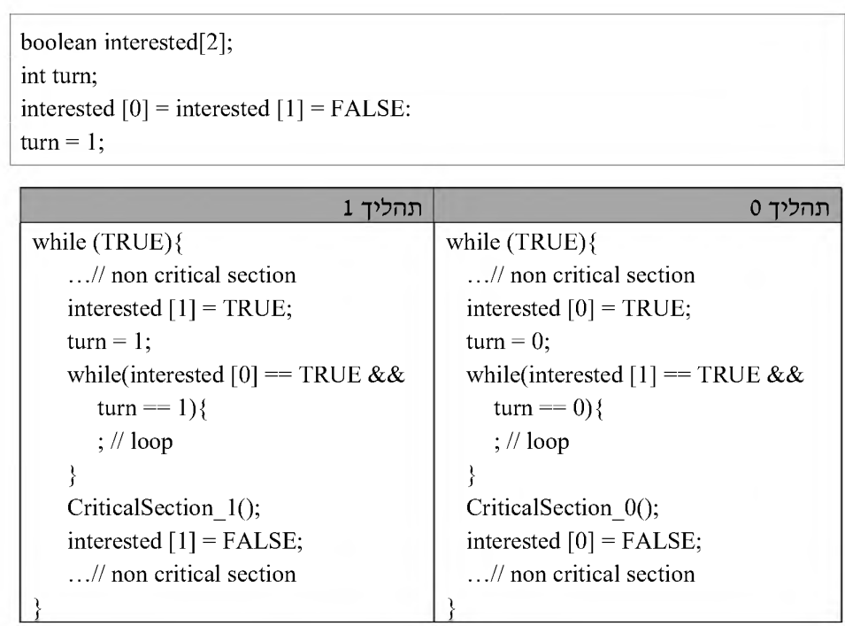
    - TSL
      - הוראה אטומית - פעולה שמתבצעת במחזור פקודה אחד (אין החלפת הקשר באמצע)
      - 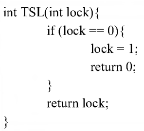
      - אם יש כמה מעבדים - ערוץ הזיכרון ננעל בזמן ביצוע ההוראה וכך יודעים שאין מעבד אחר שמתערב באמצע
      - 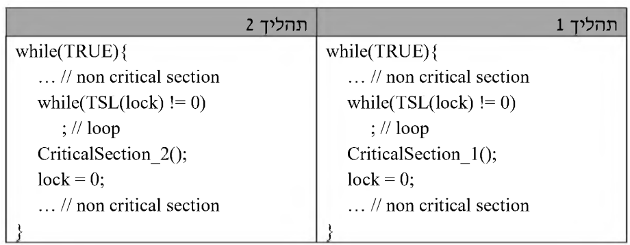
      - לא סביר בכמה תהליכים בגלל ההמתנה הפעילה, ייתכן שתהליך יורעב כי השאר רק יחכו לו והוא יחכה להיות מתוזמן
  - הרדמה והערה
    - היפוך עדיפויות - המתנה פעילה יכולה לגרום להרעבה - לדוגמה אם תהליך עם עדיפות נמוכה מחזיק במנעול ותהליך עם עדיפות גבוהה עושה המתנה פעילה, התהליך השני מבזבז זמן מעבד שיכל להיות מושקע במעבד הראשון (ייתכן שגם בכלל לא ירוץ - קיפאון)
    - הרחבת התנאים לפתרון סביר:
      - אינו גורם להמתנה פעילה
      - לא מתזמן תהליכים שלא יכולים להיכנס לקטע קריטי כי הוא תפוס
      - לא מצריך זיהוי מצבים הדורשים היפוך עדיפויות
    - קריאות מערכת - sleep() - תהליכון גורם לעצמו לישון. wakeup(t) - תהליכון מעיר תהליכון אחר.
    - בעיית היצרן-צרכן
      - אם המאגר מלא, היצרן צריך לישון עד שהצרכן הוציא לפחות פריט אחד.
      - אם המאגר ריק, הצרכן צריך לישון עד שהיצרן מכניס לפחות פריט אחד.
      - פתרון - בתנאי הנכון ישנים, כאשר מוציאים/מכניסים במצב המיוחד אז מעירים את הצד השני.
      - פותר את בעיית ההמתנה הפעילה אבל חייבים להגן על המונה של המאגר כדי שלא יווצר מצב מירוץ
  - סמפורים
    - סמפור - יש בו מספר "משאבים", אפשר לעשות down כדי לתפוס ו-up כדי לשחרר
    - בבעיית היצרן-צרכן האובייקט מרדים/מעיר תהליכונים רלוונטיים
    - סמפורים בינאריים - ערך 0 או 1 \| כלליים - גדול מ-1
    - שימוש במניעת פסיקות או TSL שונה מאוד מבעיות מרוץ כלליות כי הקטע הקריטי מכיל מעט קוד
    - יתרונות: אין המתנה פעילה, אין הגבלה של כמות תהליכים, שירות של מערכת הפעלה / שפת תכנות, פותר בעיות מרוץ
    - פתרון בעיית היצרן-צרכן עם 3 סמפורים:

> 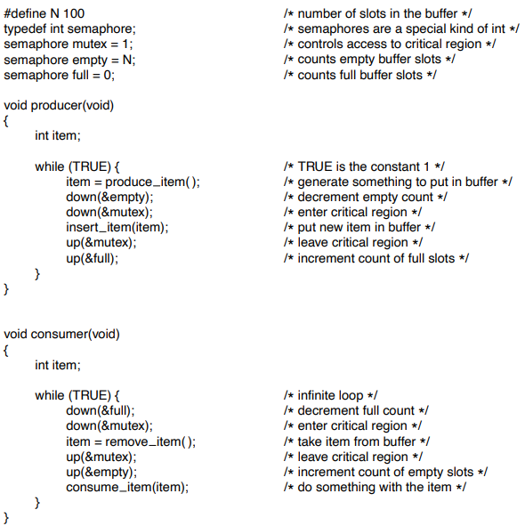
>
>

- מנעולים
  - Mutex - כמו סמפור בינארי אבל אפשרי גם ללא מעבר בגרעין, נועד כדי לנעול קטע קריטי

  <!-- -->
  - 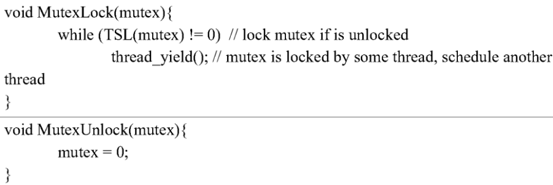

  <!-- -->
  - אם זמן ההמתנה קצר עדיף המתנה פעילה אבל בתהליכים רבים זה בזבוז

  <!-- -->
  - Futex - מנעול מהיר במרחב משתמש. מנסים לתפוס עם TSL, אם מצליחים בודקים את המנעול, אם הוא נעול אז ישנים עם קריאת מערכת. כך הוא ממעט בקריאות מערכת.

  <!-- -->
  - משתני תנאי (condition variables)
    - פעולות - cond_wait(cv,mutex) - הולכים לישון ומשחררים את המנעול, cond_signal(cv) - מעירים תהליכון ישן\
      cond_brodcast(cv) - מעירים את כל הישנים

    <!-- -->
    - מאפשרים לבצע המתנה וחסימה בצורה אטומית

    <!-- -->
    - אין "זיכרון" - אם מאותתים כשאף אחד לא ישן ואז מישהו נרדם הוא לא יתעורר.

    <!-- -->
    - ב-windows אין cv אבל יש event ולו יש זיכרון

  <!-- -->
  - מבני פיקוח (monitors)
    - סמפורים שימושיים אבל מסורבלים, לדוגמה אם מחליפים שתי שורות בבעיית הצרכן-יצרן יהיה קיפאון

    <!-- -->
    - מבנה פיקוח - מאפשר למתכנת להגדיר קטע קוד כקריטי וכך רק הקומפיילר יוודא שרק תהליכון אחד יהיה בו.

    <!-- -->
    - רלוונטי רק לתהליכונים של אותו תהליך ולא בין תהליכים שונים

    <!-- -->
    - אפשר לשלב עם משתני תנאי כדי לשפר שימושיות.
      - גישות:
        - לגרום למי שקורא ל-signal(c) להיחסם ואז להעיר תהליכון אחר

        <!-- -->
        - לגרום למי שקורא ל-signal(c) לצאת ממבנה הפיקוח ואז להעיר תהליכון אחר

        <!-- -->
        - לדרוש בתחביר השפה ש-signal(c) יהיה בסוף מבנה הפיקוח

      <!-- -->
      - מימוש
        - תור תהליכים למי שקראו ל-wait(c)

        <!-- -->
        - תור תהלכים שרוצים להיכנס למבנה פיקוח

        <!-- -->
        - תור urgent למי שרוצים שקיבלו signal ונכנסו למבנה פיקוח (על פני מי שלא נכנסו)

        <!-- -->
        - 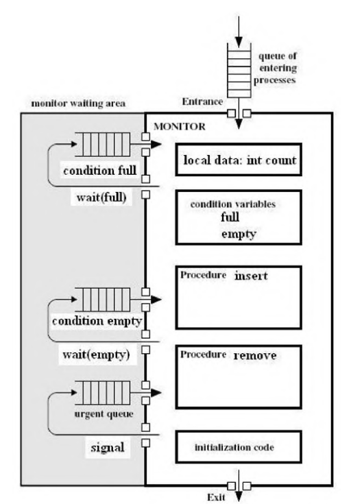

      <!-- -->
      - בשפות תכנות רבות אין מבני פיקוח, בדרך כלל כן יש סמפורים

    <!-- -->
    - הערה: מבני פיקוח וסמפורים לא שימושיים כשיש כמה מעבדים וכמה זכרונות
- העברת הודעות
  - send(destination,message) - שליחה, receive(source, \[out\] message) - קבלה

  <!-- -->
  - שליחה יכולה להיות חוסמת (סינכרונית) או לא

  <!-- -->
  - מיעון ישיר - היעד הוא תהליך. מיעון עקיף - היעד הוא "תיבת דואר"

  <!-- -->
  - פתרון צרכן-יצרן - אפשר לפתור על ידי קריאת הודעה לפני קטע קריטי ושליחת הודעה אחריו. באתחול מכניסים הודעה אחת. כך בכל פעם רק תהליך אחד נכנס לקטע הקריטי (תכלס זה abuse)
    - איך ייראה פרוטוקול שמשתמש במיעון ישיר - יכול להעביר את ה"זכות" לרוץ בין תהליך אחד לשני אם יודעים סדר מסוים ע"י שליחת ההודעה בין תהליך אחד לאחר. או על ידי הגרלת תהליך אחר ושליחת הודעה לו בלבד.
- מחסומים
  - משהה קבוצת תהליכים גדולה עד שמתקיים תנאי כלשהו

  <!-- -->
  - לדוגמה - מחלקים חישוב של מטריצה לכמה תהליכים, ממשיכים רק כשכולם סיימו

### תזמון תהליכים

- משפיע מאוד על כל המערכת. סוגי משימות - עתירות חישובים, עתירות קלט-פלט, אינטראקטיביות, זמן אמת
- תזמון לטווח קצר: הבעיה: בהינתן קבוצת תהליכים שמוכנים לריצה, מי צריך לרוץ?
- קריטריונים
  - כללי
    - הגינות - כל תהליך מקבל אותו זמן
    - אכיפת מדיניות - קבוצה שרוצים לתעדף
    - איזון - אם יש כמה מעבדים - איזון עומסים
  - מערכות אצטווה - קצב העבודה, זמן שהייה (כמה זמן תהליכים מחכים למשאב), ניצולת מעבד
  - מערכות אינטראקטיביות - זמן תגובה, יחסיות
  - זמן אמת - עמידה בזמנים, ניתנות לחיזוי (כשיש אילוצים לא נוקשים, אפשר לחזות תבניות עתידיות)
- תזמון במערכות אצטווה
  - FCFS (FIFO) - פשוט אבל יכול לגרום להרעבה (לדוגמה אם יש הרבה חישובים)
  - Shortest Job First (SJF) - מריץ את העבודה הקצרה ביותר, אם זמני הריצה ידועים מראש, לא מפקיע את המעבד (nonpreemptive), יכול לשפר זמן השהייה (כי כולם יחכו פחות זמן כי התהליך הכי קצר ירוץ)
  - Shortest Remaining Time Next (SRTN) - מריץ את העבודה עם הזמן הכי קצר שנשאר , אם זמני הריצה ידועים מראש, מפקיע את המעבד (בעצם כמו SJF אבל מפקיע)
    - מתי יכולה להיות הפקעה? - תהליך שנחסם הופך למוכן, תהליך חדש מגיע, תהליך שרץ מבצע קריאת מערכת שמרדימה אותו
    - גורם למזעור זמן שהייה עבור קבוצת תהליכים קבועה (TOOD: למה?)
    - גורם לתקורה בגלל החלפות ההקשר
- תזמון במערכות אינטראקטיביות
  - Round Robin - לכל אחד זמן שווה (הקוואנטום), עוברים אחד-אחד וחוזר חלילה, אם תהליך מפקיע עצמאית עוברים לבא
    - אורך הקוואנטום - ככל שיותר קצר יש תגובתיות וככל שיותר ארוך מבזבזים פחות זמן בהחלפת הקשר
    - האידיאל - כמות הזמן שצריך עד שהפעולה האינטראקטיבית תסתיים. אבל משך הזמן יכול להיות שונה בין תהליכים ובין מצבים של אותו תהליך
    - אפשר להשתמש בתעדוף תהליכים - עם הגדרת עדיפות קבועה או דינאמית.
      - לדוגמה לתת עדיפות לתהליכים שמהר מרדימים את עצמם כדי לשפר תגובתיות
      - אבל יכול לגרום להרעבה
      - תהליכים יכולים לשנות את התנהגותם ובכך לפגוע בתגובתיות
    - אפשר להשתמש בריבוי תורים
      - מפרידים לקבוצות כאשר כל קבוצה מצפה לאותו סוג העדפה ובאותה קבוצה יש עדיפות שווה (TODO: איך מחלקים את העדיפות?)
      - משתמשים בשיטה זו ב-windows וב-unix
  - Shortest Process Next - תהליכים כאלו הם מונחי אירועים לכן אי אפשר לדעת זמן מראש.
    - שיטת המיצוי המעריכי - משערים זמן לפי נוסחת נסיגה, אפשר לייחס יותר או פחות חשיבות להיסטוריה.
    - גם יכולה לגרום להרעבה של תהליכים ארוכים, אפשר לשפר על ידי ריבוי תורים
  - תזמון מובטח - לתת למשתמשים או תהליכים כמות שווה של זמן, כל פעם נותנים זמן לפרט הכי "מוזנח".
  - שיטת ההגרלה - חישובי רקע יכולים לקחת זמן, לכן אפשר להגריל זמן בין התהליכים ולאורך זמן משיגים חלוקה כמעט שווה
    - אפשר לתת עדיפות לתהליך על ידי מתן כמה "כרטיסים", תהליכים שמשתפים פעולה יכולים להעביר כרטיסים זה לזה
- תזמון במערכות זמן אמת
  - סוגים של מערכות - אילוצים נוקשים (כמו מטוס) ואילוצים גמישים (כמו נגן מוזיקה)
  - משימות - מחזוריות או לא מחזוריות.
  - קריטריון תזמון - sum(C(i)/P(i))\<=1 (C-כמות מעבד דרושה,P-זמן מחזור)

> הנחות סמויות: מעבד אחד, אין הרצה במקביל,

- תזמון - סטאטי (מתאים לאילוצים נוקשים) או דינמי (מתאים לאילוצים גמישים או שאין ידע מוקדם)
- מדיניות ומנגנונים
  - אפשר להגיע לפשרה בין שיקולי מערכת לבין התאמה ייחודית על ידי יכולת לקנפג את האלגוריתמים
  - דוגמאות - RR אבל אפשר להחליט על אורך הקוואנטום

### בעיות IPC קלאסיות

- פרוטוקול - כללי משחק שלפיהם נקבעת התוצאה של הרצת התהליכים
- בעיית הפילוסופים הסועדים - כל אחד ניגש למקלון שמאלי ומקלון ימני כדי לאכול, אבל הם יכולים לנצח לנסות לתפוס ולא להצליח ובכך לרעוב ולהיות בקיפאון (ייתכן שלכולם יהיה את השמאלי ולעולם לא ישיגו את הימני)
- בעיית הקוראים כותבים - רק כותב אחד יכול להיכנס, אפשר לתת לכמה קוראים להיות במקביל.
  - פתרון הנותן עדיפות לכותבים:
    - 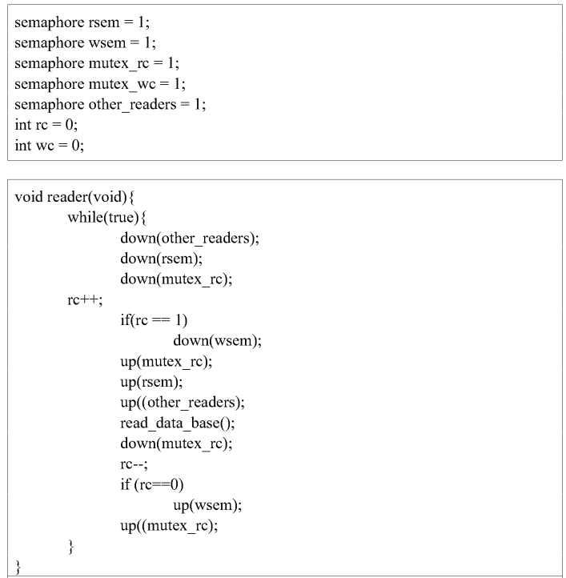

>

- 

>

- 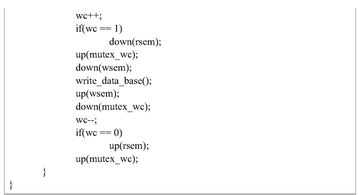

## זיכרון

### ניהול זיכרון ישיר

- הנחת יסוד: אין מספיק זיכרון וצריך לחסוך עד כמה שניתן (אולי מתישהו תישבר כשהרכיבים יהיו זולים)
- ככל שהזיכרון יותר קטן הוא יותר מהיר (ולהפך). כדי לגשר על הפערים משתמשים בהיררכיה.
- זיכרון משני - שמירת זיכרון של תהליכים ותזמונם מאוחר יותר
- יש נוסחה לזמן גישה משוכלל בשתי רמות - T1+(1-H)T2, ככל שהסיכוי למצוא תהליך ברמה המהירה גדול כך רוב הזמן נישאר שם
- ניהול זיכרון ישיר - חלוקה של מרחב הזיכרון בין מערכת ההפעלה ותכנית משתמש יחידה (חומר רשות). אפשר לפעמים להריץ כמה תכניות בו זמנית אבל אסור שהן יתייחסו לאותן הכתובות

### מרחב זיכרון

- הרצת תכניות במקביל: אסור שיחבלו זה בזה, ניידות (שונים להיטען לאזורים בזיכרון)
- זיכרון וירטואלי - הכתובות בתכנית לא תלויות בכתובות הפיזיות
- תרגום מתבצע באמצעות האוגרים limit,base כדי לא לפגוע בביצועים
  - אם הכתובת קטנה מ-limit, הוסף לה את base וגש לזיכרון הפיזי (אחרת דחה). מבצעים קודם השוואה כי זו פעולה זולה
- החלפה בזיכרון - חלוקת הזיכרון למחיצות ניידות
  - שומרים בדיסק תהליכים שאינם בשימוש
  - כמות וגודל מחיצות לא קבוע מראש
  - ריסוק חיצוני - יש רווחים בין מחיצה למחיצה וכך יש מספיק זיכרון פנוי אבל אין מספיק זיכרון ברצף
  - ציפוף - פותר ריסוק חיצוני אבל יקר
  - כמות הזיכרון של תהליך יכולה להשתנות, אם הוא מגיע למגבלה צריך לעצור ולהזיז אותו
  - נדרשת גם הגנה של תהליך מפני עצמו - לדוגמה אם הערימה דורסת את המחסנית
  - אפשר להוסיף עוד מקום על ידי פסיקה שמתבצעת אם חורגים מהמקום, תתן עוד מקום ותנסה שוב את הפקודה
- ניהול זיכרון פנוי
  - מפת זיכרון
    - מחלקים את המרחב לחלקים קטנים בגודל קטן וקבוע, שומרים את המידע מי פנוי על ידי מפת סיביות
    - מציאת מקום פנוי - מציאת רצף 0-ים גדול מספיק
    - גרעיניות החלוקה - גודל הקטעים - חשוב מאוד - קטן יגרום למפת סיביות גדולה ולהקטנת יעילות וגדול יגרום לבזבוז מקום
    - שיטה פשוטה, חיפוש יכול להיות איטי
  - רשימה מקושרת
    - שמירת מקומות פנויים
      - אפשרות אחת - רשימה מקושרת ממויינת של שטחים פנויים ותפוסים לפי כתובת. כדי לייעל כדאי שהרשימה תהיה דו מקושרת. חיפוש לוקח זמן, קל לבצע עדכון.
      - אפשרות שניה - רשימה דו מקושרת אחת לפנויים ואחת לתפוסים, ההצבעה מתבצעת מתוך השטח עצמו. מציאת שטחים פנויים יותר קלה אך שחרור זיכרון דורש עדכון כפול.
    - הקצאת מחיצות עבור תהליכים
      - First-fit - האלגוריתם הפשוט ביותר, סורקים מההתחלה עד שמוצאים מקום מספיק גדול, משאירים את שאר המקום שאין בו צורך כשטח פנוי חדש.
      - Next-fit - כמו FF אבל סורקים מהמקום האחרון בו נמצא שטח (סריקה מעגלית)
      - Best-fit - סורקים מההתחלה עד שמוצאים את השטח הכי קטן שיכול להכיל את התהליך
      - Worst-fit - סורקים מההתחלה עד שמוצאים את השטח הכי גדול שיכול להכיל את התהליך.
      - Quick-fit - פיצול רשימת השטחים לפי טווחי גדלים ואז החיפוש מהיר יותר, אבל בשחרור צריך לראות אם השטח שהתפנה ניתן לאיחוד עם שטח אחר וזה דורש לעבור על כל הרשימות המשורשרות.
      - הערות
        - אין באמת סריקה הכי טובה כי זה תלוי מקרה
        - אם מנהלים שתי רשימות נפרדות אפשר למיין לפי גודל השטח וכך BF,WF יהיו מהירים כמו\
          NF,FF
        - NF מהיר כמו FF אבל תבנית הריסוק שלו אחידה יותר (לא רק בהתחלה). נוטה להשתמש בסוף הזיכרון ולכן נצטרך לבצע ציפוף יותר פעמים.
        - BF בדרך כלל הכי גרוע כי הוא יוצר שטחים קטנים שאי אפשר להשתמש בהם ולבצע ציפוף הכי הרבה
        - WF גם יוצר תבנית ריסוק אחידה כי הוא יוצר שטחים רציפים גדולים

### זיכרון מדומה

- זיכרון וירטואלי - רק החלק החיוני של התהליך נמצא בזיכרון והשאר יכול להיות בדיסק + זיכרון התהליך לא חייב להיות רציף אלא להישמר במקומות שונים
- דפדוף
  - מרחב הכתובות מחולק ל"דפים" בגודל קבוע, הזיכרון הראשי מחולק ל"מסגרות" באותו גודל.
- טבלת דפים
  - מכילה מידע עבור הדפים
    - האם הם בזיכרון הראשי (RAM) או במשני (דיסק)
      - לאיזו כתובת הם ממופים
  - פסיקת דף - אם פונים לכתובת שהדף שלה הוא בזיכרון המשני מתרחשת פסיקה זו, מ"ה טוענת את הדף, מעדכנת את טבלת הדפים וההוראה שגרמה לפסיקה תבוצע שוב
  - תרגום כתובת וירטואלית לכתובת פיזית: ההתחלה של הכתובת היא אינדקס בטבלת דפים, השאר אופסט בדף. כל שורה בטבלה מכילה כתובת פיזית + ביט שאומר אם הדף קיים או חסר. אם הדף קיים אפשר לקחת את הכתובת הפיזית ולחבר לאופסט וזו הכתובת הפיזית
  - חישובי גדלים
    - גודל טבלת דפים = גודל שורה \* מספר הדפים
    - מספר הדפים = גודל מרחב הזיכרון חלקי גודל דף
    - גודל מרחב הזיכרון אפשר להשיג ממספר הביטים (n) של כתובת כלשהי - 2^n
  - מבנה שורה בטבלת דפים
    - מספר המסגרת
    - סיבית נוכחות
    - שדה הגנה (קריאה/כתיבה/הרצה)
    - סיבית התייחסות (האם הייתה פניה) - מאפשר לדעת האם כדאי לפנות את הדף אם חסר מקום
    - סיבית שינוי (האם הדף השתנה) - מאפשר לדעת האם צריך לשמור חזרה לדיסק
    - סיבית שימוש בזכרון מטמון - רק לארכיטקטורות שבהן התקני קלט/פלט ממופים לזיכרון (כדי תמיד לקבל ערכים מעודכנים)
  - בדרך כלל החומרה דואגת לעדכון הסיביות הרלוונטיות ומערכת ההפעלה יכולה לשנות את הערך
  - אין אפשרות בזכרונות היום לשמור את כל טבלת הדפים בדף אחד - גדולה מדי
  - חשוב שלמעבד תהיה אפשרות הטמנה, אחרת כל פניה לזיכרון הראשי תדרוש בפועל שתי פניות לזיכרון (טבלת דפים + גישה)
- הגברת מהירות פיענוח כתובת
  - TLB - Translation Lookaside Buffers
    - מוטיבציה - לרוב תכניות ניגשות לכתובות סמוכות זו לזו (מערכים, מחסנית וכו') ולכן אם נדע את הפרטים של מספר מועט של דפים אנו נוכל לרוב לא לגשת בכלל לטבלה
    - גודל לדוגמה - 256
    - הTLB הוא מטמון שמכיל שורות נבחרות מתוך טבלת הדפים שתורגמו לאחרונה. הוא נמצא ב-MMU ובעל יכולות חומרתיות מיוחדות.
    - אם מחפשים כתובת שאין ב-TLB אז מחפשים אותה בטבלת דפים, מוציאים רשומה ומוסיפים חדשה ב-TLB.
    - לא מכיל סיבית התייחסות כי הוא שימושי למערכת ההפעלה ולא לחומרה
    - בטבלה מחפשים בכל השורות בבת אחת.
    - מה-TLB משיגים את מספר הדף הפיזי ומחברים עם ההיסט שנמצא בכתובת הוירטואלית
    - (תרחיש אפשרי: מנסים לתרגם כתובת -\> היא לא ב-TLB -\> מחפשים בטבלת הדפים -\> היא לא בזיכרון -\> טוענים לזיכרון -\> מעדכנים טבלת דפים -\> מעדכנים TLB)
    - אם משנים הגנה של דף נצטרך למחוק את הרשומה ב-TLB כי היא מכילה את ההגנה הישנה
    - יש מעבדים עם TLBים נפרדים להוראות ולמידע וקיימים מנגנוני סנכרון ביניהם. זה כדי שהמערכת תהיה תתעדף מהירות.
    - שימוש בזיכרון מטמון
      - מכיל העתק של מידע מהזיכרון הראשי שחיוני לתהליך
      - 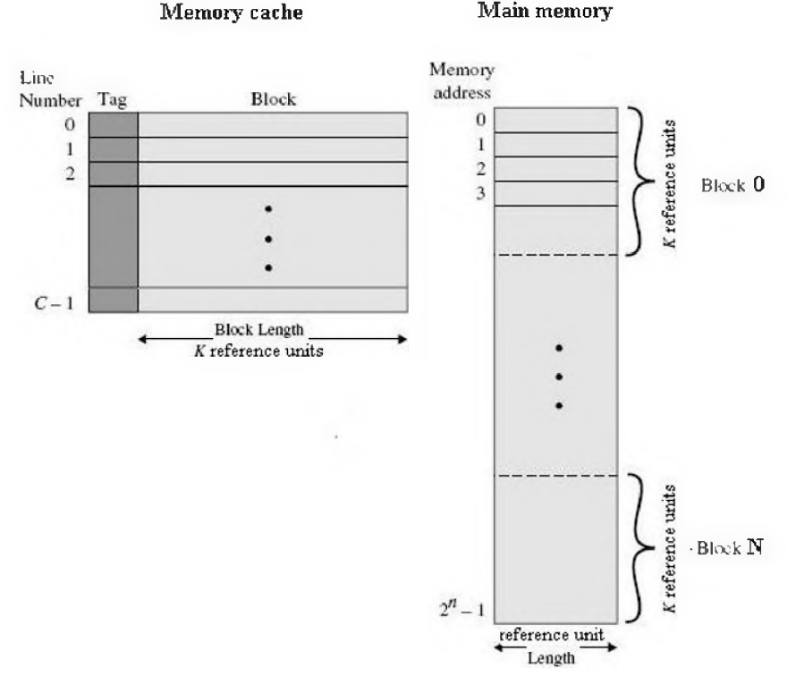
      - מורכב משורות כאשר כל שורה שייכת לבלוק זיכרון מסוים (קטן מדף בד"כ)
      - מיפוי ישיר - כל בלוק יכול להיות ממופה רק לשורה אחת
      - מיפוי דו-אסוציאטיבי - כל בלוק יכול להיות ממופה לאחת משתי שורות. דורשת חיפוש מקביל בשתי שורות, ה-TLB מאפשר חיפוש בכל השורות במקביל
      - מעבדים יכולים להכיל כמה היררכיות של זכרונות מטמון. הזכרונות יכולים להיות כוללניים או לא (האם הם מכילים מידע שקיים באחר - מהירות גישה מצד אחד אבל איטיות עדכון וניהול בצד השני)
    - היום ב-OOP תכניות משתמשות במודולים רבים שמגדיל את כמות הדפים השונה בה יש שימוש. ישנן מערכות הפעלה שתומכות בגודל דף משתנה (תכנית צריכה דף גדול, תהליכון צריך דף קטן)
  - טבלאות דפים במרחבי זיכרון גדולים
    - היום יש הרבה זיכרון -\> הרבה דפים -\> אי אפשר לשמור הכל בטבלה אחת
    - רעיון 1: טבלה דו שכבתית
      - כתובת מחולקת לאינדקס1 + אינדקס2 + היסט. תרגום: אינדקס1 הוא מספר שורה בטבלת דפים ראשונה. הערך הוא מספר הדף של טבלת הדפים השניה. אינדקס2 הוא מספר השורה של טבלת הדפים השניה. ממנה משיגים את מספר המסגרת ומחברים להיסט. הטבלה הראשונה יכולה להכיל רק מספר מועט של עמודות (לדוגמה לא צריך לשמור את ההגנה או סיבית ההתייחסות כי היא ניגשת לטבלת הדפים השניה שהיא לא זיכרון משתמש רגיל)
    - רעיון 2: טבלת דפים מהופכת
      - כתובת מחולקת לאינדקס והיסט. את האינדקס מעבירים בפונקציית ערבול (hash) והוא מוביל לשורה מסוימת בטבלה. כל שורה מכילה מספר דף ומזהה תהליך. אם השורה מתאימה למספר הדף שלנו אז מצאנו. אם לא, השורה יכולה להכיל מצביע לשורה אחרת בעלת אותו ערך ערבול. אנו נעבור על כל השורות בשרשרת עד שנמצא את השורה שלנו או שלא. אם לא סימן שהדף לא ממופה לזיכרון
      - הטבלה קטנה מאוד ולכן אפשר להחזיק אותה בהיררכיית זיכרון גבוהה. גודל הטבלה - גודל שורה \* מספר הדפים. מספר הדפים = גודל הזיכרון הפיזי חלקי גודל דף. פה התוצאה יוצאת קטנה כי לרוב מחשבים מגיעים עם כמה ג'יגות של זיכרון פיזי (מילה בסדר גודל 30 ביט) אבל גודל מילה יכול להיות 64 ביט.
      - גם פה יש שימוש ב-TLB כדי לחסוך בזמן
      - אפשר גם להשתמש בטבלת ה-hash גם בטבלת דפים רגילה שנשמרת על הדיסק.

### אלגוריתמים להחלפת דפים

- השאלה: מתוך קבוצת דפים נתונה את מי מחליפים
- אופטימלי
  - אין כזה כי אנחנו לא יודעים את העתיד של התהליך ואיזה זיכרון יצטרך. רק בדיעבד נדע.
- Not Recently Used (NRU)
  - מסתכלים על סיבית ההתייחסות וסיבית השינוי.
  - סדר עדיפות לפינוי: (R=0,M=0), (R=0,M=1), (R=1,M=0), (R=1,M=1)
  - היגיון: עדיף לפנות דפים ללא שימוש ודפים שלא נצטרך לעבוד קשה כדי לפנות
  - בחירת הדף תתבצע באופן אקראי מבין הקבוצה הראשונה שלא ריקה
  - פשוטה יחסית למימוש, ביצועים סבירים
- FIFO
  - מפנים את הדף הותיק ביותר
  - פשוטה למימוש אבל יכולה לפנות גם דפים שימושיים
  - בחירה לא טובה
- הזדמנות שנייה
  - FIFO אבל כשמוציאים דף מהתור בודקים את סיבית ההתייחסות. אם היא 0 אז מפנים ואם 1 מכבים אותה ומכניסים לתור.
  - אם בכל הדפים R=1 אז בפועל אנו נפנה את הדף הראשון (TODO: נכון?)
- שעון
  - זהה לאלגוריתם ההזדמנות השניה אבל עם מבנה נתונים בעל ביצועים טובים יותר - במקום תור מחזיקים רשימה מקושרת מעגלית וסורקים אותה.
- שעון משופר
  - יש התייחסות גם לסיבית השינוי. יכול לספק ביצועים דומים ל-LRU ויעיל.
- Least Recently Used (LRU)
  - נפנה את הדף הותיק יותר בהתייחסות אליו (הראשון שעבורו נעשה R=1)
  - שימושי כי פעמים רבות העתיד דומה לעבר
  - חיסרון - עלות - דורש מימושים מורכבים ויקרים - בחומרה (שמירת שעונים ושליפה לפיהם) או בתכנה (שמירת דפים ממויינים)
  - יעיל בתיאוריה אבל לא שימושי בפועל
- הזדקנות
  - לכל דף מוחזק מונה שגדל ב-1 אם הייתה פניה החל מהסיבית השמאלית. לפני כל העלאת ערך עושים הזזה ימינה. מפנים את הדף בעל הערך הקטן ביותר (ואם יש כמה בוחרים אקראית).
  - היגיון: ככל שיש יותר פניות הערך עולה
- Not Frequently Used (NFU)
  - כמו הזדקנות אבל זוכר היסטוריה לעד, החיסרון הוא שאם היה דף שהיו אליו הרבה פניות אבל הפסיקו עדיין הוא לא יפונה
  - שונה מ-LRU - לא יודעים את סדר הפניות לדפים וגם המונה בעל מקום מוגבל
- קבוצת עבודה
  - קבוצת עבודה - קבוצת דפים שנחוצים לתהליך כדי לעבוד בשלב מסוים של הביצוע. אם קבוצת העבודה שלו בזיכרון הוא לא יעשה פסיקות דף.
  - אם אנו יודעים אותה מראש - הכי טוב להביא אותה כבר כדי שיהיו ביצועים גבוהים (prepaging), במקום לפי דרישה
  - הגדרה - W(k,t) - קבוצת הדפים בזמן t שאליהם נעשתה פנייה ב-k הפניות האחרונות.
    - קשה לזכור איזה דף היה בשימוש מתי
    - K קטן יגרום להבאה לפי דרישה וk גדול ישאיר יותר מדי דפים בזיכרון
  - סחרור (thrashing) - אם מקצים לתהליך קבוצת דפים שקטנה מקבוצת העבודה שלו. הקוד לא מתקדם כי הוא כל פעם טוען עוד דף
  - יותר קל להשתמש בזמן הוירטואלי (זמן cpu שתהליך השתמש בו בפועל מתחילת ריצתו).מסמנים את הזמן באות טאו
  - האלגוריתם
    - (כאשר ניגשים לדף שומרים את הזמן הנוכחי)
    - עוברים על הדפים - אם R=1 קובעים R=0, מעדכנים את זמן הדף וממשיכים
    - אם R=0מחשבים את גיל הדף (זמן נוכחי פחות זמן הדף). אם גיל הדף גדול מ-טאו מפנים, אם לא מפנים את הדף הותיק ביותר
- WSClock
  - דומה לקודם עם שינויים קלים:
    - מחזיקים את הדפים ברשימה מקושרת מעגלית.
    - אם הדף ותיק מ-טאו: אם M=0 הדף מפונה. אם M=1 מתזמנים כתיבה ומשנים ל-0 (עד n פעמים כדי לא להציף כתיבות) וממשיכים.
    - אם לא פונה דף ייתכנו שני מצבים:
      - תוזמנה כתיבה ולכן אפשר לעבור שוב על הדפים עד שמגיעים לדף עם סיבית שינוי כבויה
      - לא תוזמנה כתיבה ולכן נוריד את הדף הותיק ביותר עם סיבית שינוי כבויה, ואם אין כזה אז את הותיק ביותר עם סיבית שינוי דלוקה.

### שיקולים בתכנון מערכות דפדוף

- סוגיות
  - כמה מסגרות מוקצות לתהליך ולאילו תהליכים מקצים?
  - מהן ההשלכות של שינוי מסגרות מוקצות?
  - האם עדיף הקצאה סטטית או דינמית?
  - האם עדיף החלפה גלובלית (מתחשבת בכל התהליכים, אין קשר בין מי שביקש דף למי שיפנה) או לוקאלית (תהליך מסוים)?
- מקומית מול גלובלית, דינמית מול סטטית
  - מקומית
    - סטטית - גרועה כי ייתכן שקבוצת העבודה תגדל ואז הוא יהיה בסחרור, אם היא תקטן אז יהיו דפים מבוזבזים
    - דינמית - טובה אבל דורשת משאבי חישוב (הערכה תקופתית של דפים בשימוש)
  - גלובלית
    - סטטית - חסרת היגיון (כי לכולם יש כמות דפים שווה)
    - דינמית - קלה ליישום ומביאה ביצועי מערכת טובים (תשחרר דפים שלא בשימוש) אבל גם יכולה לגרום לסחרור אם אין מסגרות פנויות ולוקחים דף בקבוצת העבודה של תהליך
- ניהול כמות מסגרות - אלגוריתם Page Fault Frequency (PFF)
  - יוצרים סף עליון ותחתון, אם קצב החלפת הדפים גדול מהעליון אז נותנים לו מסגרות ואם הוא קטן מהתחתון אז לוקחים לו.
  - היגיון: אם לתהליך חסרים דפים הוא יגרום להרבה פסיקות דף ואם לא אז הוא לא יגרום הרבה
- קביעת רמת ריבוי מקביליות
  - אם סכום קבוצות העבודה של התהליך הרצים גדול מהסכום שניתן להקצות אז צריך להוציא זיכרון של תהליך לזיכרון משני, החיסרון הוא שהמקביליות נפגעת
  - את מי מוציאים? - יש כמה אפשרויות
    - התהליך עם העדיפות הנמוכה ביותר (כנראה לא ירוץ)
    - התהליך שגורם להכי הרבה פסיקות דף (ישחרר משאבי מערכת וייתן לשאר לרוץ באופן יציב)
    - התהליך עם מספר הדפים הקטן ביותר (מהיר אבל משחרר מעט מסגרות)
    - התהליך עם מספר הדפים הגדול ביותר (משחרר הרבה מסגרות אבל לוקח זמן)
- שד הדפדוף
  - דפדפוף היא פעולה יקרה שפוגעת בביצועי התהליך
  - פתרון: ליצור תהליך רקע שידאג שיש מספיק דפים פנויים ואם חסר אז יוציא דפים החוצה
  - לא תמיד באמת צריך לכתוב משהו: אם הדף לא שונה אפשר רק לשנות את סיבית ה-valid. אם יצטרכו את הדף שוב והוא לא שונה - נדליק אותה חזרה.
  - טכניקה נוספת לפינוי: שעון שני מחוגים עם זווית הפרש קבועה, מחוג ראשון עובר ומכבה סיבית התייחסות, אם המחוג השני עובר והסיבית עדיין כבויה אז הדף מפונה.
- קביעת גודל דפים
  - בעד דפים קטנים - לא מבזבזים זיכרון שלא בשימוש בסוף הדף (TODO: הגרעיניות העדינה זה טיעון שונה?)
  - בעד דפים גדולים - שומרים על טבלת דפים קטנה ויגרמו לפחות פעולות דפדוף ופסיקות דף
  - הגדלה של זיכרון תהליך ממוצע מגדילה פי 4 את גודל הדף האופטימלי
- דפים משותפים
  - דפדוף מאפשר שיתוף זיכרון על ידי שיתוף דפים
  - Copy-on-write - ניתן לשתף דפי כתיבה, אם יש שינוי אז הדף מועתק והמצביע עובר לחדש, אחרת משתפים את אותו עותק
  - חסרונות: אי אפשר לפנות דף שכמה דפים משתשמשים בו, יכול לגרום לסתירה עם מנגנוני פינוי דפים ובכללי יוצר סיבוך
- מיפוי קבצים לזיכרון
  - מ"ה מספקת אפשרות למפות חלקים שלמים של קובץ לזיכרון (במקום לקרוא ולכתוב בתים אחד-אחד), המערכת ברקע מסנכרנת את התוכן וכאשר המיפוי מוסר אז תוכן הדף יישמר לקובץ.
  - חיסרון: קשה לעקוב אחרי הגודל האמיתי של הקובץ כי מ"ה שומרת מידע בכפולות של דפים

### שיקולי יישום

- מעורבות מ"ה בדפדוף
  - יצירת תהליך
    - לפי קובץ ההרצה גודל טבלת הדפים נקבע והיא מאותחלת
    - מקצים מקום בדיסק עבור דפי התהליך שישמרו בו (תזמון טווח ארוך), לפעמים גם תוכן קובץ ההרצה כמו הקוד והמידע
  - החלפת הקשר
    - החלפת MMU לתהליך החדש, פניה לזכרונות מטמון לא יוביל למידע של תהליך ישן (לפעמים לגמרי חומרתי)
    - ביצוע prepaging (אם אפשר)
  - פסיקת דף
    - זיהוי הכתובת שנכשלה, חישוב הדף, בדיקת ההגנה של הדף והריגת התהליך אם הייתה גישה לא חוקית, מציאת מסגרת פנויה, אולי פינוי דף אחר (אם חסר), טעינת הדף, אולי החלפת הקשר לתהליך אחר, החלפת הקשר חזרה לתהליך, ביצוע ההוראה מחדש
    - הערה: יש אוגרים מיוחדים ששומרים את מצב המעבד כי להחזיר אותו למצב שהיה לפני ביצוע ההוראה שגרמה לפסיקת דף
  - סיום תהליך
    - שחרור משאבים: מסגרות, טבלאות דפים, אזור בקובץ הדפדוף, לא לשחרר דפים משותפים בשימוש
- נעילת דפים בזיכרון
  - אם קלט/פלט מועבר דרך כתיבה לדפים מסמנים שהדף לא מיועד לשימוש על ידי גורמים אחרים (TODO: תהליך אחרים?).
  - משתמשים בזה גם בגרעין
  - פתרון נוסף הוא שכל ההעברות ייעשו לחוצצים של מ"ה ואז יועתקו לקלט/פלט (דפי מ"ה אינם מתחלפים כי הם בשימוש מתמיד וכי מ"ה בשליטה ויודעת לא להחליף אותם)
- אחסון בדיסק
  - שיטת אזור דפדוף (swapping area) בסיסית
    - רשימה מקושרת של שטחים פנויים (דומה למחיצות ניידות)
    - שומרים שטח כגודל התהליך והמבנה של השטח דומה למבנה על הדיסק (TOOD: להבין לעומק)
    - ניתן לשפר על ידי ניהול אזורים שונים לקוד, מחסנית ומידע כדי להתמודד יותר טוב עם שינויי גודל.
  - שיטה דינמית
    - כאשר רוצים לאחסן דף יוצרים לו מקום ושומרים את מיקומו. אפשר להשתמש בבלוקי מערכת הקבצים לאחסון וניהול הדפים.
- הפרדה בין מנגנונים למדיניות
  - שימושית אבל דורשת תמיכה יקרה בחומרה, הפרדה בין מנגנון גרעין ומדיניות בצד משתמש תדרוש תיאום ולכן תקורה גבוהה

### חלקות הזיכרון לקטעים

- מרחב הזיכרון מחולק לקטעים (סגמנטים) שונים
- כתובת וירטואלית - מספר קטע והיסט
- יש טבלת קטעים שמכילה את כתובת המסגרת וגודלה, בודקים שההיסט לא חורג מהגודל ומחשבים את הכתובת על ידי כתובת המסגרת + היסט
- גם קטעים יכולים להיות בזיכרון משני ותתרחש פסיקה תטען אותם לזיכרון
- חלוקה לקטעים לא בהכרח שקופה למתכנת והוא יכול לשלוט בה לפי צרכי התכנה
- יישום
  - בעיה: יכול להתרחש ריסוק חיצוני בחלוקה לקטעים (כאשר מפנים מקטעים מהזיכרון יווצרו חורים ולא יהיה אפשר להקצות מקטע חדש)
  - שיטה מעורבת: דפדוף עם קטעים
    - כל קטע מחולק לפי דרישת המתכנת, אפשר לחלק אותו לדפים בגודל זהה, והמסגרות בגודל זהה לדפים
    - כתובת מדומה מחולקת לשלושה שדות - מספר קטע בטבלת הקטעים, מספר דף בטבלת הדפים של הקטע, והיסט
    - תרגום: טבלת סגמנטים (ידועה) + מספר קטע (בכתובת) -\> שורה בטבלת קטעים -\> כתובת של טבלת דפים + מספר דף (בכתובת) -\> שורה בטבלת דפים -\> מספר מסגרת + היסט (מהכתובת) -\> כתובת פיזית

## קבצים

- שמירת מידע לטווח ארוך, שמות,
- תוכן - בתים, רשומות, רשומות במבנה לחיפוש מהיר \| חלוקה נוספת - טקסט ובתים
- טיפוסי קבצים -
  - block (קלט/פלט של בתים ויש הטמנה במערכת ההפעלה)
  - character (קלט/פלט של תווים כמו מקלדת ומסך, לרוב אין הטמנה אלא כתיבה ישירה)
  - Pseudo-devices - התקנים וירטואליים כמו /dev/null (פלט ריק), /dev/zero (קלט שמייצר אפסים), /dev/random (קלט שמייצר רנדום)
  - UNIX
    - קבצי FIFO (pipes)
    - Sockets (תקשורת רשת)
    - קישורים סימבוליים - הפניה לקובץ אחר
- גישה לקבצים
  - סדרתית - עקרונית ממש תו-תו, בפועל מחלקים לבלוקים כדי לא להתחיל מההתחלה (מתאים לטייפ מגנטי)
  - אקראית - אפשר לגשת לבתים באיזה סדר שרוצים, בפועל מתורגם לבלוקים (מתאים לדיסק מגנטי)
- מאפייני קובץ - הרשאות, בעלים, זמני גישה ועדכון וכו', גודל, מספר הצבעות (hard links), מזהה התקן (device number), מזהה התקן לקובץ מיוחד, מספר inode
  - מספר הצבעות - אפשר ליצור קבצים שמצביעים לקבצים אחרים (מגדיל מונה) או לפתוח קבצים (מגדיל מונה), כשמוחקים קובץ רק כשהמספר מגיע ל-0 הקובץ באמת נמחק
- פעולות - יצירה, מחיקה, פתיחה, סגירה, קריאה, כתיבה, כתיבת צירוף (append), הזזה (seek), קריאת מאפיינים, עדכון מאפיינים, שינוי שם

### מדריכים (תיקיות)

- נתיב מלא, נתיב יחסי, ספריית העבודה (working directory)
- פעולות - יצירה, מחיקה, פתיחה, סגירה, קריאת תוכן, שינוי שם, יצירת קישור סימבולי

### יישום

- תסדיר (Layout)
  - Master Boot Record - אתחול מערכת ההפעלה

  <!-- -->
  - טבלת מחיצות - מידע על המחיצות

  <!-- -->
  - מחיצות - המידע, כל מחיצה יכולה להיות מערכת קבצים שונה
- תסדיר מחיצת UNIX
  - בלוק אתחול

  <!-- -->
  - סופר בלוק - מידע על מערכת הקבצים, טעון בזיכרון הראשי, קריטי ולכן מחזיקים גיבויים שלו

  <!-- -->
  - בלוקים המכילים מבני נתונים לניהול שטחים פנויים במחיצה

  <!-- -->
  - בלוקים המכילים טבלאות inode

  <!-- -->
  - בלוקים של ספריית השורש - מכילים את הקבצים והספריות שספריית השורש מכילה

  <!-- -->
  - בלוקים לניהול קבצים וספריות - התפוסים מנוהלים על ידי טבלאות inode, פנויים על ידי הבלוקים לניהול שטחים פנויים
- הערות
  - UEFI - חלופה מודרנית לMBR (TODO: לסכם)

  <!-- -->
  - במחיצות גדולות שומרים את מידע הניהול קרוב לקבצים
- יישום קבצים
  - הקצאה רצופה -
    - קבצים נמצאים בדיסק בבלוקים רציפים, אם הגודל לא מכפלה של בלוק אז יש קצת בזבוז מקום בסוף

    <!-- -->
    - יתרונות: פשוט למימוש, גישה מהירה לקובץ (רק חיפוש אחד וקוראים את כל הקובץ בבת אחת)

    <!-- -->
    - חסרונות: ריסוק חיצוני, אוכפים גודל מקסימלי לכל קובץ וכדי להגדיל עוד צריך להזיז וזה ייקח זמן

  <!-- -->
  - רשימה מקושרת
    - הקובץ הוא רשימה מקושרת של בלוקים

    <!-- -->
    - יתרונות: אין ריסוק חיצוני, לא דורש חיפוש בלוקים בהקצאה,

    <!-- -->
    - חסרונות: קריאה איטית (O(n)), המידע הוא לא חזקה של 2 וזה יכול לשבש עבודה של תוכנות מסוימות או לדרוש שימוש בשני בלוקים רק כי יש את המצביע בתחילת הבלוק.

  <!-- -->
  - רשימה משורשת עם טבלת אינדקס בזיכרון (רשות) - מערכות קבצים FAT, יש טבלה שמכילה מצביע לרשימה משורשרת של חלקי הקובץ

  <!-- -->
  - שיטת inodes
    - מספר inode הוא מזהה של struct שמכיל את המטה-דאטא של הקובץ, מכיל 10 קישורים לבלוקים של מידע, קישור לטבלה, קישור לגישה עקיפה יחידה (בלוק מידע שהוא כולו טבלה שמכילה קישורים לבלוקים של מידע), גישה עקיפה כפולה וגישה עקיפה משולשת

    <!-- -->
    - גודל טיפוסי של טבלת inode הוא 64 או 128 בתים

    <!-- -->
    - בעיה: גישה לקובץ אחד כוללת הרבה גישות לדיסק. פתרון: הטמנה (פירוט בהמשך)

    <!-- -->
    - קישורים:
      - Soft link מכיל "מצביע" שהוא שם קובץ. שיקולים: לא מקושר לקובץ עצמו אבל מאפשר לקשר מערכות קבצים שונות

      <!-- -->
      - Hard link: בתוך מדריכים יש שם קובץ + מצביע ל-inode (נמצא במדריך)

      <!-- -->
      - inode מכיל מצביע לקובץ: הוא מכיל מונה שעולה אם מוסיפים עוד מצביעים במדריכים. כאשר המונה מגיע ל-0 הinode נמחק.
- יישום מדריכים
  - יש מדריכים שכל רשומה של קובץ נמצאת בתוך הרשומה של המדריך, כל המידע נמצא שם.

  <!-- -->
  - יש מדריכים שכל רשומה של קובץ שלהם נמאצת ב-inode והמדריך מפנה לשם.

  <!-- -->
  - איך שומרים שם קובץ? -
    - אם קצר וקבוע - המערכת מוגבלת. אם ארוך וקבוע - יש בזבוז כי רוב השמות הם לא ארוכים.

    <!-- -->
    - אפשר גם שיהיה אורך משתנה על ידי כך שכל רשומה תהיה עם אורך משתנה, היא תתחיל במבנה קבוע והשדה האחרון יהיה השם ובעל אורך משתנה. החיסרון לכך הוא שכאשר קובץ מוסר נשאר "חור" באורך משתנה. גם עכשיו גודל התיקייה יכול להיות כמה דפים.

    <!-- -->
    - אפשר שכל הרשומות של הקובץ יהיו ביחד באורך קבוע וכל השמות יהיו במקום אחר.

  <!-- -->
  - חיפוש קבצים במדריך
    - חיפוש סדרתי - טוב כשיש מעט קבצים, כשיש הרבה זה בעיה

    <!-- -->
    - אפשר לשמור את הקבצים ב-hash table - חלוקה ל"דליים" וכל דלי הוא רשימה מקושרת. משפר ביצועים אבל מסובך למימוש, טוב כשיודעים שיהיו הרבה קבצים.

    <!-- -->
    - אפשר לשמור מטמון של החיפושים האחרונים וזה יעזור אם רק מעט מהקבצים בשימוש תדיר

  <!-- -->
  - שיתוף קבצים ב-UNIX
    - לכל תהליך יש טבלת קבצים פתוחים, עבור כל פתיחת קובץ נוצרת רשומה, בפועל יש inode 1

    <!-- -->
    - ברשומה מוחזק גם המיקום הנוכחי בתוך הקובץ (seek)

  <!-- -->
  - מערכת קבצים בצורת יומן
    - שינויים תכופים של פניות לדיסק יכולות לגרום לביצועים רעים

    <!-- -->
    - התמודדות: רושמים את כל האירועים בצורה של יומן לדיסק, יש תהליך רקע שקורא אותם ומבצע עדכונים

  <!-- -->
  - מערכת קבצים מבוססת פלאש
    - קריאה וכתיבה מהירות מאוד, קריאה בצורה אקראית קרובה לקריאה סדרתית

    <!-- -->
    - כדי לכתוב צריך קודם כל למחוק, אבל אז מתפנות כמה יחידות כתיבה ביחד

    <!-- -->
    - Flash Transformation Layer - מנהל את הגישה, לדוגמה שומר על כתובות היררכיות במקום לינאריות, עושה garbage collection

    <!-- -->
    - שיקולים ב-SSD: להימנע מכתיבות אקראיות, לפזר את הכתיבות כדי לצמצם שחיקה
      - שימוש בצורת יומן יכול לעזור

### ניהול ואופטימיזציה של מערכת קבצים

- ניהול שטח הדיסק
  - גודל הבלוק - גדול יותר יעיל אבל גורם לריסוק פנימי

  <!-- -->
  - מעקב אחר שטח חופשי -
    - מפת סיביות

    <!-- -->
    - רשימה מקושרת
      - עדיפה אם יש שטחים רציפים

  <!-- -->
  - הגבלת השימוש בדיסק
    - ניתן לרשום כמה בלוקים תופס כל משתמש ולציין מכסה

  <!-- -->
  - גיבוי מערכת הקבצים
    - חשוב מאוד

    <!-- -->
    - עדיף גיבוי אינקרמנטלי (מה השתנה ולא הכל מחדש), מדי פעם עושים גיבוי מלא

    <!-- -->
    - ברמה הפיזית - שומרים את הבתים שהשתנו בדיסק. ברמה הלוגית - עוברים על עץ הקבצים ושומרים עבור כל קובץ את השינויים.
      - בגיבוי לוגי לא נשמרים הקבצים המיוחדים ורשימות הבלוקים הפנויים

  <!-- -->
  - עקביות מערכת קבצים
    - מקרים
      - בלוק חסר - לא מוקצה אבל גם לא ברשימת הפנויים

      <!-- -->
      - בלוק חופשי מיותר - מופיע ברשימת הפנויים יותר מפעם אחת

      <!-- -->
      - בלוק עם הקצאה עודפת - מוקצה ליותר מקובץ אחד

      <!-- -->
      - בלוק חופשי מוקצה - מופיע ברשימת התפוסים ורשימת הפנויים

  <!-- -->
  - ביצועים
    - הגישה לדיסק איטית, רוצים לצמצם

    <!-- -->
    - מטמון בלוקים
      - שומרים בלוקים ב-hash table (עושים ערבול על ה-device, disk address)

      <!-- -->
      - מפנים בלוקים על ידי LRU, עושים התאמות כדי לשמור על עקביות כי יש סכנה שהמטמון יכיל מידע לא מעודכן

      <!-- -->
      - יש אפשרות לבצע מטמון עם write-through כדי שכתיבות תמיד יופיעו בדיסק, אפשר גם לסנכרן באופן קבוע ואז יש חשש קטן יותר מחוסר עקביות

    <!-- -->
    - הבאת בלוקים מראש
      - כמו בדפדוף אפשר להביא בלוקים של דיסק מראש

    <!-- -->
    - צמצום תנועות של זרוע הדיסק
      - רצוי למקם רשומות inode וכו' קרוב למידע כדי שהזרוע לא תצטרך לנוע הרבה.

  <!-- -->
  - 4.5 דוגמאות למערכות קבצים
    - (לקרוא מהספר)

## קלט/פלט

- מ"ה מסתירה מורכבות של המכשירים בפועל, מטפלת בשגיאות ומתזמנת תקשרות

### חומרה

- התקנים
  - התקן בלוקים - מאחסנים מידע בבלוקים בגודל קבוע שאפשר להתייחס אליהם. לדוגמה cd-rom והארד דיסק.
  - התקן תווי - פועלים על רצפי תווים, אי אפשר לזוז בתוך הרצף. לדוגמה מקלדת וכרטיס תקשורת.
- בקרים
  - מפעילים כל התקן עם כרטיס אלקטרוני שנקרא בקר שנותן למ"ה ממשק ניהול. דוגמה - SCSI - חיבור עד 16 דיסקים קשיחים וניהולם באמצעות פקודות
- שיטות מיעון
  - מרחב כתובות נפרד
  - מרחב כתובות משותף (memory mapped I/O)
    - יתרונות - קל לתכנות, מנגנון קיים (דפדוף), יעילות (הוראה אחת במקום כמה)
    - חסרונות - דורש ביטול מטמון בניהול זיכרון, דורש תמיכה בחומרה והתייחסות של כל ההתקנים כדי שהם יראו אם ההוראה מתייחסת אליהם
  - שיטה מעורבת, כמו לדוגמה מיפוי חוצצים למרחב הראשי ומיפוי אוגרים למרחב נפרד
- גישה ישירה לזיכרון
  - יש בקרים שמאפשרים לקרוא/לכתוב לזיכרון של המחשב באופן ישיר ללא צורך בפעולות נוספות - DMA
  - יתרון: מגדיל מקביליות של המערכת כי הבקר יכול לעשות משימות בשביל המעבד ואז המעבד ישתמש בתוצאה
  - מורכב יותר חומרתית
  - הבקר צריך גישה לזיכרון של המחשב ולכן נועל את האפיק, יכול להפריע למעבד. שיטות:
    - Work-at-a-time - הבקר מעביר מילים בזו אחר זו וגונב מחזור של המעבד. בדרך כלל לא מורגש, בהעברות גדולות יכול להיות
    - Block mode - מעביר בלוקים - נעילת האפיק מתבצעת פעם אחת אבל תיקח יותר זמן ותגרום למעבד להמתין

### עקרונות למימוש קלט/פלט בתכנה

- מטרות
  - אי תלות בהתקנים
  - כינוי אחד (לדוגמה התקן יכול להיות נתיב במערכת קבצים)
  - טיפול אחיד בשגיאות (הבקרים מפעפעים את השגיאה בהדרגה)
  - העברת נתונים
    - סינכרונית

    <!-- -->
    - אסינכרונית
  - הטמנה - חיסכון בזמן
  - שיתוף (אם אפשרי)
- קלט/פלט באמצעות המעבד הראשי
  - כמעט לא בשימוש היום, המעבד מעביר תווים להתקן אבל צריך לחכות עד סיום הפעולה
- מונחה אירועים
  - מעבד לא מבצע המתנה פעילה אלא התהליך מועבר למצב חסום ובסיום הפעולה הבקר שולח אל המעבד פסיקה והתהליך מועבר למצב מוכן
  - לא בשימוש עם התקנים מהירים כי יש תקורה גבוהה של פסיקות
- DMA
  - המעבד נותן פקודה לבקר כיצד לבצע את ההעברה, בסוף הפעולה הבקר שולח למעבד פסיקה

### חלוקה לשכבות

- מנהל הפסיקות
  - עוסקת בעיקר בפסיקות חומרה כדי ליצור ממשק אחיד, הגנה על החומרה מפני גישה לא תקינה
- מתאמי התקנים
  - מספק ממשק להפעלת התקן, מסתיר את מורכבותם, ניגשים לחוצצים ואוגרים של ההתקנים ולכן חלק מהגרעין
- תוכנה בלתי תלויה בהתקנים
  - קביעת ממשקים אחידים בשימוש בהתקנים
  - הטמנה בחוצצי ביניים
  - טיפול בשגיאות
  - הקצאה ושחרור התקנים שלא ניתנים לשיתוף כדי לא להיות בקיפאון
  - גודל בלוק אחיד (גם בין התקנים שונים)
- תוכנה ברמת המשתמש
  - מספקים ממשק אחיד לתוכנות
  - ספריות סטנדרטיות (לדוגמה stdlib.printf)
  - שדים (לדוגמה spooler)

### דיסקים

- חומרת הדיסק
  - דיסקים מגנטיים
    - דיסק מחולק למסלולים שמחולקים לגזרות

    <!-- -->
    - אוסף כל המסלולים בכל התקליטים במרחק זהה נקראים גליל

    <!-- -->
    - זמן העברת הנתונים
      - זמן חיפוש המסלול (S) - עד שהראש מגיע

      <!-- -->
      - זמן הסיבוב (R) - זמן סיבוב סביב הציר. בממוצע חיפוש הגזרה הוא מחצית הסיבוב

      <!-- -->
      - כמות נתונים הדרושה - b, כמות הנתונים במסלול - N

      <!-- -->
      - זמן העברת הנתונים - S+0.5R+R\*(b/N)
  - אלגוריתמים לתזמון זרוע דיסק
    - עיקר הבעיה - זמן חיפוש המסלול

    <!-- -->
    - FIFO/FCFS - פשוט והוגן אבל יכול להיות לא יעיל, אפשר להגביל בקשות לאותו מסלול כדי לשפר יעילות

    <!-- -->
    - Shortest Seek First - מקטין את מספר התזוזות בדיסק אבל יכול לגרום להרעבה

    <!-- -->
    - מעלית / סריקה - עובר מקצה אחד לשני ומטפל בבקשות שבדרך, הכיוון מתחלף כאשר אין בקשות בכיוון התנועה הנוכחי, מעדיף מסלולים אמצעיים (סיכוי גבוה שיעבור שם)

    <!-- -->
    - סריקה חוזרת - סורק רק בכיוון אחד וכאשר מגיע לסוף חוזר מהר להתחלה, עלול להגיע למספר רב של בקשות למסלול מסוים וכדי לא לגרום להרעבה אפשר להחליט שמטפלים רק בחלק מהבקשות בכל פעם.

    <!-- -->
    - אפשר לשמור מטמון כדי למנוע טיפול בגזרות שעברנו בהן, לדוגמה חצי מהמטמון מכיל נתונים שעברנו עליהם וחצי בלוקים שצריך לכתוב במסלול החולף (TOOD: להבין עד הסוף)
      - למ"ה אין שליטה במטמון הדיסק

    <!-- -->
    - האלגוריתמים הבטוחים למניעת הרעבה הם התור והסריקה החוזרת כי יש הגבלה על כמות הבקשות.
- כונני מצב מוצק (SSD)
  - חלק אפשר לחבר ב-SATA (פרוטוקול ישן, רק תור אחד), חלק ב-NVMe (ניצול טוב יותר - הרבה תורים והם ארוכים יותר ואפשר לטפפל בהם במקביל)
- מערך דיסקים (RAID)
  - שיטה לאחסון נתונים בכמה דיסקים במקביל, מאפשרת להגביר שרידות וקצב מענה ע"י כמה דיסקים משוכפלים שנראים כמו דיסק אחד.

>

## קיפאון

- משאב - ממש כל דבר, אפילו מחרוזת
- משאב הניתן לחילוץ - משאב שאפשר לקחת בכוח מתהליך בלי לפגוע בריצה
  - בדרך כלל אם יש משאבים כאלה אפשר בקלות לקחת אותם ואין קיפאון
- קיפאון - מעגל של תהליכים שכל אחד מצפה לאירוע שנמצא בשליטה בלעדית של תהליך אחר (התהליך הנידון לא יכול להשפיע).
- תנאים לקיפאון
  - מניעה הדדית - משאב מוקצה לתהליך אחד לכל היותר
  - החזקה והמתנה - תהליך יכול להחזיק יותר ממשאב אחד
  - אין חילוץ כפוי
  - מעגל ההמתנה - חייב להיות מעגל שבו כל תהליך מחזיק במשאב שנדרש על ידי תהליך אחר
- מודל לקיפאון
  - בכל מערכת שמקיימת את 3 התנאים הראשונים אפשר ליצור גרף תלויות ולחפש האם מתקיים הרביעי.
    - צמתים: משאבים (ריבועים שמכילים נקודות כמספר המשאבים) ותהליכים (עיגולים)
    - קשתות: תהליך-\>משאב אם התהליך מבקש את המשאב, משאב-\> תהליך אם התהליך מחזיק במשאב.
- אסטרטגיות לטיפול
  - התעלמות (שיטת בת היענה) - לא להתייחס בכלל לבעיה כי הסיכוי שהיא תקרה הוא קטן והפתרון יעשה יותר נזק
  - גילוי והיחלצות - מנסים לגלות קיפאון ואם מגלים מנסים לתקן
    - גילוי
      - שימוש בגרף
        - מנסים למצוא מעגלים עם DFS (אם מצאנו את אותו צומת פעמיים סימן שיש מעגל), סיבוכיות O(E(V^2))
        - TODO: שאלה 2 - להציע אלגוריתם חיפוש מעגלים עם כמה משאבים מאותו סוג
      - שימוש במערכים
        - Ei - מספר משאבים כולל, Ai - משאבים חופשיים, Cij - משאבים מוקצים מהמחלקה j לתהליך i, R - משאבי j שנדרשים על ידי תהליך i. מגדירים יחס \<= לוקטורים כאשר לכל I מתקיים Ai\<=Bi
        - סורקים את קבוצת התהליכים שוב ושוב, אם יש תהליך שכל צרכי המשאבים שלו (R) מסופקים (קטנים מ-A) אז ניתן להריץ אותו
        - אם סרקנו את כל התהליכים ואף אחד מהם לא יכול לרוץ סימן שיש קיפאון
    - היחלצות
      - יכול לגרום נזק למשאב או צורך בהתערבות חיצונית
      - לא קל לבחור איזה משאבים צריך לחלץ מאיזה תהליך
      - גלגול לאחור - שומרים מדי פעם את המצב וכך אפשר לחזור אחורה, שימושי גם בהפסקת חשמל וכו'. הרבה שיקולים כמו כמה זמן, כמה מידע לשמור. לפעמים גלגול לאחור יכול לעשות יותר נזק (כמו לדוגמה לשלוח הודעות כמה פעמים).
      - הריגת תהליכים - פעולה אלימה, יכול להיות שימושי מאוד, לא חייב להיות תהליך שבקיפאון.
  - התחמקות - הקצאת משאבים בצורה שלא תגרום לקיפאון
    - מסלולים לוגיים להקצאת משאבים
      - כל הצעדים האפשריים על ידי כל התהליכים יוצרים מרחב, אפשר לסמן בו את הנתיבים שמובילים לקיפאון, לשמור את הנתיב שבו התהליכים מתקדמים ולמנוע מהם לעבור באזורים האסורים
      - מצבים בטוחים לעומת מסוכנים
        - מצב בטוח - התהליכים אינם קפואים ויש דרך להשלים את כל הבקשות כך שבוודאות לא יהיה קיפאון
        - קיים רק כשיש שני תהליכים במקביל, מצב נחשב בטוח גם אם יש אפשרות הרצה אחד-אחד
      - אלגוריתם הבנקאים עבור משאב יחיד
        - בנק - מחזיק מלאי משאבים ונותן לכל לקוח קצת, אסור לו שהכל ייגמר
        - חוקים
          - לכל תהליך יש אשראי (כמות שאפשר לקחת) מוגבל
          - כאשר תהליך מגיע לתקרת האשראי הוא מת ומחזיר את כל המשאבים
          - לבנק מותר לא להיענות אבל הוא חייב לאפשר לתהליכים לרוץ בסדר מסוים (אפילו אחד-אחד) ולסיים
      - אלגוריתם הבנקאים עבור מחלקות משאבים
        - הקוד לבנקאים וגילוי דומים, בהתחמקות בעצם מריצים את הגילוי לפני כל הקצאה ובודקים אם יהיה קיפאון
        - מתאים למערכת סגורה שבה כל התהליכים, צרכיהם וכמות המשאבים ידועים מראש - לא למקרה הכללי
  - מניעה - שינוי מדיניות כך שלפחות אחד מארבעת התנאים לא יוכל להתממש
    - תקיפת תנאי מניעה הדדית
      - באידיאל נהפוך כל משאב למשותף, לא נדרוש משאב מניעתי אלא אם כן הוא הכרחי
      - פרקטי רק במערכת סגורה שבה לגרום לכל התהליכים לשתף פעולה (כמו מערכת הפעלה או קבוצת תהליכים בנים)
    - תקיפת תנאי ההחזקה וההמתנה
      - המטרה היא לא להמתין
      - רעיון: משיגים את כל המשאבים מראש
        - חסרונות - בזבוז משאבים כי הם לא בשימוש, לא תמיד יודעים מראש
      - רעיון: לזרוק את כל המשאבים ולבקש את כולם ביחד
        - חסרונות - יכול לגרום לקיפאון (כמו בפילוסופים הסועדים)
    - חילוץ כפוי
      - שיטה אלימה ולא ניתנת ליישום רחב
    - מניעת המתנה מעגלית
      - הקצאת משאב יחיד לתהליך - נכון תיאורטי אבל לא מעשי
      - הקצאת משאבים בסדר קבוע - נכון תיאורטי אבל קשה למספר את כל המשאבים ולפעמים כן חשוב הסדר
- נושאים הקשורים לקיפאון
  - לפעמים אפשר ליישם פרוטוקולים שימנעו קיפאון
  - נעילה בשני שלבים
    - דומה לבקשת כל המשאבים מראש, פותח בשביל מסדי נתונים, נועלים את כל הרשומות ואז משחררים. אם התהליך לא הצליח לנעול רשומה הוא משחרר את כולן.
  - קיפאון שאינו קשור במצבים מקובלים
    - רעיון: לטפל בתסמינים - למצוא תהליכים שממתינים הרבה זמן לסמפורים
    - חסרונות - קשה ליישום, דורש משאבי חישוב,
  - הרעבה
    - קיפאון - מניעת גישה למשאבים שנובעת גם מהתהליך (כמו להחזיק משאב)
    - הרעבה - מניעת גישה למשאבים ללא תלות בתהליך, המתנה ארוכה או אינסופית
    - גורם לדוגמה - הקצאת משאבים בהתאם למדיניות קבועה
    - איך למנוע - FIFO, מגנגון הזדקנות שמגביר עדיפות של תהליכים שמחכים הרבה זמן

## וירטואליזציה

- אפשרות להריץ מערכת הפעלה בתוך סביבה פיזית שהיא לא מחשב רגיל ויחיד, אלא על שרת או מחשב אחר.
- יתרונות: ניהול שרת גדול במקום הרבה מחשבים קטנים, ניוד מערכת הפעלה וירטואלית בין (כי היא נועדה לכך) מחשבים פיזיים , הפצת תכנה, הרצת בדיקות (על כל מ"ה האפשריות לדוגמה), אבטחה, ענן (מיקור חוץ)
- יש הרבה רמות שונות בהן ניתן לבצע וירטואליזציה
  - Instruction Set Architecture
    - חיקוי של כל פקודות המעבד (ISA), ביצועים חלשים מאוד
  - Hardware Abstraction Layer
    - דרושה קרבה בין ארכיטקטורות של מ"ה מארחת ואורחת, מריצים את הוראות מ"ה האורחת על המעבד. דוגמה - VMWare
  - מערכת ההפעלה
    - יצירת קונטיינרים (סביבות מבודדות) שמוגבלים על ידי מנגנוני מערכת הפעלה ובעצם משתפים אותה ביניהם. דוגמה - xv6
  - ספרייה
    - תרגום קריאות מערכת לספריות וירטואליות. לדוגמה - להריץ תוכנות Windows על Unix באמצעות Wine
  - אפליקציה
    - מימוש סביבה וירטואלית שיכולה להריץ bytecode של האפליקציה. דוגמה - Java, .NET
- גורמים המושפעים מהרמה
  - רמת המידור
  - משאבים נדרשים
  - תקורה
  - סקליביליות
  - גמישות (חומרה שונה וכו')
  - ככל שהרמה נמוכה יותר (קרובה לחומרה) יש יותר מידור אבל דרושים יותר משאבים ויש פחות גמישות

### דרישות חומרה

- דרישות מה-hypervisor (=VMM)
  - ניהול משאבים מלא
  - נאמנות למקור (למכונה רגילה)
  - יעילות (כמה שפחות התערבות)
- ניהול משאבים והתערבות
  - את רוב ההוראות מ"ה אורחת יכולה להריץ, יש כאלה שלא כמו החלפת מיפויים בטבלת דפים
  - ה-hypervisor צריך שיהיה מצב במעבד שיהיה מודע לכך שזו מ"ה אורחת ולהעביר שליטה אליו.
    - אם יהיו הרבה פקודות כאלה הביצועים יהיו רעים
- נאמנות למקור
  - דוגמה - X86
  - הוראות רגישות - פועלות שונה במצב מיוחס (לדוגמה - שינוי הגדרות MMU).
  - הוראות מיוחסות - גורמות ל-TRAP אם מתבצעות ממצב משתמש.
  - כלומר - אם מ"ה אורחת תהיה במצב משתמש אז יהיו הוראות שלא יתבצעו באותה צורה
  - משפט גולברג-פופק - "למערכת מחשב אופיינית מדור שלישי אפשר לבנות VMM יעיל אם קבוצת הוראות רגישות היא תת קבוצה אמיתית של הוראות מיוחסות."
    - כל ההוראות שעלולות להשפיע על נאמנות למקור יגרמו ל-TRAP והוא יעשה להן חיקוי
    - VT - VMM יכול לקבוע בעזרת מפת סיביות אילו הוראות מכונה יגרמו ל-TRAP ולדאוג לביצוע תכנית מחקה
    - פעם VMMים ניסו לשכתב קוד בזמן ריצה כדי למנוע פנייה למצבים רגישים
  - פרה-וירטואליזציה - קריאה במערכת ההפעלה ל-VMM (hypercalls), דורש שכתוב מ"ה
- טיפוסי hypervisor
  - סוג 1 - סוג של מערכת הפעלה, רץ ישירות על חומרה, מריץ מערכות הפעלה כלליות וייחודיות, גודל VM משתנה.
  - סוג 2 - תכנה שרצה על מ"ה ומספקת שירותי VMM למ"ה אחרת. אין גישה לכל החומרה. פחות יעיל כי יש שתי מ"ה במקביל.
  - "סוג 0" - תכנה רזה במערכות משובצות כדי להריץ VMים קטנים וביעילות
- היבטים למימוש יעיל
  - מצב מיוחס וירטואלי - מצב מיוחס של ה-VM
  - הוראות רגילות הן רגילות, מיוחסות גורמות ל-TRAP ל-VMM ולחיקוי, רגישות הן הבעיה
  - אם הוראה רגישה מבוצעת ללא VT המערכת כנראה תקרוס, אם יש VT אז ה-VMM יבדוק אם צריך לבצע או לא לפי האם ה-VM נמצא במצב מיוחס וירטואלי או לא
  - איך אפשר לממש וירטואליזציה לx86 ללא VT?
    - יש "מצבי הגנה" (protection rings), 0 זה הגרעין ו-3 זה משתמש
    - גרעין ה-VM יכול לרוץ בתור מצב הגנה 1 ואם הוא מבצע הוראה מיוחסת ה-hypervisor יבחן את הבקשה
    - תרגום בינארי: הוראות רגישות - ה-hypervisor עובר על תכנית ה-VM ומחלק ל"בלוקים בסיסים" - קטעי קוד שאינם משפיעים על זרימת התכנית או כוללים הוראות רגישות. אם מוצאים הוראה רגישה מחליפים אותה בפונקציה של ה-hypervisor, והיא תהיה ההוראה האחרונה בבלוק.
    - אופיטמיזציות מטיפוס ראשון:
      - החלפת jump מקטע קוד מקורי לקטע קוד מתורגם וכך ה-hypervisor לא יצטרך להתערב
      - לתרגם קוד של ה-VM ישירות בצורה שלא תגרום ל-TRAP
    - אופטימיזציות מטיפוס שני:
      - רעיון דומה לטיפוס ראשון, מימוש שונה
      - מ"ה אורחת חושבת שיש לה גישה מלאה לחומרה אבל בפועל אין לה כי המארח הוא תהליך משתמש
      - רוב ה-hypervisors צריכים רכיבים שנמצאים בגרעיון מ"ה
      - שינוי segment descriptor
        - ה-VMM צריכה לטפל בgate descriptors (סגמנטים של מ"ה בתהליך) שמשמשים לקבוע אילו רמות ייחוס יכולים לגשת לאילו סגמנטים (הבנתי נכון?)
      - טיפול בפסיקות
        - מ"ה אורחת פונה לקובץ שנראה לה כמו דיסק, בפועל הדיסק שולח פסיקות למ"ה מארחת והיא מעבירה אותן לאורחת
      - טיפול ב-TRAP
        - בשיטת trap and emulate (כמו בטיפוס ראשון) - מ"ה אורחת גורמת ל-TRAP, שמוביל לגרעין מ"ה מארחת, שמודיע ל-VMM על ה-TRAP
      - החלפת עולם
        - אם פסיקת חומרה שמיודעת למ"ה אורחת מתרחשת כאשר המעבד מריץ קוד של ה-VMM או מ"ה אורחת אז צריך לשמר את המצב של המכונה הוירטואלית ולבצע טעינה של מצב שבו מתאפשרת קבלת פסיקות ע"י מ"ה מארחת.
  - מיקרו-קרנל של hypervisor
    - מיקרו-קרנל - מצב שבו משנים מ"ה אורחת כדי להריצה על VMM (הוספת hypercalls)
    - VMI - ממשק שבנתה VMWare כדי להריץ מערכת הפעלה על VMM ולבצע הוראות רגישות
    - יתרונות: ביצועים טובים יותר, מימוש פשוט יותר
    - חסרונות: לא סטנדרטי (יש מ"ה עם קוד סגור לדוגמה, לא רוצים להחליף קוד שעובד, חברות קיימות לא רוצות לאבד יתרון),
- ענן
  - סוגים: ענן פרטי, ענן ציבורי, ענן היברידי
- וירטואליזציה ברמת מ"ה
  - יצירת סביבת משתמש מבודדת - קונטיינר או jail
  - מ"ה מבודדת את התהליכים - מרחב שמות, תהליכים, קבצים וכו' נפרד
  - Crgoups - הקצאת משאבים לקבוצות תהליכים
  - יתרונות: פשוטים יחסית למימוש, מהירים
  - חסרונות: אי אפשר להפעיל כמה מ"ה שונות, בידוד לא מוחלט (לדוגמה מגבלת קבצים פתוחים משפיעה על כולם), פגיעה במ"ה משפיעה על כולם

>

## נושאים נוספים

## מערכות מרובות מעבדים

- זיכרון - הכל משותף או שלכל אחד יש מרחב משלו ויש מרחב משותף
- חומרה
  - UMA/NUMA - גישה אחידה / לא אחידה לזיכרון
  - עקביות המטמון - יש שינויים שליבה אחת עושה וצריכים להיות "נראים" על ידי ליבות אחרות
    - לפעמים זה נתמך בחומרה, פה נניח שלא
  - שבב רב ליבתי - 4-16 ליבות, אין הבדל בין זה לריבוי מעבדים אם בשני המקרים לכולם יש גישה לכל הזיכרון. לפעמים לכל אחת יהיה מטמון משלה ולפעמים יהיה מטמון משותף
  - שבב מרובה ליבות - עשרות ואפילו אלפי ליבות
  - חלוקת עבודה - הומוגנית (כל ליבה יכולה להריץ כל קוד ביעילות) או הטרוגנית (לליבות שונות יש תכונות ותפקידים מסוימים)
  - ריבוי תהליכונים - להריץ תהליכונים כמעט במקביל ע"י שכפול משאבים פיזיים (כמו קבוצת אוגרים לכל תהליכון) או שהם משותפים. לא כמו ליבה נוספת ומוגבל בדרך כלל ל-30% הספק.
  - תכנות עם ריבוי ליבות - המתכנת צריך לכתוב את הקוד בצורה מיוחדת שתהיה מסוגלת לכך, אי אפשר סתם לפצל הוראות בין מעבדים.
- מערכות הפעלה
  - לכל מעבד מ"ה משלו
    - מחלקים את הזיכרון למחיצות, נותנים לכל מעבד זיכרון פרטי ועותק של מ"ה. אפשר גם לשתף מ"ה וליצור עותקים פרטיים של מבני נתונים.
  - מבנה מוביל-נגרר
    - מעבד אחד מריץ מ"ה, השאר מריצים תהליכי משתמש, כשיש הרבה מעבדים המעבד המוביל הופך להיות צוואר בקבוק
  - מבנה סימטרי
    - Symmetric Multiprocessor (SMP), קיים עותק אחד של מ"ה וכל המעבדים יכולים להשתמש בו. מעבד שעליו הייתה קריאת מערכת מבצע TRAP ומעבד אותה.
    - חסרונות - מ"ה עצמה היא צוואר בקבוק כי רק מעבד אחד יכול לשנות אותה בו זמנית
    - פתרון - לפצל את המערכת לכמה אזורים בלתי תלויים עם קטעים קריטיים קטנים. החסרון בשיטה הזו הוא מניעת קיפאון
- סנכרון
  - במעבד אחד, כשמבצעים קריאת מערכת אפשר לחסום פסיקות כדי למנוע גישה לנתונים הדורשים סנכרון. בכמה מעבדים אם אחד עוצר השאר ממשיכים.
  - TSL לא עובד בכמה מעבדים כי כמה מעבדים יכולים לעבד את הערך במקביל על האפיק (BUS) המשותף. כדי למנוע - נועלים את האפיק. שאר המעבדים מחכים בהמתנה פעילה, רע כי זה בזבוז משאבים ויכול להעמיס על האפיק.
  - המתנה פעילה לעומת מיתוג - אפשר לעבור לתהליך אחר כשתהליך אחד מחכה למנעול
- תזמון
  - חשוב לא רק מה התהליך הבא, אלא מה הקבוצה הבאה שתמנע כניסה לקיפאון ותרוץ הכי מהר
  - שיתוף זמן
    - הכי פשוט - כמו מעבד רגיל - תור תהליכים לפי עדיפויות
    - Affinity-scheduling - עדיף לתזמן תהליך על מעבד שכבר היה בו בעבר כי ההקשר והמטמון שלו שם. אפשר לממש על ידי הקצאת קבוצת תהליכים לכל מעבד וכאשר תהליך חדש נוצר הוא מוקצה למעבד הפנוי ביותר.
  - שיתוף מרחבי
    - כאשר יש קבוצה שצריך לתזמן יחד, מחכים שתהיה קבוצת מעבדים בגודל מתאים. לכל תהליכון מוקצה מעבד משלו עד שיסתיים. אם התהליכון ישן המעבד לא פעיל עד שהוא מתעורר.
    - לא מבזבזים זמן על החלפת הקשר אבל יש בזבוז זמן מעבד
  - תזמון "כנופיות"
    - כדי לצמצם בזבוז מעבד, אפשר לסנכרן את ההחלפות הקשר של כל המעבדים ואז לתזמן קבוצות תהליכונים קשורות ביחד, ולהחליף תהליכונים אחרי סיום הקוונטה

>

## בטיחות

### מנגנוני הגנה

- קביעת תחומים
  - עצם - יכול להיות כל דבר, חומרה (התקני קלט/פלט), אובייקטיים לוגיים (קבצים וקטעים קריטיים), אובייקטים פעילים (תהליכים)
  - פעולה - קריאה, כתיבה וכו'
  - תחום - קבוצה של זוגות של עצם ופעולה - לדוגמה \[File1\[R\],Printer\[W\]\],
  - כל תהליך שייך לתחום שמגדיר מה הוא יכול לעשות
  - גם תחומים יכולים להיות מוגדרים כ"עצמים" כי תחום אחד יכול "להתחזות" לתחום אחר באופן זמני
  - מטריצת תחומי הגנה - בשורות יש את התחומים, בעמודות יש את העצמים, בכל תא יש רשימת פעולות שהתהליך מסוגל לעשות.
  - שיקולים - קביעת הרשאות היא מהירה אבל יש במטריצת ההגנה יש הרבה תאים ריקים
- רשימות גישה (ACL)
  - לשמור עבור כל עצם את ההרשאות של כל תחום עבורו, מבטל את החסרון של בזבוז המקום
- רשימת יכולות (c-lists)
  - לשמור עבור לכ תהליך את ההרשאות שיש לו על כל עצם.
  - צריך למנוע מתהליך אפשרות לשנות את הרשימה
    - לשמור בזיכרון התהליך עם אפשרות חומרתית להגדיר עבור כל מילה האם אפשר לשנות אותה ממצב משתמש
    - לשמור במבנה מ"ה (גישה דרך קריאות מערכת)
    - לשמור בזיכרון התהליך ולהצפין כך שרק למ"ה יש גישה. מתאים למערכות מבוזרות כי כך השרת יכול לייצר הרשאות שרק הוא יכול ליצור ורק הוא יכול לאמת את תקינותן (לדוגמה לחשב hash של האובייקט וההשראות ביחד עם שדה סודי שקיים רק בשרת)

>

## XV6

- Unshare - יוצרת namespace חדש
  - Pid namespace
    - התהליך **הבא** שיווצר יהיה במרחב החדש.
    - אין דרך לראות תהליכים אחרים במערכת
    - אם ננסה לקרוא לפונקציות מערכת עם pid תקין אבל שלא ב-NS שלנו הן לא יעבדו
    - אם התהליך הראשי מת כל ה-NS מת
    - אם התהליך הראשי עושה getppid מוחזר 0
  - Mount namespace
    - באמת נוצר אזור נפרד כאשר קוראים ל-mount()
    - שאר מערכת הקבצים זהה
    - בן יורש את הmountים של אבא שלו אם הם נעשו לפני fork
    - אם unshare נעשה לפני הfork אז האבא והבן יהיו באותו ה-NS (גם אם הבן ייצור mountים אז האבא יראה)

>

## תרגול

## סוגי שאלות

### בחירת שיטת קבצים

- ההקצאה הרציפה
  - תיאור - שומרים את כל הקובץ במקום אחד על הדיסק
  - זמן - טוב
    - גישה לכל הקובץ - O(1)
    - גישה למקום אקראי בקובץ - O(1)
  - מקום -
    - אם ידוע גודל מקסימלי ונותנים לכל קובץ גודל מקסימלי - לא צריך להזיז קבצים אבל יש בזבוז מקום (ריסוק פנימי)
    - אם נותנים לכל קובץ גודל ממוצע ו/או אפשר להקטין קבצים - יש בזבוז מקום (ריסוק חיצוני)
    - אם נותנים לכל קובץ גודל ממוצע ואפשר להגדיל קבצים - פוגע בביצועים כי אם הקובץ גדל צריך למצוא לו מקום חדש
    - אם גודל קובץ ידוע מראש ואופי השימוש הוא קבצים לא נמחקים - שיטה טובה במקום
- רשימה המקושרת
  - תיאור - מחלקים את הקובץ לבלוקים, כל בלוק מכיל בהתחלה מצביע לבלוק הבא
  - זמן - סביר מינוס
    - גישה לכל הקובץ - O(n)
    - גישה למקום אקראי בקובץ - O(n) (כי צריך לעבור בכל הבלוקים הקודמים)
  - מקום -
    - סביר, נוסחה לכמות המצביעים שצריך: AVERAGE_FILE_SIZE/BLOCK_SIZE
    - בזבוז מקום למצביעים - טובה - לינארי O(n) (n - כמות הבלוקים שצריך)
    - אם יש קבצים גדולים ו/או צריך להגדיל קבצים - יש עדיפות כי קל מאוד למצוא עוד מקום (עוד בלוקים)
      - בקבצים גדולים בזבוז המקום למצביעים נהיה עדיף בסדר גודל
- i-node
  - תיאור - שמירת מצביעים ישירים ו/או עקיפים יחידים ו/או עקיפים כפולים ו/או עקיפים משולשים (בהתאם לגודל הקובץ)
  - זמן - סביר
    - גישה לכל הקובץ - O(n)
    - גישה למקום אקראי בקובץ - O(1)
  - מקום -
    - כמות מצביעים בהתאם לגודל הקובץ כדי לדעת כמה צריך לדעת לכמה בלוקים צריך ואז להתחיל לחשב כמה צריך.\
      נסמן N=BLOCK_SIZE/WORD_SIZE\
      ברשומה עצמה יש עד 10 בלוקים (כל מצביע ישיר מוסיף עוד בלוק)\
      במצביעים עקיפים יחידים יש עד N בלוקים למידע (כל רשומה בתוך מצביע יחיד מוסיפה עוד בלוק) וזה עולה 1 בלוקים למצביעים.\
      במצביעים עקיפים כפולים יש עד N^2 בלוקים (כל רשומה בתוך מצביע כפול מוסיפה עוד N בלוקים) וזה עולה N+1 בלוקים\
      במצביעים עקיפים משולשים יש עד N^3 בלוקים (כל רשומה בתוך מצביע משולש מוסיפה עוד N^2 בלוקים) וזה עולה\
      1+N+N^2 בלוקים למצביעים.
    - בזבוז מקום למצביעים - אם צריך n בלוקים לזיכרון אז העלות היא כזו:\
      אם n\<=10 - צריך 0 בלוקים למצביעים - O(1)\
      אם n\<=N - צריך 1 בלוקים למצביעים - O(1)

> אם n\<=N^2 - צריך 1+O(N) בלוקים למצביעים - O(N) כלומר O(n^(1/2))\
> אם n\<=N^3 - צריך 1+O(N)+N\*O(N) בלוקים למצביעים - O(N^2) כלומר O(n^(2/3))

- מה קורה אם יש כמה מחיצות? (נראה לי) שאפשר לחלק למחיצות לפי גדלי קבצים כדי למנוע ריסוק חיצוני
- מה קורה אם יש כמה דיסקים - ?

## מבחנים

- 2025א
  - 4 - נתונים 3076 בלוקים (4K כל בלוק, 4 כל כתובת), מה גודל הקובץ?
    - השיטה: משיגים עוד בלוקים עד שמנצלים את הכל
    - נשים לב שבלוק מצביעים משיג 4K/4=1K בלוקים של מידע
    - מצביעים ישירים - צריך 0 בלוקים למצביעים ומקבלים 10 בלוקים למידע
    - מצביעים לא ישירים יחידים - צריך 1 בלוקים למצביעים ומקבלים עוד 1024 בלוקים למידע
    - מצביעים לא ישירים כפולים - 1 בלוק כפול, כל בלוק ישיר מביא 1024 בלוקים למידע. נשארו בערך 2000 בלוקים לכן נוכל להוסיף רק 2 מצביעים ישירים (1 מלא ו1 מלא חלקית)
    - כלומר בסוף אנו צריכים רק 4 בלוקים למצביעים (1 ישיר + 1 כפול שמצביע ל-2 ישירים) לכן יש 3072 בלוקים למידע שהם 12288KB.
  - 7 -
    - מימוש מנעול עם פונקציית compare and swap - כדי לנעול צריך ערך 0 ושמים ערך 1, כדי לפתוח שמים ערך 0
    - העלאת ערך מונה על ידי תהליכונים במקביל (מצב מירוץ קלאסי) יכול לקרות גם בליבה אחת
  - 8
    - א - אלגוריתם השעון יכול לעשות יותר מסיבוב אחד עבור תהליכוני גרעין (כי תהליכון אחר יכול להיות מתוזמן ולגשת לדף) אבל לא בתהליכון משתמש (כי שאר התהליכונים נעולים)
    - ב - הגדלת דף פי 2 יכולה להקטין קבוצת עבודה של לתהליך או להקטין אותה, בעיקר תלוי בלוקליות השימוש של התהליך
  - 9
    - ב - יש עדיפות לסדר ביצוע פעולות בבלוקים
      - בהקצאה - עדיף קודם למחוק מרשימת פנויים ואז להקצות לקובץ - כדי שלא ישמתמשו בבלוק פעמיים
      - במחיקה - עדיף קודם להוסיף לרשימת הפנויים ואז למחוק מהקובץ - גם ככה לא יעשה בו עוד שימוש בקובץ אז לא נורא שתהיה החלפת הקשר ואז תהליך אחר כבר יתחיל להשתמש
  - 10 -
    - העברת פרמטרים לקריאת מערכת - אם מעט אז דרך רגיסטרים, אם לא דרך המחסנית ואז צריכה להיות אפשרות קריאה לגרעין
- 2024ב 67
  - 6
    - אם לפני שצרכן ישן הוא עושה if (counter==0) down(sem) ו-sem בינארי אז יש באג שבו נכנסים כמה צרכנים ואז יצרן אחד ורק צרכן יתעורר. צריך לעשות down רק אם אין הודעות
- מתי יש שגיאת דף שמובילה לטעינת דף (שיכולה להוביל להוצאת דף)?
  - גישה ראשונה לדף שעוד לא נטען / גישה חוזרת לדף שנטען בעבר והוחלף
  - גדילת מחסנית
  - Copy on write
- 2024ב 69

> 7:
>
> א:
>
> global id = 0, turn=0, counter=0;
>
> priv_counter = 0;
>
> B_SEM1=0,B_SEM2=0;
>
> F_UP():
>
> DOWN(B_SEM2);
>
> counter++;
>
> UP(B_SEM1);
>
> UP(B_SEM2);
>
>
>
>
>
> F_DOWN():
>
> DOWN(B_SEM2);
>
> priv_counter = id;
>
> id++;
>
> // Wake up all readers untill finding the one that should run
>
> while (counter == 0 \|\| priv_counter != turn)
>
> UP(B_SEM2);
>
> DOWN(B_SEM1);
>
> DOWN(B_SEM2);
>
> if (counter \> 0 && priv_counter != turn) UP(B_SEM1);
>
> DOWN(B_SEM1);
>
> counter--;
>
> turn++;
>
> if (counter \> 0) UP(B_SEM1);
>
> UP(B_SEM2)
>
> ב:
>
> לא - כאשר יש כמה קוראים מחכים אז כל פעם מעירים קורא ואם הוא לא הקורא הבא אז הוא חוזר לישון. ההנחה היא שמתישהו יתעורר הקורא שהגיע תורו וימשיך. אם הוא יחכה זמן בלתי מוגבל הסמפור לעולם לא ייפתח.
>
> ג:
>
> אם ידוע שהתהליכונים יתעוררו לפי סדר הגעתם אז אפשר לוותר על השימוש במשתנה turn
>
> 8:
>
> א:
>
> נסמן את הביטים של כל חלק בכתובת ב-f,i1,i2
>
> יש f ביטים להיסט בתוך הדף ולכן גודל דף הוא 2^f
>
> האינדקסים אומרים כמה שורות יש בטבלת הדפים. גודל כל שורה הוא 4 ולכן גודל טבלאות הדפים הוא (2^i)\*4=2^(i+2)
>
> אנחנו לא רוצים שיהיה מקום לא מנוצל, כלומר ששתי הטבלאות יתפסו את כל הדף.
>
> מכאן נובע 2^(i+2)=2^f כלומר f=i+2
>
> נשלב אם מספר הביטים הכולל לכתובת ונקבל f+f-2+f-2=3f-4=40 כלומר 3f=44 ו-f~14.
>
> אם f=14 אז סכום האינדקסים הוא 26 ולכן לפחות אחד מהאינדקסים הוא 13 - סתירה כי אז הטבלה לא מוכלת בדף.
>
> אם f=15 אז i1=12,i=13, גודל דף הוא 2^15 ויש 2^13 דפים. בזבוז המקום הוא 2^13-2^12=4096 בתים בטבלה של i1 ו-0 בטבלה של i2.
>
> ב:
>
> דפים קטנים גורמים למעט בזבוז מקום בטבלאות הדפים כי אז יש פחות מקום "מבוזבז" בטבלה שלא בשימוש
>
> ג:
>
> דפים גדולים גורמים לפחות חריגות זיכרון כי יותר זיכרון נשמר בפחות דפים (ובכללי יש פחות דפים במערכת אז יהיו פחות חריגות זיכרון)s
>
> 9:
>
> א:
>
> בקבצים גדולים מקושרת עדיפה?
>
>

- 2023
  - תהליך זומבי - קיים כדי שהאבא יוכל לעשות wait
  - האם האם גישה לסוף הדיסק מהירה יותר?
  - במערכת קבצים שנמצאת על הארד דיסק, קבצים שנמצאים בהתחלה ניגשים אליהם מהר יותר (כי הטבעת החיצונית מכילה יותר סקטורים בכל סיבוב)
- הערה: יודעים איפה טבלת דפים נמצאת כי יש אוגרים ששומרים את המיקום שלה
- 2024א 88
  - זמן תגובה הכי טוב עם RR והכנסה לראש התור?
  - אם יש לפחות פריט אחד במאגר אז אפשר שיהיו מנעולים נפרדים ליצרן וצרכן (כי אין מצב שהם יתנגשו)
  - אם הזיכרון בסחרור אז אלגוריתם השעון רץ מהר (עובר כל פעם על הרבה דפים) כי כולם בשימוש לאחרונה
    - הגדלת הדף יכולה לגרום לו להסתובב לאט יותר כי אז יהיו פחות פסיקות זיכרון אבל תכלס תלוי מקרה
  - הגדלת סביבת העבודה של תהליך והקטנה מאוחר יותר יכולה לגרום לפחות פסיקות זיכרון אם התהליך טען את מה שהוא צריך ולא צריך עוד הרבה
  - רעיון: נאחסן קבצים בדיסק השטח הפנוי הכי גדול
    - יתרון: אפשר להרחיב את הקובץ. חיסרון: יגרום לריסוק חיצוני גדול יותר כי כך יהיה פחות מקום לאחסן את הקובץ הגדול הבא
    - עדיף להשתמש ברשימה מקושרת כי קל יהיה לאחסן ביחד ולהזיז אם צריך, inode גם בסדר
- 2023ב 82
  - דפים בגודל משתנה
    - למה?
      - יתרונות: גמישות, חיסכון בזיכרון, פחות פסיקות דף למי שצריך דפים גדולים
      - חסרונות: מורכבות מערכת בעת הקצאה, בעייתי אם הדפים הגדולים הם גדולים מדי (ריסוק פנימי, בזבוז זיכרון)
    - איך?
      - אם הזיכרון הפיזי לא מודע נצטרך לאחסן על כמה מסגרות (כנראה רציפות)
      - את הכתובת הוירטואלית מחלקים לפי ה-MSB ואז את שאר הביטים מחלקים בהתאם לחצי / רבע שבו הדף נמצא
- בדיקת mount: בן יורש את הmountים של אבא שלו

> \<\<ps.c\>\>
>
>
