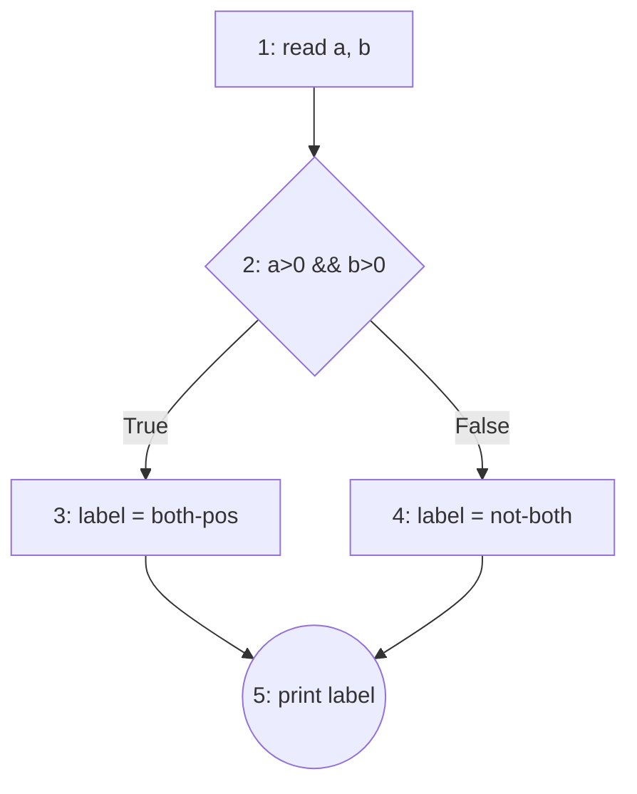
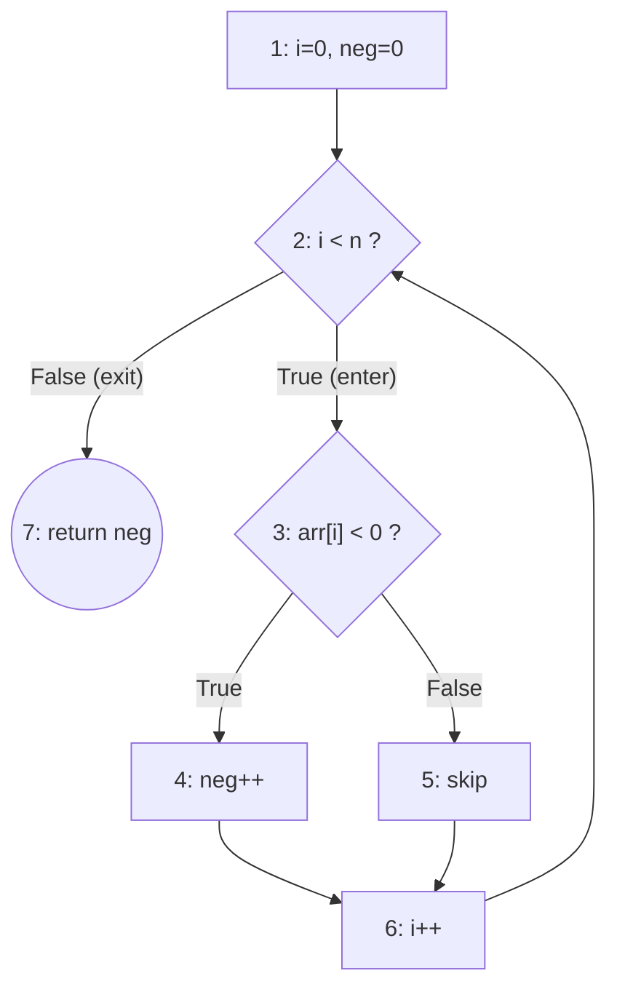

# Software Tests Summary

We can almost never run a program on _every_ possible input (there are far too many). So testing is really about **choosing a small, smart set of inputs** that still gives us confidence the program is correct. A **coverage criterion** is just a rule that tells you _which_ inputs (or paths, or combinations) you must exercise — e.g. "run every line at least once" or "make every `if` go both true and false". Most of this guide is a tour of different such rules, how to satisfy them, and how they compare in strength. Keep asking two questions while you read: _"What must this criterion make me test?"_ and _"How few tests can I get away with?"_

## Topics

| #   | Topic                                                                                                   | Exam frequency |
| --- | ------------------------------------------------------------------------------------------------------- | -------------- |
| 1   | [Mutation Testing](#1-mutation-testing)                                                                 | Q1 every exam  |
| 2   | [Control Flow & Coverage Criteria](#2-control-flow--coverage-criteria)                                  | every exam     |
| 3   | [Data Flow Testing](#3-data-flow-testing)                                                               | most exams     |
| 4   | [Subsumption — Master Cheat Sheet](#4-subsumption--master-cheat-sheet)                                  | every exam     |
| 5   | [Combinatorial / Pairwise (AETG, IPO/IPOG)](#5-combinatorial--pairwise-testing-aetg--ipoipog)           | every exam     |
| 6   | [Symbolic Execution](#6-symbolic-execution)                                                             | every exam     |
| 7   | [Concolic Testing (DART, CUTE)](#7-concolic-testing-dart--cute)                                         | most exams     |
| 8   | [FSM-based Testing (UIO, DS, W)](#8-fsm-based-testing-uio-ds-w-set)                                     | every exam     |
| 9   | [Black-box (ECP, BVA, Decision Tables, Domain)](#9-black-box-techniques-ecp-bva-decision-tables-domain) | sometimes      |
| 10  | [JUnit & Tooling (Pitest, JaCoCo)](#10-junit--tooling-reference-pitest-jacoco)                          | support        |

---

## 1. Mutation Testing

#### Plain words

Mutation testing checks _how good your tests are_ (not the program). The idea: deliberately break the program in tiny ways — each broken copy is a **mutant** — then see whether your test suite notices. A good suite should fail on a broken program. If a mutant slips through with all tests still passing, your tests have a blind spot. Think of it as "planting bugs on purpose to check that your bug-detector actually detects."

**Key definitions:**

- **Mutant** — a copy of program `P` with _one_ small, still-compilable change, written `Pᵢ`. "Syntactically-valid change" just means the edit still compiles/runs (you can't test a program that won't build). Examples: swap an operator (`>` → `>=`, `+` → `-`), or change a boundary. One mutant = one tiny change.
- **Killed (dead) mutant** — at least one test in your suite `T` gives a _different output_ on the mutant `Pᵢ` than on the original `P`. That difference is the test "catching" the planted bug. **Survived** — no test noticed the change (all tests give the same result on `Pᵢ` as on `P`). Surviving mutants point at weak spots in your tests.
- **Equivalent mutant** — the change happens to make _no difference at all_: `Pᵢ` and `P` behave identically on _every possible input_ (e.g. rewriting `a*b` as `b*a`). No test can ever kill it because there is nothing to catch — it's not really a different program. Deciding in general whether two programs always agree is **undecidable** ("undecidable" = no algorithm can answer it correctly for every case; you must argue each one by hand).
- **Mutation score** = `100 × D / (N − E)` — D = killed, N = total mutants, E = equivalent. It's the percentage of _killable_ mutants your suite actually killed. Equivalents are removed from the **denominator** (they were never killable, so counting them would unfairly punish the suite), and never counted as killed. Higher score = stronger test suite.
- **Competent-programmer hypothesis** — the assumption that real programmers write _almost_-correct code, so real bugs are small slips (a wrong operator, an off-by-one), not wild rewrites. **Coupling effect** — the observation that tests catching these small planted bugs also tend to catch bigger, more complex bugs. Together these justify why testing with _single_ tiny changes is worthwhile.
- A mutant survives if **either**: (1) no test even executes the mutated line, **or** (2) a test runs the line but the final _output_ comes out the same anyway (this case includes equivalent mutants). "iff" = "if and only if".

**The recipe (per mutant):**

0. **Precondition:** run the suite `T` against the original `P` first — every test must pass. A failing test means **fix `P` and retest**, not a killed mutant. The whole process iterates: after adding tests, re-run until the score clears the chosen threshold.
1. **Locate** the mutated line and the exact change (e.g. `>` → `>=`).
2. **Find a reaching input** — an input that (a) actually runs the mutated line, AND (b) makes the mutated expression compute a different value there than the original would. Step (b) is called **infection**: the internal state is now "infected" (wrong) at that point. Just running the line isn't enough; the value has to actually diverge.
3. **Propagate:** an infected internal value is useless unless it changes what the program finally _outputs/returns_ — that's **propagation** (the wrong value has to travel out to where a test can see it). Check the return value / output actually differs for that input. If for _every_ input the output stays identical → the change never shows ⇒ **equivalent** (add to E). Otherwise it is **killable**.
4. **Killed?** A mutant is killed iff the _existing_ test suite contains an input from step 2/3 whose asserted value now mismatches. If none → it **survives**.
5. **Count:** N = total mutants, E = equivalents, D = killed.
6. **Score** = `100·D/(N−E)`.
7. **To reach 100%:** for each surviving non-equivalent mutant, add a test whose input flips the mutated expression's outcome AND whose assertion checks the differing result. Boundary-adjacent inputs (the two values straddling a comparison) kill the most mutants per test.

**Worked example — one function, one test, four mutants.** (`foo(x) = 2x` if `x<0`, else `x`.)

```java
int foo(int x) {
2:  int y = 0;
3:  if (x < 0)          // C1
4:    y = -x;
5:  else
6:    y = x;
7:  if (x < 0)          // C2
8:    y = 2 * x;        // overwrites y when x<0
9:  return y;
}
```

The suite is a **single** test: `assertEquals(-2, foo(-1))` (passes on the original: `x=-1` → line4 `y=1`, then line8 `y=-2`). Four mutants, applied one at a time:

| #   | mutator                          | change         | on `foo(-1)`       | verdict            |
| --- | -------------------------------- | -------------- | ------------------ | ------------------ |
| M1  | `CONDITIONALS_BOUNDARY` (line 3) | `x<0` → `x<=0` | `-2` (same)        | **equivalent**     |
| M2  | `MATH` (line 8)                  | `2*x` → `2/x`  | `2/-1 = -2` (same) | killable, survives |
| M3  | `INVERT_NEGS` (line 4)           | `y=-x` → `y=x` | `-2` (same)        | **equivalent**     |
| M4  | `NEGATE_CONDITIONALS` (line 3)   | `x<0` → `x>=0` | `-2` (same)        | killable, survives |

- **Which are killed by the test? None — all 4 survive** (each computes `-2` on `x=-1`, matching the assertion). M2 survives only by luck: `2*(-1)` and `2/(-1)` both equal `-2`.
- **Which are equivalent?**
  - **M1** — `x<0` vs `x<=0` differ only at `x=0`; there original takes the else (`y=0`) and the mutant takes `y=-0=0` — same output. No input distinguishes them.
  - **M3** — line 4 runs only when `x<0`, but then line 8 (`x<0` true) **overwrites** `y=2*x`, so line 4's value is **dead**; changing `-x`→`x` never reaches the output.
- **Coverage of the one test?** `foo(-1)` only ever takes the `x<0` path, so the **else (line 6) never runs** ⇒ statement coverage < 100%, and each `if` takes only its True edge ⇒ **branch coverage = 2/4 = 50%**. (Full coverage still wouldn't kill the equivalents — the weak-oracle point.)
- **Score:** killed `D=0`, total `N=4`, equivalent `E=2` ⇒ `100·D/(N−E) = 0/(4−2) =` **0%**.
- **Add tests to kill the two killable ones → 100%:**
  - `assertEquals(-4, foo(-2))` **kills M2** (`2*-2=-4` ≠ `2/-2=-1`).
  - `assertEquals(3, foo(3))` **kills M4** (original `3` ≠ mutant `-3`) — and this hits the else branch, fixing coverage too.
  - Leave M1, M3 alone (equivalent — unkillable). New score `2/(4−2) =` **100%**.

**Exam patterns & gotchas:**

- **Score formula:** memorize `100·D/(N−E)`. Equivalents leave the denominator; they are NOT killed.
- **Branch coverage ≠ mutants all killed:** 100% branch coverage does NOT guarantee killing all `CONDITIONALS_BOUNDARY` mutants — you cover both branches without testing the _boundary value_ that distinguishes `>` from `>=`. Counterexample: `if(x>0)` tested with x=5 and x=−5 covers both branches, but x=0 (where `>` vs `>=` differ) is never tried → the mutant survives.
- **Writing a surviving mutant on purpose:** pick a comparison, test only inputs _far_ from the boundary so the boundary swap doesn't change any asserted result.

**Cheat sheet — Pitest DEFAULT mutators** _(this is the group the exam draws from — memorize these; the exam really only uses the first three)_:

| Mutator (NAME)                                      | What it does                                           | Example                              |
| --------------------------------------------------- | ------------------------------------------------------ | ------------------------------------ |
| **Conditionals Boundary** (`CONDITIONALS_BOUNDARY`) | `<`↔`<=`, `>`↔`>=`                                     | `a<b` → `a<=b`                       |
| **Negate Conditionals** (`NEGATE_CONDITIONALS`)     | flip the whole relational op                           | `==`→`!=`, `>`→`<=`, `>=`→`<`        |
| **Math** (`MATH`)                                   | swap arithmetic op                                     | `*`→`/`, `+`→`-`, `%`→`*`, `<<`→`>>` |
| **Increments** (`INCREMENTS`)                       | `++`↔`--`                                              |                                      |
| **Invert Negatives** (`INVERT_NEGS`)                | `-x` → `x`                                             |                                      |
| **Return Values**                                   | mutate returns: `true`↔`false`, `0`→`1`, non-null→null | see version note below               |
| **Void Method Calls** (`VOID_METHOD_CALLS`)         | delete a void call                                     |                                      |

Exact boundary table (memorize): `<→<=`, `<=→<`, `>→>=`, `>=→>`.
Exact negate table: `==→!=`, `!=→==`, `<=→>`, `>=→<`, `<→>=`, `>→<=`.

---

## 2. Control Flow & Coverage Criteria

#### Plain words

"Control flow" = the order in which statements run and the branch points (`if`, loops) that decide the route. We draw the program as a map — the **Control Flow Graph (CFG)** — and then pick coverage rules that say how thoroughly the map must be walked: every box? every fork-direction? every combination of conditions in a fork? The rules get progressively stronger (and need more tests). The recurring exam skills are: _draw the CFG_, _pick the smallest test set that satisfies a given rule_, and _say how many tests each rule needs_.

**Key definitions:**

- **CFG (Control Flow Graph)** — a diagram of the program's possible routes. Three node shapes: **computation** (rectangle = straight-line code that just runs top to bottom), **decision** (diamond = a condition, with a True edge and a False edge coming out), **merge** (circle = where two branches rejoin). Assume one **entry** and one **exit**; number every node so you can name paths like `1,2,3`.
- **Statement (node) coverage** — every node runs at least once. This is the _weakest_ rule (bare minimum: "no line of code went completely untested").
- **Branch (edge/decision) coverage** — every decision is taken **both** ways: each `if` goes True at least once and False at least once. **Subsumes statement** (see §4 — it forces every node to run too, so it's strictly stronger).
- **Basic-condition coverage** — in a compound condition like `a && b`, each _elementary_ (atomic) part `a` and `b` is individually made both True and False at some point. _Incomparable with branch_ (neither one guarantees the other — see §4 [CE2](#counterexample-library)).
- **Branch-and-condition** — satisfy branch coverage AND basic-condition coverage at the same time.
- **Compound-condition** — test _every combination_ of the atomic conditions in one decision. With N atoms that's up to **2ᴺ** combinations (short-circuit evaluation — where `&&`/`||` stops early once the result is decided — removes some impossible combinations).
- **MC/DC (Modified Condition/Decision Coverage)** — for _each_ atomic condition, show it matters _on its own_: find two tests that differ in **only that one condition** and produce **opposite** overall decision results (proving that condition alone can flip the outcome). This needs about **N+1** tests for N conditions — far fewer than the 2ᴺ of compound-condition — because each test is reused across several conditions. Required by aviation-safety standards **DO-178B / ED-12B**.
- **Cyclomatic complexity (McCabe, `V(G)`)** — a number measuring a module's **branching complexity** = the count of **linearly independent paths** through its CFG (equivalently, the size of a _basis set_ of paths). Both course books define it as **`V = e − n + 2`** (`e` = edges, `n` = nodes of the CFG; with `P` disconnected components it's `e − n + 2P`). Two equivalent shortcuts:
  - **`V = (# binary decision points) + 1`** — count each `if`/`while`/`for`/`case` and each `&&`/`||`; an `else` is **not** a decision. (Fastest by hand.)
  - `V` = number of enclosed regions of the planar CFG, `+1`.
    It measures _control structure, not size_, and equals the number of independent paths **cyclomatic testing** aims to cover. Rule of thumb (P&Y): `<20` simple, `>50` may be untestable.
  - _Worked example_ (`calculateCyclomaticComplexity`):
    ```
    while (y < 100) {          // decision 1
      if (y % 5 == 0) ...      // decision 2
      else if (y % 3 == 0) ... // decision 3
      else ...                 // (else is NOT a decision)
    }
    ```
    3 binary decisions (`while`, `if %5`, `else-if %3`) ⇒ **`V = 3 + 1 = 4`** (the same 4 you'd get from `e − n + 2` after drawing the CFG).
- **Path (all-paths) coverage** — execute **every complete route from entry to exit** at least once. It is the **strongest** structural criterion (it subsumes all the others — cover every path and you cover every edge, node, and condition combination along the way), but it is usually **infeasible**: a single loop creates unboundedly many paths (0, 1, 2, … iterations ⇒ infinitely many tests), and even loop-free code with `k` independent decisions has up to **2ᵏ** paths. That blow-up is exactly why the weaker criteria (and, for loops, **boundary-interior** below) exist. When you _are_ asked for a path-coverage test set (loop-free code only), list one input per feasible entry→exit path and mark any **infeasible** path (no input can drive it) rather than inventing one.
- **Infeasible (inexecutable) path** — a route that exists on the CFG diagram but **no input can ever actually make the program take**, because the branch choices along it **contradict each other**. Simple example: a path that needs `x > 0` at one `if` and later `x < 0` at another `if`, with `x` never changed in between — no single `x` is both, so the path can never run. **How to detect it:** walk the path and AND together the condition each decision forces (True → the condition, False → its negation) into one big formula — the **path condition** — then ask "can any input satisfy all of these at once?" (this is exactly symbolic execution, §6). If the formula is **contradictory (unsatisfiable / UNSAT)** → the path is **infeasible**; if some assignment satisfies it → the path is **feasible** and that assignment is an input that drives it. Infeasible paths are why you can rarely reach 100% path- or du-path coverage: you **drop them and write "infeasible" (with the contradiction)** instead of inventing an input.
- **Boundary-interior** — a way to tame loops (which otherwise create infinitely many paths). It splits the loop paths into two classes. **Full coverage of each is about _every subpath through the loop body_, not just iteration count** — this is the part people get wrong:
  - **Boundary tests (full coverage)** = for **every distinct subpath through the loop body**, one feasible path that _enters the loop and exits after that single iteration_ — **plus** the path that _skips the loop entirely_. Mechanically: unfold the CFG into a tree up to the **first repeated node** (the loop condition on its 2nd arrival), then stop and exit; **provide one feasible path per branch of that tree.** ⚠️ One single-iteration path is **not** enough if the body has an `if` — you need _one per body-subpath_. In this course, this boundary set is the expected answer.
  - **Interior tests (full coverage)** = paths that iterate **≥2 times where the first two iterations take _different_ body-subpaths**; you enumerate the body's branch outcomes over iterations 1 and 2. Needs unfolding a **second** iteration, so the first-repeated-node tree does **not** produce them. The _more general_ requirement — usually not required on the exam.
  - **Concrete `while(c){ if(d) X else Y }`:** the body has two subpaths (`d`-True→X, `d`-False→Y).
    - **Boundary (3 tests):** skip loop (`c` false at once) · one iteration through **X** (`d`=T) · one iteration through **Y** (`d`=F).
    - **Interior (4 tests):** two iterations with `d` = **TT, TF, FT, FF** (the TF/FT cases — where the iterations differ — are the ones that truly define "interior").
  - Quick test (course clarification): a feasible path starting with the unfolded prefix — _one iteration then exit → boundary; two-or-more **differing** iterations → interior._ Also aim for full **branch** coverage on any branches **outside** the loop.
- **Loop-boundary adequacy** — a simpler loop rule: run each loop **0 times, exactly 1 time, and more than 1 time** (the three qualitatively different loop behaviors).

#### ⚠️ Loop-boundary vs boundary-interior — don't confuse them

The word "boundary" means different things.
Here "boundary" is a false friend: a _loop-boundary_ "boundary" is an **iteration-count edge case** (0/1/many); a _boundary-interior_ "boundary" test is a **path that barely enters the loop**.

- **Subsumption:** "A subsumes B" means A is at least as strong — any test set that satisfies A automatically satisfies B, for _every_ program. (Full treatment in §4.)

**The recipe:**

_Drawing the CFG:_ one node per basic block; each `if`/loop condition = a diamond with T/F edges; loop back-edge returns to the condition node; merge after branches. Number nodes; label which source line each represents (line numbers are required).

_Drawing a CFG that spans **two functions** (caller + a callee you're told to include, e.g. `f()` calls `printProduct()`):_ **inline the callee's own CFG at the call site** — don't draw it as a single opaque node. At the call, add an edge **into the callee's entry**, draw the callee's full subgraph (its own diamonds/nodes), then an edge from the callee's **exit back to the caller's next node** — and if the callee **returns a value**, draw that return edge back to where the caller uses it (a classic lost point: forgetting the return-value edge). Number nodes continuously across **both** functions so you can name paths/du-paths over the whole thing.

_Branch coverage + denominator:_ denominator = **number of outgoing edges from decision nodes** = 2 × (number of decisions counted as branches). Example: two `if`s → **4 branches**. Pick a minimal input set hitting each diamond's T and F.

_Boundary-interior (the high-value recipe):_

1. Draw CFG, identify the loop condition node.
2. **Unfold into a tree**, expanding until you reach a node you've _already visited_ (the loop-condition node on its second arrival), then stop and exit the loop.
3. Enumerate every root-to-leaf subpath. **Always include the path that does NOT enter the loop** (condition false on first arrival).
4. For each subpath, find a _feasible_ concrete input. If a prefix is infeasible (e.g. inner index can't exceed outer on iteration 1), state "infeasible" and continue.
5. Each path starts at entry, ends at exit. The set should be **minimal**.

_Compound vs basic condition counting:_

- Compound-condition tests for a single decision with N elementary conditions = up to **2ᴺ**. To "need >100": use **N=7** (`2⁷=128 > 100`) elementary conditions in one decision.
- Basic-condition tests for that same decision = **2** (all-true row + all-false row suffice).

_Building a minimal MC/DC set (list-the-table-then-pick; P&Y §12.5):_ MC/DC = _each_ atomic condition must be shown to **independently flip the decision**. Target **N+1** tests for N conditions.

1. **List the full truth table** — all `2ᴺ` rows of the N atomic conditions.
2. **Mark infeasible rows** — cross out combos no input can produce (e.g. `income>50000`=F while `income>70000`=T; two conditions on the same variable). Do this **first** — you may not use an infeasible row in a pair.
3. **Compute the Decision** for every feasible row.
4. **For each condition Cᵢ, find an independence pair:** two feasible rows that differ in **only Cᵢ** (all other conditions equal) and give **opposite** Decisions. The two rows _prove_ Cᵢ matters on its own.
5. **Reuse rows to minimize:** one row can anchor several conditions' pairs (P&Y: "the same test case can cover several basic conditions"). Greedily pick anchors that serve multiple Cᵢ → the set shrinks toward **N+1**.
6. **Present the pairs:** list the chosen tests and, per condition, which two rows form its pair. The minimal set is **not unique** — any valid selection is accepted; short-circuit/coupling may force slightly more than N+1.

- _Don't-cares (`–`)_ are allowed for a condition not evaluated (short-circuit) — it can shrink the table.

**Worked example:**

```java
void checkNumbers(int[] numbers) {
  2: for (int i=0; i<numbers.length; i++)
  3:   if (numbers[i] % 2 == 0)        // even?
  4:     if (numbers[i] > 10)          // >10?
  5:       System.out.println(...);
  8: (exit)
}
```

**CFG** — nodes: **1** `i=0` · **2** `i<len?` (loop cond) · **3** `even?` · **4** `>10?` · **5** print · **6** `i++` · **8** exit. `(T)/(F)` = branch; node 6 is the loop back-edge to 2:

```
      1: i = 0
         |
         v
  +-->  2: i < len?  --F-->  8: exit
  |       | T
  |       v
  |     3: even?  --F-->  6      (odd -> skip to i++)
  |       | T
  |       v
  |     4: >10?   --F-->  6      (not >10 -> skip to i++)
  |       | T
  |       v
  |     5: print  ------>  6
  |                        |
  +----- 6: i++  <---------+
```

Unfold to the first repeated node (2 on its 2nd arrival) → **minimal boundary-interior set (4 paths = skip + one per loop-body subpath):**

```
1,2(F),8                       input []   -> loop not entered, exit
1,2(T),3(T),4(T),5,6,2(F),8    input [12] -> even & >10  -> prints
1,2(T),3(T),4(F),6,2(F),8      input [2]  -> even, not >10 -> nothing
1,2(T),3(F),6,2(F),8           input [3]  -> odd -> nothing
```

**Worked examples — two CFGs, every criterion shown its own test set:**

The definitions above say _what_ each rule demands; here are two tiny programs where you can watch each rule pick its inputs. **CFG-A** (one compound `if`, no loop) drives the _condition_ family; **CFG-B** (a loop with an inner `if`) drives the _loop_ family. _(Diagrams are mermaid; if your README→PDF path doesn't render mermaid, the edge-list + path tables under each diagram carry the same information.)_

**CFG-A — `if (a>0 && b>0)`** — atoms `A=(a>0)`, `B=(b>0)`, decision `D = A && B`:



Edges: `1→2`, `2→3` (T), `2→4` (F), `3→5`, `4→5`. Four input classes: `(1,1)=TT`, `(1,−1)=TF`, `(−1,1)=FT`, `(−1,−1)=FF` — only `TT` makes `D` true.

| Criterion                | What it forces here                                        | Minimal test set `(a,b)`    | #                       |
| ------------------------ | ---------------------------------------------------------- | --------------------------- | ----------------------- |
| **Statement**            | reach nodes 1–5 (one D-true + one D-false)                 | `(1,1)`, `(1,−1)`           | 2                       |
| **Branch / edge**        | take edge `2→3` and edge `2→4`                             | `(1,1)`, `(1,−1)`           | 2                       |
| **Basic-condition**      | `A` both ways, `B` both ways                               | `(1,1)`, `(−1,−1)`          | 2                       |
| **Branch-and-condition** | the two obligations above at once                          | `(1,1)`, `(−1,−1)`          | 2                       |
| **Compound-condition**   | every atom combo (short-circuit merges the two `A=F` rows) | `(1,1)`, `(1,−1)`, `(−1,·)` | 3 (4 w/o short-circuit) |
| **MC/DC**                | each atom flips `D` on its own                             | `(1,1)`, `(−1,1)`, `(1,−1)` | 3 = N+1                 |
| **Path**                 | every entry→exit route (only 2 exist)                      | `(1,1)`, `(1,−1)`           | 2                       |

Reading the rows:

- **Statement and branch coincide _here_** — with a single decision, reaching both node 3 and node 4 _is_ taking both edges. They diverge only when a node can be reached without covering every edge into it.
- **MC/DC pairs:** `A` is shown to matter by `{(1,1)=TT→D=T, (−1,1)=FT→D=F}` (only `A` changed, `D` flipped); `B` by `{(1,1)=TT→D=T, (1,−1)=TF→D=F}`. Three tests, `(1,1)` reused across both pairs — that's the `N+1`, not `2²`.
- **Why basic-condition ≠ branch (they're incomparable):** the suite `{(1,−1)=TF, (−1,1)=FT}` gives `A` both values _and_ `B` both values — basic-condition satisfied — yet **both** rows make `D` false, so edge `2→3` is never taken. Full basic-condition, broken branch. (The reverse gap — full branch, missing a condition combo — is CE1 in §4.)

**CFG-B — `while (i<n) { if (arr[i]<0) neg++ }`** — loop cond `c=(i<n)`, body cond `d=(arr[i]<0)`:



Edges: `1→2`, `2→7` (c F, skip), `2→3` (c T, enter), `3→4` (d T), `3→5` (d F), `4→6`, `5→6`, `6→2` (back-edge). The body has **two subpaths**: `d`-T = `3→4` (call it **X**), `d`-F = `3→5` (**Y**).

- **Path coverage is infeasible** here: the back-edge `6→2` lets the loop run 0, 1, 2, … times → unboundedly many entry→exit routes. _This is exactly why the loop criteria below exist._

- **Loop-boundary** — run the loop **0 / 1 / >1** times, indifferent to which body path runs:

  | Iters | Input       | Path                    |
  | ----- | ----------- | ----------------------- |
  | 0     | `arr=[]`    | `1,2,7`                 |
  | 1     | `arr=[5]`   | `1,2,3,5,6,2,7`         |
  | >1    | `arr=[5,5]` | `1,2,3,5,6,2,3,5,6,2,7` |

  3 tests; never forced through **X** (cares about count, not path).

- **Boundary-interior — boundary set** (the course's expected answer): unfold to the first repeated node (`2` on its 2nd arrival), then one feasible path **per body-subpath**, **plus** the skip path:

  | Case                         | Input      | Path            |
  | ---------------------------- | ---------- | --------------- |
  | skip loop                    | `arr=[]`   | `1,2,7`         |
  | 1 iter through **X** (`d`=T) | `arr=[−1]` | `1,2,3,4,6,2,7` |
  | 1 iter through **Y** (`d`=F) | `arr=[5]`  | `1,2,3,5,6,2,7` |

  3 tests. These 3 already hit **every edge** of the CFG → boundary-interior **subsumes branch**. A single-iteration-only version (skip + one pass) would miss the **X** path — that's the trap the definition warns about.

- **Boundary-interior — interior set** (the fuller rule, usually _not_ required): iterate **≥2 times** and enumerate the first two body outcomes `dd`:

  | `dd` | Input         |
  | ---- | ------------- |
  | TT   | `arr=[−1,−2]` |
  | TF   | `arr=[−1, 5]` |
  | FT   | `arr=[5, −1]` |
  | FF   | `arr=[5, 8]`  |

  The **TF / FT** rows — where the two iterations take _different_ body paths — are what genuinely distinguish "interior" from "boundary."

Tie-back to the ladder: CFG-A's rows climb `statement → branch → branch-and-condition → {compound, MC/DC}`; CFG-B shows why `path` is unreachable, and how `boundary-interior` (top of the ladder) and `loop-boundary` (base, incomparable) tame the same loop differently.

**Exam patterns & gotchas:**

- **Don't forget the loop-not-entered path** — always part of the boundary set.
- **Subsumption facts to quote** (all disproofs live in §4's [Counterexample library](#counterexample-library)):
  - boundary-interior **subsumes branch** (covering every subpath including in-loop branches covers every T/F edge).
  - branch **subsumes statement**; statement does NOT subsume branch.
  - branch does **NOT** subsume compound-condition → [CE1](#counterexample-library) (`if(a&&b)`, suite (T,T),(T,F): full branch, never tests (F,T)/(F,F)).
  - **basic-condition and branch are incomparable** → [CE2](#counterexample-library).
  - **loop-boundary and statement have NO subsumption either way** → [CE3](#counterexample-library) (both-directions counterexample).

**Cheat sheet — criteria, denominators, subsumption:**

| Criterion            | Obligation (denominator)                            | # tests (rough) | Subsumes                      |
| -------------------- | --------------------------------------------------- | --------------- | ----------------------------- |
| Statement            | each node/basic block                               | —               | (weakest)                     |
| Branch               | each decision edge = **2 × #decisions**             | ≥ #edges        | statement                     |
| Basic condition      | each elem. cond. T & F = **2 × #elem-conds**        | 2 (often)       | — (incomparable w/ branch)    |
| Branch-and-condition | branch ∪ basic-condition                            |                 | branch, basic-cond            |
| Compound condition   | every combination per decision = **≤ 2ᴺ**           | up to 2ᴺ        | branch-and-condition          |
| MC/DC                | 2 obligations per elem. condition                   | **~N+1**        | branch-and-condition          |
| Boundary-interior    | each subpath of CFG unfolded to first repeated node | varies          | branch                        |
| Loop-boundary        | loop runs **0, 1, >1**                              | 3 per loop      | — (incomparable w/ statement) |
| Path / all-paths     | every path                                          | ∞ w/ loops      | everything                    |

**Subsumption ladder (strong → weak):** all-paths ⊃ boundary-interior ⊃ {MC/DC, compound-condition, cyclomatic, LCSAJ} ⊃ branch-and-condition ⊃ branch ⊃ statement; basic-condition and loop-boundary sit at the base, _incomparable_ to branch/statement respectively. _(This is the **idealized, possibly-infeasible** model — the one the exams use; see the note at §4's diagrams.)_

---

## 3. Data Flow Testing

#### Plain words

Control-flow testing cared about _which lines run_. Data-flow testing cares about _the life of each variable's value_: where it's **set** (given a value) and where it's later **used**. The worry is a broken link between them — e.g. code sets `x` but a bug means a stale or wrong `x` gets used downstream. So we pair up every "here's where `x` is set" with every "here's where that `x` is read", and require tests that actually travel from the set to the use. Vocabulary below is just names for "set" (**definition**), "read" (**use**), and "a route from set to read that doesn't overwrite `x` on the way" (**def-clear path**).

**Key definitions:**

- **Definition** `d_n(x)` ("def"): `x` is _given a value_ at node n — the left-hand side of `x = …`, a parameter receiving its argument at entry, or reading input into `x`. Parameters count as defined at the entry node.
- **Use** `u_n(x)`: `x`'s value is _read_ (on the right-hand side of an assignment, inside a condition, or as a call argument). Two flavors:
  - **c-use (computation use)** — the value feeds a _computation_ or output (an assignment, a `return`, a `print`); attached to a **NODE**. E.g. `return x+10` is a c-use of `x`.
  - **p-use (predicate use)** — the value is read _in a decision_ (an `if`/loop condition). A p-use is attached to an **EDGE, not a node** — and a predicate node has **two** out-edges (True and False), so **one variable read in a condition creates two _separate_ p-uses: one on the True edge, one on the False edge.** Each individual p-use is a single `(variable, edge)` pair. E.g. `if(flag)` gives p-use of `flag` on edge `→True` **and** p-use of `flag` on edge `→False` — two obligations. _So "cover **a** p-use" = traverse **one** edge; "cover the condition's p-uses" (or **all-p-uses**) = traverse **both** edges._
- **def-clear path w.r.t. `x`** ("w.r.t." = with respect to): a route where none of the _in-between_ nodes reassign or clear `x`. Meaning: the value set at the start is _still the same value_ when it reaches the end — the link is intact.
- **`d_m(x)` reaches `u_n(x)`**: there exists a def-clear path from the def at m to the use at n — i.e. the value set at m can actually arrive, unchanged, at the use at n.
- **complete path** — a path that runs all the way from the **entry node to an exit node** (a whole execution route). This is what a **test case actually runs**: a du-path or def-clear path is usually only a _segment_ of the program, so to exercise it you pick a complete path `entry → … → exit` that _contains_ that segment. (In the dataflow criteria, you "select complete paths which include the required def-clear paths.") **simple path** = no repeated nodes _except possibly the two endpoints_ (so a single loop back to the start is allowed); **loop-free path** = all nodes distinct (no repeat at all).
- **du-path** (definition-use path, n1…nk): a def-clear path from a _definition_ of `x` to a _use_ of `x`. Precisely: n1 has a def of `x`, and **either** nk has a c-use and the path is **simple** (no repeated nodes except possibly the endpoints), **or** the last edge has a p-use and the path up to it is **loop-free**.
- A node like `x = x+1` is _both_ a **use** of `x` (the old value, on the right) **and** a **def** of `x` (the new value, on the left) — order matters: it reads, then overwrites.

**The recipe (mechanical):**

1. **Draw the CFG**, number nodes, force a single entry/single exit (add an exit edge if a `return` dangles).
2. **Annotate each node**: list `d_i(var)` for every assigned variable, and the uses. Predicate node → p-use on **both** out-edges; assignment/return/print node → c-use in the node.
3. **Build the def-use table**: for every (def, use) pair of the same variable, find a def-clear path connecting them. Each such pair is one **obligation** — a thing some test must exercise. The full list of pairs is your obligation set (the checklist to tick off).
4. **Satisfy a criterion:** the criteria below differ only in _how many_ of those def→use pairs you must cover. They range from lazy (`all-defs`: reach _some_ use of each def) to thorough (`all-du-paths`: cover _every_ route to _every_ use). Read the table as "for each definition of `x`, how much must I cover?"

| Criterion                  | Obligation per definition `d(x)`                                                                                                                                              |
| -------------------------- | ----------------------------------------------------------------------------------------------------------------------------------------------------------------------------- |
| **all-defs**               | one def-clear path from each def to **some** (any one) use it reaches                                                                                                         |
| **all-c-uses**             | a def-clear path from each def to **every c-use** it reaches                                                                                                                  |
| **all-p-uses**             | a def-clear path from each def to **every p-use it reaches — i.e. to BOTH out-edges (True and False) of every decision the def reaches** (⇒ all-p-uses subsumes all-branches) |
| **all-c-uses/some-p-uses** | all c-uses; if a def reaches **no** c-use, then at least one p-use                                                                                                            |
| **all-p-uses/some-c-uses** | all p-uses; if a def reaches **no** p-use, then at least one c-use                                                                                                            |
| **all-uses**               | **one (any)** def-clear path to **every** use (all c-uses AND all p-uses) — one route per use suffices                                                                        |
| **all-du-paths**           | **every** def-clear du-path (cycle-free / simple-cycle) to every use — _all_ routes, not just one ⇒ trivially includes all-uses; may be exponential                           |

5. **Feasibility check**: drop infeasible paths; you rarely hit 100%.

**Worked examples — the two dataflow subsumption disproofs** (both live in §4's [Counterexample library](#counterexample-library), so all subsumption counterexamples sit in one place):

- **[CE4](#counterexample-library) — full branch coverage ⊉ all-defs:** a two-`if` program where both tests give 100% branch coverage yet the def of `x` never reaches one of its uses. This is the canonical "all-defs is easy to break" trap (bullet below).
- **[CE5](#counterexample-library) — all-c-uses/some-p-uses ⇎ all-p-uses/some-c-uses:** two small programs (one per direction) proving the pair **incomparable**. Direction 1 is the `foo(x,y)` program: suite `{1-2-4-6}` covers the only c-uses but skips p-use edges. Key fact used: **all-p-uses requires _both_ out-edges of every decision**, so a single path can never satisfy it.

**Exam patterns & gotchas:**

- p-use lives on the EDGE (count both T and F edges); c-use lives in the NODE. A predicate node has **no defs** by assumption.
- A node like `x = x + 1` is simultaneously a **c-use** and a **def** of x; that def kills earlier defs through it.
- "all-defs" only needs **some** use per def — easy to satisfy, easy to break with branch coverage.
- all-c-uses and all-p-uses are **incomparable**.
- For "/some" criteria: the "some" clause only fires when a def reaches **zero** uses of the other kind.
- all-du-paths can be exponential; when asked to "list all du-paths," include both branches around a diamond.
- **Variable appears in two functions:** if you're asked for the du-paths of `x` and `x` is defined/used in **both** functions (e.g. a caller and the callee you inlined into the CFG — see §2), **list the du-paths in _each_ function.** Don't report only one; a `def→use` pair in the callee and one in the caller are separate obligations (they don't cross the function boundary unless a value is passed and the CFG is genuinely inlined).

**Cheat sheet — criteria table (slide CFG `1:d(x) → {2:u(x),3:u(x)} → 4 → {5:u(x),6}`):**

| Criterion    | Requires                 | Satisfying path(s)        |
| ------------ | ------------------------ | ------------------------- |
| all-defs     | d*1(x) to \_some* use    | `1,2,4,6`                 |
| all-uses     | d_1(x) to u_2, u_3, u_5  | `1,2,4,5,6` + `1,3,4,6`   |
| all-du-paths | every cycle-free du-path | `1,2,4,5,6` + `1,3,4,5,6` |

---

## 4. Subsumption — Master Cheat Sheet

#### Plain words

"Subsumption" ranks coverage criteria by strength. Saying **A subsumes B** means: _if you've satisfied A, you've automatically satisfied B_ — A is the tougher bar, so passing it gets B for free. (Example: branch coverage subsumes statement coverage — take every `if` both ways and you can't help but run every line.) The exam skill is almost always the _opposite_ direction: **disprove** a claimed subsumption by inventing one small program + one test suite that satisfies A yet misses B. This section is the toolkit for that.

**Key definitions:**

- **A subsumes B** ("A includes B"): for **every** program P, **every** test suite that satisfies A on P also satisfies B on P. A is then _strictly stronger_. (Note the "for every program" — a single program where A implies B is _not_ enough; it must always hold.)
- **Equivalent**: A subsumes B _and_ B subsumes A (they demand the same coverage). **Incomparable**: neither subsumes the other (each can be satisfied while missing something the other requires).
- Caution: subsumption is a _logical_ relation only — "A is stronger on paper". It does **not** guarantee A finds more real bugs in practice.

**⚠️ An example is NOT a proof.** Because "A subsumes B" is a **∀-program** claim, the two directions need opposite evidence.

**The recipe — to disprove "A subsumes B", find ONE program P + ONE suite T with: T satisfies A on P, but T does NOT satisfy B on P.**

1. Pick the obligation B requires that A does **not**.
2. **Build a tiny program** where that exact obligation can be isolated — a single extra statement, branch, def-use pair, or loop iteration A can skip.
3. **Construct the smallest suite T** meeting all of A's obligations while deliberately avoiding B's distinguishing obligation.
4. **Verify both claims explicitly**: (a) T satisfies A (enumerate A's obligations, show each met); (b) T misses ≥1 of B's obligations (name it).
5. For "no subsumption in BOTH directions" (incomparability), repeat with a **second** program/suite swapping roles.

### Counterexample library

_This is the one place every non-subsumption / incomparability in the doc is proved, each with **one program + one suite**. Other sections point here by ID (**CE1–CE6**). Template for all of them: show T satisfies A (every A-obligation met), then name the single B-obligation T misses._

**CE1 — branch ⊉ compound-condition** (equivalently, branch ⊉ "all 2ᴺ combinations").

```
if (a && b)  X;  else  Y;
```

Suite `{ (a,b)=(T,T), (T,F) }`: the decision is **True** then **False** ⇒ **full branch coverage**. But compound-condition needs all `2²=4` atom-combinations, and `(F,T)`, `(F,F)` are never tried ⇒ **branch ⊉ compound-condition.** _(Referenced from §2.)_

**CE2 — basic-condition ⇎ branch (incomparable, both directions).**

_Direction 1 — branch ⊉ basic-condition._ Program `if (a || b) X; else Y;` with suite `{ (T,F), (F,F) }`: decision **True** then **False** ⇒ full branch, yet atom **`b` is never True** ⇒ basic-condition unmet.
_Direction 2 — basic-condition ⊉ branch._ Program `if (a && b) X; else Y;` with suite `{ (T,F), (F,T) }`: each atom takes **both** T and F ⇒ basic-condition met, yet the decision is **False in both tests** (the true-branch is never taken) ⇒ branch unmet. Neither direction holds ⇒ **incomparable.** _(Referenced from §2.)_

**CE3 — statement ⇎ loop-boundary (incomparable, both directions).**

```
1 int foo(int x, int y) {
2   while (x > 0)
3     x--;
4   if (y == 0)
5     return x;
6   return y; }
```

_Direction 1 (loop-boundary adequate, NOT statement adequate):_ suite `foo(0,0)` (loop 0×), `foo(1,0)` (1×), `foo(2,0)` (>1×). All keep `y==0` ⇒ **statement 6 never executed** ⇒ loop-boundary ⊉ statement.
_Direction 2 (statement adequate, NOT loop-boundary adequate):_ suite `foo(0,0)` (loop 0×, hits line 5) + `foo(1,1)` (loop 1×, hits line 6). **Every statement** executed, but loop **never runs >1** ⇒ statement ⊉ loop-boundary. The two are **incomparable**. _(Referenced from §2.)_

**CE4 — full branch coverage ⊉ all-defs (dataflow).**

```
1 int f(int a, int b) {
2   int x = 0;        // def D1 of x
3   if (a > 0)
4     x = 1;          // def D2 of x  (overwrites D1 on this path)
5   if (b > 0)
6     print(x);       // the only use of x
7 }
```

Suite **{ (a=1,b=1), (a=-1,b=-1) }** takes both edges of each `if` ⇒ **full branch coverage**. But **D1 (`x=0`)** can reach the use only via `a≤0` (so it isn't overwritten) **and** `b>0` (so line 6 runs) — and neither test does both: the first overwrites `x` (D2), the second keeps `x=0` but skips the use. So **D1 reaches no use ⇒ all-defs fails** at 100% branch coverage ⇒ branch ⊉ all-defs. _(Referenced from §3.)_

**CE5 — all-c-uses/some-p-uses ⇎ all-p-uses/some-c-uses (incomparable, dataflow).** Reminder (textbook): a p-use of a variable in a predicate is associated with **each out-edge**, so **all-p-uses forces _both_ the T and F edge of every decision** (that's why all-p-uses ⊇ all-branches). A single path can therefore never satisfy all-p-uses. Each direction below needs its **own** program.

_Direction 1 — all-c-uses/some-p-uses ⊉ all-p-uses/some-c-uses._

```
void foo(int x, int y) {        // 1: def x, def y
  if (x > 0 && y < 0) {         // 2: p-use x,y — edges 2->3 (T), 2->4 (F)
    if (x > 10) return;         // 3: p-use x   — edges 3->5 (T), 3->6 (F)
  } else {
    print(x, y);                // 4: c-use x,y
  }
}                               // 5: return, 6: exit
```

Suite **{ 1-2-4-6 }** (one test with `x≤0`, so the outer `if` is false → `print`). The only c-uses are `x,y` at node 4, reached def-clear ⇒ **all-c-uses/some-p-uses satisfied** (x and y have c-uses, so the criterion asks no p-use of them). But all-p-uses needs _both_ edges of every predicate — `2->3`, `3->5`, `3->6` are never taken ⇒ **all-p-uses/some-c-uses fails.**

_Direction 2 — all-p-uses/some-c-uses ⊉ all-c-uses/some-p-uses_ (needs a def that gets **killed** on the paths p-use coverage happens to use):

```
void bar(int v, int w) {        // 1: def v, def w
  if (v > 0) { }                // 2: p-use v — edges 2->3 (T), 2->4 (F)
  else       { v = 1; }         // 4: v=1  → KILLS v   (node 3 = empty T-branch)
  if (w > 0) { v = 2; }         // 5: p-use w — edges 5->6 (T), 5->7 (F);  6: v=2 → KILLS v
  else       { }                // 7 = empty F-branch
  print(v);                     // 8: c-use v
}
```

Suite **{ (v>0,w>0): 1-2-3-5-6-8 , (v≤0,w≤0): 1-2-4-5-7-8 }** takes both edges of both predicates ⇒ **all-p-uses/some-c-uses satisfied** (v and w have p-uses). But the c-use of the _original_ `v` (def@1) needs a def-clear path to node 8, which exists **only** via node-2-True **and** node-5-False (`1-2-3-5-7-8`, i.e. `v>0 ∧ w≤0`) — a corner neither test hits (each test kills `v` at node 4 or 6 first) ⇒ that c-use pair is missed ⇒ **all-c-uses/some-p-uses fails.**

Both directions ⇒ **incomparable.**

**CE6 — full branch coverage ⊉ all-c-uses (dataflow).**

```
1 int f(int w, int y) {
2   int x, r;
3   if (w < 0) x = 1;  else x = 2;      // TWO defs of x (one per arm)
4   if (y < 0) r = x + 10;  else r = 99; // c-use of x ONLY on the y<0 arm
5   return r; }
```

`x` is defined on both arms of the first `if`, and has one **c-use** (`x + 10`) on the true arm of the second `if`. all-c-uses therefore has **two** obligations: _def-from-the-`w<0`-arm → the c-use_ and _def-from-the-`w≥0`-arm → the c-use_. Tests **{w=−1, y=1}** and **{w=1, y=−1}** take both T and F of each `if` ⇒ **full branch coverage**. But the first test defines `x` on the `w<0` arm and then takes `y≥0` (never reaching the c-use), while the c-use is only reached by the second test, which defined `x` on the `w≥0` arm ⇒ the pair _def-on-`w<0`-arm → c-use_ is **never exercised** ⇒ all-c-uses unmet ⇒ branch ⊉ all-c-uses.

**Exam patterns & gotchas:**

- Branch = "all-edges"; statement = "all-nodes"; decision ≡ branch.
- **Boundary-interior subsumes branch.**
- **Loop-boundary (0,1,many) is at the BASE** — incomparable with statement ([CE3](#counterexample-library)); do not confuse with boundary-interior.

**Cheat sheet (A → B means "A subsumes B", i.e. A stronger):**

STRUCTURAL hierarchy:

```
            Path  +  Boundary-Interior            (top: theoretical, often infeasible)
                       |
        +--------------+---------------+
        |              |               |
   Cyclomatic       MC/DC        LCSAJ / Compound-condition
        |              |
        +------ Branch-and-condition ------+       (= branch obligations ∪ basic-condition obligations)
              /                       \
        Branch                   Basic-condition
   (= all-edges = decision)      (INCOMPARABLE with branch — neither subsumes the
        |                         other, CE2 — so it hangs off branch-and-condition,
    Statement                     a SIBLING of branch, never below it)
   (= all-nodes)

   Loop-boundary (0,1,many) — incomparable with statement; sits at the base on its own
```

DATAFLOW hierarchy (Rapps–Weyuker "includes"); top = strongest:

```
                         All-Paths
                        /    |     \
              All-DU-Paths   |    Required k-Tuples
                   |         |          |
                All-Uses     |          |
                /       \     |          |
  All-C-Uses/      All-P-Uses/Some-C-Uses
  Some-P-Uses          /        \        |
        \             /          \       |
         \           /        All-P-Uses |
          \         /              |
          All-Defs            All-Edges (branch)
                                   |
                              All-Nodes (statement)
```

---

## 5. Combinatorial / Pairwise Testing (AETG & IPO/IPOG)

#### Plain words

Suppose a feature has several settings (parameters), each with a few possible values — say Table ∈ {Coffee, Desk, Kitchen}, Color ∈ {Brown, White, Red}, Size ∈ {Small, Medium}. Testing _every_ combination is `3×3×2 = 18` tests here, and explodes fast with more parameters. The insight behind **pairwise (2-way) testing**: most bugs are triggered by _one_ setting or the _interaction of two_ settings, rarely by three-plus at once. So we don't need every full combination — we only need every **pair** of values (from any two parameters) to appear together in _at least one_ test. That collapses the suite dramatically (often to a handful of tests) while still catching the vast majority of interaction bugs. **AETG** and **IPO/IPOG** are two algorithms that build such a small test set.

### What you're GIVEN and what you PRODUCE

- **Given:** a list of **parameters**, and for each one its **set of allowed values** (its "domain"). ⚠️ **Parameters can have any number of values, and different counts each** — e.g. P1 has 3 values, P2 has 3, P3 has 2. This is normal and the exams test it deliberately. There is **no special formula** for the multi-valued case — the mechanics below are identical; the only effect of a bigger domain is _more pairs to cover_ and _uneven pair counts_ when you count.
- **Produce:** a small set of **tests** (each test = one value chosen for _every_ parameter) such that for **every pair of parameters**, **every** combination of one value from each appears in **at least one** test.

**Key definitions.**

- **t-way / pairwise (t=2):** for every group of `t` parameters, every value-combination of those `t` appears in ≥1 test. Pairwise is the `t=2` case (every _pair_). "At least once" — it does **not** need to be balanced/equal counts.
- **Pair:** a specific (value-of-Pi, value-of-Pj) with i≠j. E.g. `(Table=Coffee, Size=Small)`. Pairs are always across **two different** parameters.
- **π (pi) = the set of pairs still _uncovered_.** This is your running checklist / bookkeeping object. The moment a test covers a pair, cross it off π. **You stop when π is empty** — every pair covered. Keeping π correct is where most exam marks are won or lost.
- **Covering array & orthogonal array — the mental model.** Picture your test set as a **table: one row per test, one column per parameter**, each cell holding a value. Both "arrays" are just names for such a table with a coverage guarantee about its columns:
  - **Covering array `CA(N; t, k, v)`** — a table of `N` rows (tests), `k` columns (parameters), each cell one of `v` values, such that: _pick any `t` columns, and every combination of their values shows up in **at least one** row._ For pairwise (`t=2`): **every pair appears ≥ 1 time** — that's the minimum we actually want. Reading the notation: `N`=#tests, `t`=strength (2 = pairwise), `k`=#parameters, `v`=#values per parameter. Its size grows only **logarithmically in the number of parameters** — why pairwise scales so well. (When parameters have _different_ value counts, people write `CA(N; t, v₁v₂…v_k)` or a "mixed-level" array; the idea is unchanged.)

  - **Orthogonal array `L_Runs(Levels^Factors)`** — the _stronger, balanced_ version: \*pick any two columns, and every combination appears **exactly the same number of times\*** (that fixed count is the array's "index", usually 1). Reading the notation `L4(2³)`: 4 **runs** (rows/tests), 3 **factors** (columns/parameters), each with 2 **levels** (values) — the `³` is the number of columns, the `2` is the values-per-column. So `L8(2⁷)` = 8 tests, 7 binary parameters.

  - **How they relate:** _every orthogonal array is also a covering array, but not vice versa._ "Appears exactly-equally" (orthogonal) is a tighter demand than "appears at least once" (covering). The price of that balance: orthogonal arrays are **rigid** — they exist only for special sizes (e.g. value counts that are prime powers, equal-sized domains) and are often **bigger** than the smallest covering array for the same job. So we usually _build_ covering arrays (via AETG/IPO); an orthogonal array is a nice ready-made table that's sometimes **handed to you as a ready-made starting set** (see "Orthogonal-array as a starting set" below).

  - **Concrete `L4(2³)`** (3 binary parameters, values 1/2):

    ```
    run  P1 P2 P3
     1    1  1  1
     2    1  2  2
     3    2  1  2
     4    2  2  1
    ```

    Check any two columns — e.g. P1 & P3: the pairs (1,1),(1,2),(2,1),(2,2) each appear **exactly once** ⇒ orthogonal (balanced). It's automatically a covering array too (each pair appears ≥ once). A covering array _only_ needs that "≥ once" — so for larger problems it can skip rows an orthogonal array would be forced to keep for balance.

  - **Covering array beats orthogonal — worked contrast (4 binary parameters).** Now take **4** binary parameters (values 0/1). Exhaustive testing = `2⁴ = 16` tests. An **orthogonal** array must have runs divisible by 4 for _every_ column-pair to be balanced, and no orthogonal array exists for 4 binary factors in 4 runs — the smallest is **L8 = 8 runs** (it actually holds up to 7 factors). But a **covering** array (each pair ≥ once, balance not required) does the job in just **5 tests**:

    ```
    run  P1 P2 P3 P4
     1    1  1  1  1
     2    1  0  0  0
     3    0  1  0  0
     4    0  0  1  0
     5    0  0  0  1
    ```

    Verify all `C(4,2)=6` column-pairs — e.g. P1&P4: (1,1) in run 1, (1,0) in run 2, (0,0) in runs 3–4, (0,1) in run 5 ⇒ all four combos present. The same holds for every other pair (each of the 6 pairs gets its 00/01/10/11 exactly as run 1 supplies the `11`, the "one-hot" runs supply the `10`/`01`, and the zero-heavy runs supply `00`). So **5 < 8 < 16**: the covering array is smaller than the orthogonal array precisely because it drops the exactly-equally-often demand and keeps only "appears at least once." (Balance costs the extra 3 rows and buys nothing for pair _coverage_.)

**AETG** (**A**utomatic **E**fficient **T**est **G**enerator) **— the recipe** _(builds one complete test at a time, greedy)_:

1. **Build π** = every pair across every parameter-pair. Count = `Σ_{i<j} |Pi|·|Pj|`. (Optional binary convention: start with all-0s / all-1s tests first and remove their pairs.)
2. **Repeat until π is empty.** Each pass builds exactly ONE new test:
3. **Pick the first (parameter, value):** the one appearing in the **most remaining pairs of π**. In practice: count, for each parameter-value, how many uncovered pairs still contain it (an "occurrence count" table), and take the max. Ties → first in listed order.
4. **Generate `m` candidate tests.** Each candidate fills the _remaining_ parameters in some **order** (given by the question, or random). `m` is a setting you choose (e.g. m=1 or m=3).
5. **Greedy per-parameter fill:** going through that candidate's order, for each next parameter choose the **value that forms the most pairs still in π with the values already fixed so far.** ⚠️ Only look **back** at already-assigned parameters, never ahead. Ties → first value. _(Multi-valued changes nothing here — you simply have more values to try; count each and take the max.)_
6. **Score each finished candidate** = total pairs in π it covers (re-count over the _whole_ test).
7. **Keep the max-score candidate** (ties → first); add it as a test, remove all its pairs from π. Back to step 2.

**Sub-skill: "list all pairs to add when extending to a new parameter"** (a very common AETG/IPO sub-question). "You already have a pairwise set covering P1, P2; now add a new parameter P3 — list all pairs that must be covered." **Answer = only the pairs that involve the new parameter** (the P1–P2 pairs are already done, don't re-list them). That is: every value of P3 × every value of each existing parameter.

**Formula:** pairs to add = `Σ over each existing Pj of ( |Pj| × |P3| )`.
**Example (multi-valued):** P1={Coffee,Desk} (2), P2={Brown,White,Red} (3), new P3={S,M,L} (3) → P1×P3 = `2×3 = 6` pairs + P2×P3 = `3×3 = 9` pairs = **15 pairs** to add.

⚠️ **This counts _pairs_, not _tests_.** All 15 are distinct (P1×P3 pairs use P1's values, P2×P3 pairs use P2's values — nothing overlaps), so you can't lower the 15. But the number of _tests_ needed is far smaller, because **one test covers several pairs at once**: a row `(Coffee, Brown, S)` knocks out `(Coffee,S)` _and_ `(Brown,S)` together. That reuse is exactly what IPO horizontal growth does — append a P3 value to an existing row and it covers one P1×P3 pair and one P2×P3 pair simultaneously.

**IPO** (**I**n-**P**arameter-**O**rder; the _t_-way generalization is **IPOG**, IPO-**G**eneral) **— the recipe** _(adds one parameter at a time; deterministic)_:

The core idea: start with a table that's already pairwise-correct for the **first two** parameters, then bring in each new parameter one at a time. Adding a parameter is done in two moves — **grow the table sideways** (widen the rows you already have) first, and only if that leaves pairs uncovered, **grow it downward** (add new rows). Sideways is free coverage (no new tests); downward is the last resort.

1. **Initialization:** write out the **full** cross-product of the first two parameters — every `(P1-value, P2-value)` combination, one per row. (With only two parameters each row _is_ a pair, so there's no way to do fewer; this is `|P1|×|P2|` rows.)
2. **For each next parameter Pᵢ (P3, then P4, …):**
   - **a. Build π** = all the new pairs this parameter introduces = every `(value of an earlier parameter Pj, value of Pᵢ)` — exactly the "pairs involving the new parameter" from the sub-skill above. (Earlier parameters are already mutually covered; only pairs _touching Pᵢ_ are new.)
   - **b. Horizontal (sideways) growth — widen existing rows, add NO new rows.** Go down the existing rows top to bottom and **append one Pᵢ-value to each**. For a given row, appending value `b` covers, in one shot, the pair of `b` with _every_ earlier parameter's value already in that row — so pick the `b` that covers the **most pairs still in π** (ties → first listed value). Cross those pairs off π before moving to the next row. You have exactly as many rows as before, so at most `#rows` distinct Pᵢ-values get placed here; if Pᵢ has more values (or more pairs than rows can absorb), some pairs are left for step c.
   - **c. Vertical (downward) growth — add new rows for the leftovers.** Any pair still in π after horizontal growth needs a fresh row. For each leftover pair `(Pj=a, Pᵢ=b)`: **first try to reuse** an existing vertical-growth row — one whose Pj slot is already `a` **or** blank _and_ whose Pᵢ slot is already `b` **or** blank — and fill in its blanks. **Only if none fits, add a brand-new row** with `Pj=a`, `Pᵢ=b`, and **`*` (don't-care = "any value")** in every other column. Reusing rows before adding new ones is what keeps the suite small.
   - **d.** Replace any leftover `*` with any valid value, then move on to the next parameter Pᵢ₊₁ (its horizontal growth now runs over _all_ rows, including the ones vertical growth just added).

**Worked example A — multi-valued AETG (uneven domains), full run.** P1={C,D} (2), P2={B,W,R} (3), P3={S,M} (2). Conventions (state them in your answer): **m=1** (one candidate per test); fill the still-unassigned parameters in **index order** P1→P2→P3; all ties (first pick and value) break to the **first-listed** value/parameter.

**Build π** — `|P1||P2| + |P1||P3| + |P2||P3| = 6+4+6 = 16` pairs:

```
P1P2: (C,B)(C,W)(C,R)(D,B)(D,W)(D,R)   P1P3: (C,S)(C,M)(D,S)(D,M)   P2P3: (B,S)(B,M)(W,S)(W,M)(R,S)(R,M)
```

_Test 1._

- **Count → first pick:** C→5, D→5, S→5, M→5, each of B/W/R→4. Tie at 5 → first → **P1 = C**.
- **Fill P2** (P1=C): (C,B),(C,W),(C,R) all =1 → tie → **B**.
- **Fill P3** (C,B): `S`→(C,S)ₚ₁₃+(B,S)ₚ₂₃=2; `M`→2 → tie → **S**.
- ⇒ **Test 1 = (C,B,S)**, score 3; remove (C,B),(C,S),(B,S) → **13 left**.

_Test 2._

- **Count → first pick:** on 13 left: D→5, M→5, W→4, R→4, C→3, S→3, B→2. Tie D vs M → first parameter → **P1 = D**.
- **Fill P2** (P1=D): (D,B),(D,W),(D,R) all =1 → tie → **B**.
- **Fill P3** (D,B): `S`→(D,S)ₚ₁₃=1 [(B,S) gone]; `M`→(D,M)ₚ₁₃+(B,M)ₚ₂₃=2 → **M**.
- ⇒ **Test 2 = (D,B,M)**, score 3; remove (D,B),(D,M),(B,M) → **10 left**.

_Test 3._

- **Count → first pick:** W→4 [(C,W)(D,W)+(W,S)(W,M)], R→4, else ≤3. Tie W vs R → **P2 = W**.
- **Fill P1** (P2=W): (C,W)=1, (D,W)=1 → tie → **C**.
- **Fill P3** (C,W): `S`→(W,S)ₚ₂₃=1 [(C,S) gone]; `M`→(C,M)ₚ₁₃+(W,M)ₚ₂₃=2 → **M**.
- ⇒ **Test 3 = (C,W,M)**, score 3; remove (C,W),(C,M),(W,M) → **7 left**: P1P2:(C,R)(D,W)(D,R) · P1P3:(D,S) · P2P3:(W,S)(R,S)(R,M).

_Test 4._

- **Count → first pick:** R→4 [(C,R)(D,R)+(R,S)(R,M)] is the max → **P2 = R**.
- **Fill P1** (P2=R): (C,R)=1, (D,R)=1 → tie → **C**.
- **Fill P3** (C,R): `S`→(R,S)ₚ₂₃=1 [(C,S) gone]; `M`→(R,M)ₚ₂₃=1 → tie → **S**.
- ⇒ **Test 4 = (C,R,S)**, score **2** (only (C,R),(R,S); (C,S) already covered) → **5 left**: P1P2:(D,W)(D,R) · P1P3:(D,S) · P2P3:(W,S)(R,M).

_Test 5._

- **Count → first pick:** D→3 [(D,W)(D,R)+(D,S)] → **P1 = D**.
- **Fill P2** (P1=D): (D,W)=1, (D,R)=1 → tie → **W**.
- **Fill P3** (D,W): `S`→(D,S)ₚ₁₃+(W,S)ₚ₂₃=2; `M`→0 → **S**.
- ⇒ **Test 5 = (D,W,S)**, score 3; remove (D,W),(D,S),(W,S) → **2 left**: P1P2:(D,R) · P2P3:(R,M).

_Test 6._

- **Count → first pick:** R→2 [(D,R)+(R,M)] → **P2 = R**.
- **Fill P1** (P2=R): (D,R)=1 → **D**.
- **Fill P3** (D,R): `M`→(R,M)ₚ₂₃=1 → **M**.
- ⇒ **Test 6 = (D,R,M)**, score 2; π **empty**.

**Answer — 6 tests** (vs `2×3×2 = 12` exhaustive): `(C,B,S), (D,B,M), (C,W,M), (C,R,S), (D,W,S), (D,R,M)`. Verify: P1P2 gets all 6, P1P3 all 4 [(C,S)t1,(C,M)t3,(D,S)t5,(D,M)t2], P2P3 all 6. ✓ Takeaway: multi-valued is purely mechanical — bigger domains just mean more values to count and more pairs to clear; the not-every-test-scores-3 rows (t4, t6) are normal near the end.

#### When m>1

The run above uses **m=1** (one candidate per test). With **m>1** the only change is the "generate candidates" step: at each test you build `m` candidates (each with its own fill order), **score every candidate over its whole finished test**, and keep the highest (ties → first). Larger `m` → more candidates per step → usually **fewer total tests**, at more computation.

**Worked example B — IPOG (full trace: init → horizontal → vertical).** Three parameters: P1={1,2}, P2={1,2}, P3={1,2,3}. (P3 has 3 values, so horizontal growth _can't_ place them all in the 4 existing rows — that's what forces vertical growth, the part exams love to test.)

**Step 1 — Initialize** with the P1×P2 cross-product (4 rows):

```
row  P1 P2
 1    1  1
 2    1  2
 3    2  1
 4    2  2
```

**Step 2 — Add P3.** π = the 12 pairs touching P3: P1×P3 = (1,1)(1,2)(1,3)(2,1)(2,2)(2,3) and P2×P3 = (1,1)(1,2)(1,3)(2,1)(2,2)(2,3) _(read each as (Pj-value, P3-value))_.

**2b — Horizontal growth** (append a P3 value to each existing row; pick the value covering the most still-uncovered pairs, counting against **both** P1 and P2 in that row):

| row | P1 P2 | try P3=1                      | P3=2                  | P3=3 | pick              | pairs removed from π |
| --- | ----- | ----------------------------- | --------------------- | ---- | ----------------- | -------------------- |
| 1   | 1 1   | (P1:1,P3:1)+(P2:1,P3:1)=**2** | 2                     | 2    | **1** (tie→first) | (1,1)ₚ₁, (1,1)ₚ₂     |
| 2   | 1 2   | 1                             | (1,2)ₚ₁+(2,2)ₚ₂=**2** | 2    | **2**             | (1,2)ₚ₁, (2,2)ₚ₂     |
| 3   | 2 1   | 1                             | (2,2)ₚ₁+(1,2)ₚ₂=**2** | 2    | **2**             | (2,2)ₚ₁, (1,2)ₚ₂     |
| 4   | 2 2   | (2,1)ₚ₁+(2,1)ₚ₂=**2**         | 0                     | 2    | **1** (tie→first) | (2,1)ₚ₁, (2,1)ₚ₂     |

Rows after horizontal growth, and what's **left in π** (4 pairs — all the P3=3 pairs, since value 3 never got placed):

```
1  1  1        π left = { (P1:1,P3:3), (P1:2,P3:3),
1  2  2                   (P2:1,P3:3), (P2:2,P3:3) }
2  1  2
2  2  1
```

**2c — Vertical growth** (each leftover pair needs a row; reuse a `*` row before adding a new one):

- `(P1=1,P3=3)` → no rows yet, add **row 5 = (1, \*, 3)**.
- `(P2=1,P3=3)` → row 5 has P2=`*` and P3=3 already ⇒ **fill the blank**: row 5 = (1, **1**, 3).
- `(P1=2,P3=3)` → row 5 has P1=1 (fixed, ≠2), can't reuse ⇒ add **row 6 = (2, \*, 3)**.
- `(P2=2,P3=3)` → row 6 has P2=`*` and P3=3 ⇒ fill: row 6 = (2, **2**, 3).

π is now empty. **Final suite — 6 tests** (vs `2×2×3 = 12` exhaustive):

```
row  P1 P2 P3
 1    1  1  1
 2    1  2  2
 3    2  1  2
 4    2  2  1
 5    1  1  3
 6    2  2  3
```

Sanity-check one pair-type: P2×P3 → (1,1) r1, (2,2) r2, (1,2) r3, (2,1) r4, (1,3) r5, (2,3) r6 ⇒ all six present. ✓ The two takeaways: horizontal growth did the bulk of the work "for free" (no new rows for values 1 & 2), and vertical growth added the minimum rows for value 3, **reusing row 5 before opening row 6**.

**Special-parameter twists** (recurring "adapt the algorithm" sub-questions):

- **Fault-prone parameter — "each value of P3 must appear ≥ twice with every other value":** change π construction — **put every pair that involves P3 into π twice**; leave the other pairs at multiplicity one. Run growth/greedy normally, but **remove only ONE copy** of a doubled pair each time a test covers it — so the pair must be covered twice before it leaves π. (Works for both IPO and AETG).
- **Critical parameter — "(P2,1) must appear in ≥ 75% of tests":** this is a _frequency_ constraint, not a pair constraint, so **don't fiddle with π counts** (you don't know the final test count in advance). Instead, in AETG: when choosing the first (param,value) of each new test, if (P2,1) is currently in < 75% of tests so far, **force-select it**; and after all pairs are covered, keep **adding redundant tests containing (P2,1)** until the 75% threshold is met.
- **Orthogonal-array as a starting set:** if you're handed an orthogonal array (or any set of prebuilt tests), use it as the **starting tests**: build the full pair list, **strike out every pair those starting tests already cover**, then run AETG/IPO only on what's left → far fewer iterations.
  - **Seed IPO with an `Lₙ(2^(k-2))` OA** : an OA is already a minimal pairwise-covering set for the parameters it contains, so `Lₙ(2^(k-2))` gives you `n` rows that **already cover all pairs among `k-2` of the `k` boolean parameters — for free**. So instead of IPO's usual Step 1 (start from the full `P1×P2` cross-product), **use the OA's `n` rows as the initial test set**, then run IPO's parameter-addition (**horizontal → vertical growth**) for the remaining `k-(k-2)=2` parameters — building π from **only the pairs that involve those 2 new parameters** (the OA already covers the rest). You skip covering the first `k-2` parameters entirely.

**⚠️ Why you can't just _duplicate_ an OA's columns to fake more parameters** (a classic "why doesn't this work?"). Tempting shortcut: you have `L4(2³)` covering 3 parameters and you want 6, so you copy the 3 columns to the right (P4:=P1, P5:=P2, P6:=P3):

```
run  P1 P2 P3 | P4 P5 P6      (P4=P1, P5=P2, P6=P3)
 1    1  1  1 |  1  1  1
 2    1  2  2 |  1  2  2
 3    2  1  2 |  2  1  2
 4    2  2  1 |  2  2  1
```

The trap is the pair **between a column and its own clone** — e.g. P1 & P4. Because P4 is _identical_ to P1 in every row, that column-pair only ever shows the **matching** values `(1,1)` and `(2,2)`; the **mismatched** pairs `(1,2)` and `(2,1)` can **never** appear. So pairwise coverage is broken for P1–P4, P2–P5, and P3–P6. (Cross pairs like P1–P5 are fine — they're just the original P1–P2 pairs again.) Duplication buys columns but not coverage; you must genuinely extend the array (add the missing pairs via AETG/IPO), not clone it.

**Exam patterns & gotchas.**

- **m=1 vs m=3:** larger `m` → more candidates per step → **fewer total tests** but **more computation**. m=1 is fast but yields a bigger suite. AETG is **non-deterministic** (random orders); IPOG is **deterministic**.

**Cheat sheet — AETG vs IPOG:**

|                     | **AETG**                                       | **IPO / IPOG**                       |
| ------------------- | ---------------------------------------------- | ------------------------------------ |
| Unit added per step | one complete test                              | one parameter                        |
| Strategy            | greedy, m candidates, keep best                | init → horizontal → vertical growth  |
| Determinism         | non-deterministic                              | deterministic                        |
| Complexity          | higher                                         | lower                                |
| Flexibility         | —                                              | extend existing set; `*` don't-cares |
| Setting             | m = #candidates (bigger → fewer tests, slower) | —                                    |

---

## 6. Symbolic Execution

#### Plain words

Instead of running the program on _actual numbers_, run it on _symbols_ that stand for "any input". As you walk one path through the code, you track two things: **PV** = what each variable now equals _in terms of those symbols_ (e.g. `c1 = X*X`), and **PC** = the list of conditions the inputs must satisfy to have taken this exact path (e.g. `X > Y`). At the end, the PC is a set of equations; if a solver can find numbers satisfying it, those numbers are a real test input that drives this path — and if the PC is contradictory (unsatisfiable), the path is **impossible** and needs no test. This is how you prove things like "this ERROR line can never be reached".

**Key definitions.**

- **Symbolic value** — instead of a concrete number, each input is given an uppercase symbol standing for "whatever the caller passes" (`x→X`, `arr→A`, its length → `SIZE_OF_A`). Literal constants (like `1`, `0`) stay as themselves.
- **Symbolic state / PV (Program Variables)** — the current value of every variable written as a formula in those symbols. An **assignment** updates PV (e.g. after `c1 = x*x`, PV has `c1 = X*X`); it never touches the PC.
- **Path condition (PC)** — the running list of branch conditions joined by AND (`/\`), recording what must be true to follow this path. Taking a branch's **True** side appends the condition; taking the **False** side appends its **negation** (`!condition`).
- **Feasibility / SAT** — a path is _feasible_ (a real input can follow it) exactly when its PC is **satisfiable**. You hand the PC to a constraint solver, which answers **SAT** (+ a concrete example — "here are numbers that work"), **UNSAT** (no numbers can satisfy it), **UNKNOWN**, or **TIMEOUT**. UNSAT ⇒ path infeasible ⇒ that code is unreachable via this path.
- **Reaching ERROR** — to check whether a specific `ERROR` line can run, AND together the conditions of exactly the branches on the route to it, and test that PC for satisfiability.

**The recipe — columns `line | PV | PC`:**

1. **Entry:** bind every parameter to its symbol in PV. PC empty.
2. **Assignment:** update only PV (substitute current symbols), e.g. `c1 = X*X`.
3. **Branch:** nothing in PV; append constraint to PC with `/\`. **Convention: take the FALSE branch first**, then negate that last constraint to flip to True on the next run. Simplify and say so (`X != X+1 ≡ TRUE`, `X == X+1 ≡ FALSE`).
4. **Return/ERROR:** write symbolic return value in PV, or mark `ERROR`.
5. After each run: state the **symbolic return value** and the **full PC**; then negate the last branch and re-run.

**Worked example — unreachable ERROR:**

Specify the PC that reaches the error in this code. Is it reachable?

```
void foo(double x){ c1 = x*x; if (c1+1==0){ if (c1-1==0){ ERROR; }}}
```

| line  | PV        | PC                           |
| ----- | --------- | ---------------------------- |
| entry | x = X     |                              |
| c1    | c1 = X\*X |                              |
| if1   |           | X\*X + 1 == 0                |
| if2   |           | X*X + 1 == 0 /\ X*X - 1 == 0 |

- **Full PC to ERROR:** `X*X + 1 == 0 /\ X*X - 1 == 0`.
- **Reachable? NO.** `X*X + 1 == 0` forces `X*X = -1`, impossible for real X (would need imaginary `i`); also both `v+1==0` and `v-1==0` can't hold at once. Canonical **unreachable-error** pattern.
- **Branch-coverage denominator:** two `if`s ⇒ `2 × 2 = 4`.

**Worked example — false-branch-first:**

```
runSymbolic(int x,int y){ if(x>y) x=y+1; else y=x+1; if(x==y) ERROR; return x+y; }
```

Run 1 (false branch first ⇒ `X<=Y`, line `y=x+1` runs):
| line | PV | PC |
|---|---|---|
| entry | x=X, y=Y | |
| if1(F) | | X <= Y |
| y=x+1 | y = X+1 | |
| if2(F) | | X <= Y /\ X != X+1 ≡ X <= Y |
| return | 2\*X + 1 | |

Symbolic return `2*X+1`, PC `X <= Y`. Negate last → aim at ERROR: PC becomes `X <= Y /\ X == X+1 ≡ FALSE` ⇒ **infeasible**, ERROR unreachable on this branch.

**Exam patterns & gotchas.**

- **Branch denominator** = `2 × #decisions` (loop conditions count, infeasable also counted).
- **Unreachable errors:** spot UNSAT PCs — `x*x+1==0`, `v+1==0 /\ v-1==0`, `x>0 /\ y>0 /\ x+y<0`. Answer "not reachable" + algebraic reason; never invent an input.
- **Satisfying input:** if the PC is SAT, give one concrete tuple that satisfies it (for PC `X<=Y`, answer `x=0, y=0`). **Finding an array out-of-bounds bug is the same skill:** an access `arr[b+1]` is only safe while `0 ≤ b+1 ≤ SIZE_OF_A − 1`, so to _hit_ the bug you add the violating constraint `b+1 > SIZE_OF_A − 1` to the PC and solve. E.g. `arr` has 4 slots (indices 0–3, `SIZE_OF_A = 4`) and the code reads `arr[b+1]`: solving `b+1 > 3` gives `b = 3`, which reads index 4 — one past the end ⇒ out-of-bounds.
- **What changes in symbolic execution to guarantee MC/DC coverage?**. Normally a compound decision is treated as **one** branch — you add the whole condition (or its negation) to the PC and fork just True/False. The change:
  1. For each decision, **first build its MC/DC cases** — the ~N+1 rows: all-true, then flip **one** atom at a time (each flip must flip the overall result).
  2. **Run one symbolic execution per MC/DC row**, and to the PC add **each atomic condition's required truth value separately** (not the compound condition as a single unit). _Example_ `a /\ b /\ c` → 4 MC/DC rows ⇒ **4 runs**, each PC forcing that row's atom values: `a/\b/\c`, `!a/\b/\c`, `a/\!b/\c`, `a/\b/\!c`.
  3. **Fallback:** if MC/DC is impossible for a condition (e.g. an atom that can't independently flip the outcome — masked or coupled), handle it **"as usual"** = the ordinary behavior from the intro line: **fork the whole decision True/False** (add `C` / `¬C` to the PC), with **no** per-atom MC/DC constraints. (You just get decision/branch coverage for it.)
     - **Per-atom or per-decision?** "if for a particular _condition_ full MC/DC is impossible" is ambiguous — **state your reading**:
       - _Per basic condition (theoretically correct, what real tools do):_ keep the independence pairs for the atoms that **can** be shown independent; drop **only** the impossible atom's obligation (ordinary handling for it) → "partial MC/DC".
       - _Per decision (the exam's likely simplifying intent, since "full MC/DC coverage" is a decision-level notion):_ if the decision can't be **fully** MC/DC-covered, revert the **whole** decision to ordinary True/False — don't attempt partial MC/DC.
- **To get the next path, negate the _last_ constraint of the previous run's PC** (not an earlier one), then re-solve. Walking `X<=Y /\ X!=X+1` → flip the last → `X<=Y /\ X==X+1`. Always the most recently added conjunct.
- **Path-exploration ORDER (DFS + backtracking, "false-first").** _"Give the first k paths a symbolic engine explores"_ If code is a **depth-first walk of the decision tree**: take each decision **False first**; to advance, **flip the deepest decision that still has an untried value**; when a decision's _both_ values are done under the current prefix, **backtrack up** to the previous decision and flip that, then resume **false-first** for everything newly reached. Example (decisions at lines 2, 3-nested-in-2, and 5):
  ```
  1 int g(int p,int q){
  2   if (p>0)              // decision @2
  3     if (q>0) return 1;  // decision @3  (reached only when @2 is True)
  5   if (p==q) return 2;   // decision @5
  6   return 3; }
  ```

  - **Path 1** — all False: `@2(F)` skips the block (so @3 isn't reached), `@5(F)` → `1,2(F),5(F),6`.
  - **Path 2** — flip the last decision (@5) → True: `1,2(F),5(T)`.
  - **Path 3** — under `@2(F)`, @5 is now done both ways ⇒ **backtrack to @2, flip to True**; @3 is reached for the first time, taken **False first**, then @5 False: `1,2(T),3(F),5(F),6`.
  - (next: `1,2(T),3(F),5(T)`, then backtrack to @3 → `1,2(T),3(T)…`.)
    A **nested** `if` only enters the tree once its **enclosing** decision is True — that's why @3 appears only after @2 flips to True.
- **`for` loop — the update (`i++`) runs _last_ in each iteration.** For `for(i=0; i<n; i++) { body }` the order per iteration is **init → test `i<n` → body → `i++` → back to test**. So in the PV/PC table the `i++` row comes **after** the whole body, not next to the `i<n` test — a common ordering slip when a use of `i` inside the body must see the _pre-increment_ value.
- Assignments update PV only; branches update PC only — never both on one row.
- **"Does symbolic execution guarantee full branch coverage?"** (recurring true/false — state assumptions explicitly, then split into three cases; a tiny example for each):
  1. **Infeasible branch → doesn't count.** Symbolic execution can't find an input for it (its PC is UNSAT), **but no test suite could cover it either**, so it's not a real gap. _Example:_ `if (x > 10) { if (x < 5) DEAD; }` — reaching `DEAD` needs `X>10 /\ X<5`, which is UNSAT; that edge is uncoverable by _anyone_, so failing to cover it isn't a failure of symbolic execution.
  2. **Loops / unbounded (or too-large) tree → may not terminate.** The tree can be infinite, so the run might never finish. _Example:_ `while (i < n) i++;` with `n` symbolic unfolds to 0, 1, 2, … iterations — infinitely many paths. If the question _assumes_ "we run symbolic execution" means it **does** finish exploring the whole tree, the statement is **trivially true**; otherwise it may cover nothing conclusive.
  3. **Otherwise (bounded tree, fully explored) → true, and stronger.** _Example:_ `if (x>0) A else B; if (y>0) C else D;` — no loops, exactly 4 feasible paths; symbolic execution walks all 4, so it takes **both** edges of each `if` (full branch) **and** every path (full **path** coverage ⊃ branch coverage).
     ⇒ Under the "whole tree explored" assumption, symbolic execution gives **full branch coverage** (in fact full _path_ coverage); the only escapes are non-termination (case 2) or genuinely infeasible — hence uncoverable — branches (case 1).

**Cheat sheet.**

- Columns `line | PV | PC`. Conjunction `/\`, negation `!`/`¬`. Inputs UPPERCASE; array length `SIZE_OF_A`.
- **False branch first**; negate-last-constraint to explore sibling; simplify & state equivalences; always write explicit symbolic return + full PC; give satisfying input only when SAT.
- Branch denominator = `2 × #decisions`.

---

## 7. Concolic Testing (DART & CUTE)

#### Plain words

Pure symbolic execution (§6) breaks down when the maths gets too hard for the solver — a non-linear formula, a function whose source you don't have, a messy pointer. Concolic testing fixes this by running the program on **real inputs and symbols at the same time** ("**conc**rete + symb**olic**" = concolic). It keeps the symbolic PC to reason about paths, but whenever the solver gets stuck it just plugs in the _actual concrete value_ from the real run and moves on. To reach a new path it takes the last branch condition and flips it, then asks the solver for an input satisfying the flipped condition — repeat until you hit the target (e.g. ERROR).

**Key definitions.**

- **Concolic = concrete + symbolic, side by side.** The real (concrete) values keep the program running; the symbolic side reasons about paths. When the solver can't cope (an opaque/non-linear function, a pointer), you **fall back to the concrete value** instead of getting stuck.
- **DART (Directed Automated Random Testing)** — start from random inputs, record the branch conditions hit, then negate them one at a time to steer execution down not-yet-taken paths. For a black-box function it just substitutes the concrete number the function actually returned.
- **CUTE (Concolic Unit Testing Engine)** — extends this to pointers and dynamic data structures (linked lists, trees) using **logical addresses**: rather than reasoning about raw memory addresses (which change run to run), it treats "same value ⇒ same logical location". NULL tests become symbolic constraints like `P==NULL`, `PN==NULL`.
- **Pointer symbol notation** (how a pointer chain maps to symbols): `p→P`, `p->v→PV` (the value field), `p->next→PN` (the next pointer), `p->next->v→PNV`, `p->next->next→PNN`, … — i.e. append a letter per field you follow.

**The recipe — columns `line | concrete state | PV (symbolic) | PC`:**

1. **Pick initial input** —
   - **Linked-list / int-from-zero:** first random int starts at **0**, increment by 1 until the PC holds; pointers start `NULL`.
   - Usually you are told which inital values to choose.
2. **Run the table:** concrete column = real values / data-structure graph; PV = symbols; PC appends each branch constraint with `/\`, mark `(True)/(False)`. Black-box `result = f(x)`: PV gets token `THIRD_PARTY_FUNCTION`; concrete column gets the _actual computed number_.
3. **Report:** concrete input, concrete output, symbolic PC.
4. **Negate the last branch constraint**, solve for next input (increment int from 0 until PC holds; grow list by one cell when `->next != NULL` needed).
5. **Repeat until ERROR.** Linked-list NULL-check ⇒ **4 iterations**; black-box equality ⇒ **2 tables**.

**Worked example A — CUTE, linked list, start ints at 0 (full 4-iteration walk-through).**

```
void bar(cell* p){
1:  if (p == NULL || p->next == NULL) return;
2:  if (p->v > p->next->v) ERROR;
}
```

Pointer symbols: `p→P`, `p->v→PV`, `p->next→PN`, `p->next->v→PNV`. Each iteration: pick the input, run the table, read off output, then **negate the last branch constraint** to derive the next input.

**Iteration 1** — Input: `p = NULL` (pointers start NULL).

| line  | concrete state                                                       | PV (symbolic) | PC                          |
| ----- | -------------------------------------------------------------------- | ------------- | --------------------------- |
| entry | `p = NULL`                                                           | `p→P`         | —                           |
| 1     | `p==NULL` → **true** (`\|\|` short-circuits, 2nd atom not evaluated) | —             | `P == NULL` (True) → return |

Output: **returns normally, no ERROR.** &nbsp; **Negate** `P == NULL` (True) → `P != NULL` ⇒ next input needs a non-null pointer → build a **1-cell** list.

**Iteration 2** — Input: `p = [v=0] → NULL` (1 cell).

| line  | concrete state                                        | PV (symbolic)              | PC                                        |
| ----- | ----------------------------------------------------- | -------------------------- | ----------------------------------------- |
| entry | `p = [0]→NULL`                                        | `p→P, p->v→PV, p->next→PN` | `P != NULL` (carried from the flip)       |
| 1     | `p==NULL` false; `p->next==NULL` **true** → cond true | —                          | `P != NULL /\ PN == NULL` (True) → return |

Output: **returns normally, no ERROR.** &nbsp; **Negate** `PN == NULL` (True) → `PN != NULL` ⇒ next input needs a non-null `next` → grow to a **2-cell** list.

**Iteration 3** — Input: `p = [v=0] → [v=0] → NULL` (2 cells, values from 0).

| line  | concrete state                                     | PV (symbolic)       | PC                                  |
| ----- | -------------------------------------------------- | ------------------- | ----------------------------------- |
| entry | `p = [0]→[0]→NULL`                                 | `…, p->next->v→PNV` | `P != NULL /\ PN != NULL` (carried) |
| 1     | false `\|\|` false → **fall through**              | —                   | `P != NULL /\ PN != NULL` (False)   |
| 2     | `p->v > p->next->v` → `0 > 0` **false** → no ERROR | —                   | `… /\ PV > PNV` (False) → return    |

Output: **returns normally, no ERROR.** &nbsp; **Negate** `PV > PNV` (False) → `PV > PNV` (True) ⇒ need the first value bigger: increment to `PV=1, PNV=0`.

**Iteration 4** — Input: `p = [v=1] → [v=0] → NULL`.

| line  | concrete state                    | PV (symbolic) | PC                                                       |
| ----- | --------------------------------- | ------------- | -------------------------------------------------------- |
| entry | `p = [1]→[0]→NULL`                | as above      | `P != NULL /\ PN != NULL` (carried)                      |
| 1     | false `\|\|` false → fall through | —             | `P != NULL /\ PN != NULL` (False)                        |
| 2     | `1 > 0` **true** → **ERROR**      | —             | `P != NULL /\ PN != NULL /\ PV > PNV` (True) → **ERROR** |

Output: **ERROR reached.** &nbsp; **Final PC:** `P != NULL /\ PN != NULL /\ PV > PNV`; **input that triggers it:** the 2-cell list `[1]→[0]`.

**Worked example B — black-box `thirdPartyFunction`, start x=y=1 (full 2-table walk-through).**

```
computeResult(x, y){
1:  result = thirdPartyFunction(x);   // hidden: f(x) = 600x³ + 700x² + 900x + 8
2:  if (result == y) ERROR;
3:  return result;
}
```

Symbols `x→X, y→Y`; `result` gets the opaque token `THIRD_PARTY_FUNCTION` because the solver can't see inside `f`.

**Table 1** — Input: `x = 1, y = 1`.

| line  | concrete state                          | PV (symbolic)                 | PC                                  |
| ----- | --------------------------------------- | ----------------------------- | ----------------------------------- |
| entry | `x=1, y=1`                              | `x→X, y→Y`                    | —                                   |
| 1     | engine runs `f(1)=2208` → `result=2208` | `result→THIRD_PARTY_FUNCTION` | —                                   |
| 2     | `2208 == 1` **false** → no ERROR        | —                             | `THIRD_PARTY_FUNCTION != Y` (False) |
| 3     | `return 2208`                           | —                             | —                                   |

Output: **returns 2208, no ERROR.** &nbsp; **Negate** `THIRD_PARTY_FUNCTION != Y` → `THIRD_PARTY_FUNCTION == Y`. The solver can't invert `f`, so **reuse the concrete output**: keep `x=1` (so `result` stays 2208) and set `y = 2208`.

**Table 2** — Input: `x = 1, y = 2208`.

| line  | concrete state                      | PV (symbolic)                 | PC                                             |
| ----- | ----------------------------------- | ----------------------------- | ---------------------------------------------- |
| entry | `x=1, y=2208`                       | `x→X, y→Y`                    | —                                              |
| 1     | `f(1)=2208` → `result=2208`         | `result→THIRD_PARTY_FUNCTION` | —                                              |
| 2     | `2208 == 2208` **true** → **ERROR** | —                             | `THIRD_PARTY_FUNCTION == Y` (True) → **ERROR** |

Output: **ERROR reached.** &nbsp; **Input that triggers it:** `(x=1, y=2208)`.

**Exam patterns & gotchas.**

- **Basic-condition denominator** = `2 × #atomic conditions`. `bar` has 3 atoms ⇒ **6**.
- **"Can you get full branch coverage _without_ full basic-condition coverage?"** (a common yes/no sub-question) — **yes**, because of short-circuiting. In `if (p==NULL || p->next==NULL)`: a test with `p==NULL` takes the true branch (and `p->next==NULL` is never even evaluated, thanks to `||` stopping early); a test with a full 2-cell list takes the false branch. Both branches are now covered, yet the atom `p->next==NULL` was never made true on its own ⇒ basic-condition coverage is still incomplete.
- **Iterations:** NULL-check list ⇒ 4; black-box equality ⇒ 2 tables. (4 is the suggested count; other counts can be acceptable.)
- **Black-box/non-linear:** keep a symbolic token, fill concrete column with the real value, and reuse that concrete value as the next input when inverting. Never algebraically solve the opaque function.
- **Choose the initial input by convention:** 0-and-increment for lists, 1 for black-box; pointers start NULL.
- Always **negate the last constraint** (not an earlier one); grow the structure by one node when the negated constraint needs a non-null `next`.
- **Negation is per _atomic predicate actually evaluated_, never the whole source `&&`/`||`.** Concolic instruments individual conditional statements, and short-circuit means an un-evaluated operand is **not** in the PC. So for `if (p==NULL || p->next==NULL)` with `p=NULL`: only `P==NULL` (true) is recorded (the `||` stops early, so `p->next==NULL` isn't evaluated) — the next run negates **just `P==NULL` → `P!=NULL`**, not the whole condition. (This is why `bar()` needs 4 iterations: the atoms `P==NULL`, then `PN==NULL`, then `PV>PNV` are peeled one run at a time. Refs: DART & CUTE papers — path constraint = conjunction of executed predicates, negate one conjunct.)

**Cheat sheet.**

- Columns `line | concrete | PV | PC`. `/\` conj, `||` disj, mark `(True)/(False)`.
- Pointer symbols `P, PV, PN, PNV, PNN, …`; black-box token `THIRD_PARTY_FUNCTION`.
- Per iteration write: concrete input, concrete output, symbolic PC, how next input is chosen.
- Random ints start **0** (lists) or **1** (black-box); pointers NULL; iterate negate→resolve until ERROR.
- Basic-condition denominator = `2 × #atomic conditions`.

---

## 8. FSM-based Testing (UIO, DS, W-set)

#### Plain words

Some systems have _memory_ — the same input does different things depending on what happened before (a vending machine, a login flow). We model these as a **Finite State Machine (FSM)**: a set of states with labelled transitions ("on input `a`, go from state s0 to s1 and output 0"). To test such a system you need to confirm it's really _in_ the state you think it is. The three tools all answer "which state am I in?" by feeding inputs and watching outputs: a **UIO** is a fingerprint for _one_ state, a **DS** is a single fingerprint that identifies _every_ state at once, and a **W-set** is a _collection_ of short inputs that together tell all states apart. UIO and DS don't always exist; a W-set always does (for a well-behaved FSM).

**Key definitions.**

- **Mealy FSM** = ⟨S, I, O, s₀, δ, λ⟩ — states S, inputs I, outputs O, start state s₀, a next-state function δ (state+input→state), an output function λ (state+input→output). "Mealy" means the output is produced **on the transition** (it depends on both the current state and the input), not just on the state.
- **Four assumed properties:** **completely specified** (every state has a defined transition & output for every input — δ,λ are "total"), **deterministic** (one input → exactly one next state), **reduced** (no two states behave identically — otherwise you couldn't tell them apart), **strongly connected** (you can get from any state to any other). The UIO/DS/W theory assumes _reduced_.
- **UIO (Unique Input-Output) for state sᵢ** — an input sequence whose _output_ is **different from what every other state would produce** on that same sequence. So observing that output proves "I was in sᵢ" — a fingerprint for one state. An FSM "has a UIO" only if **every** state has one.
- **Distinguishing Sequence (DS)** — one _single_ input sequence that yields a **different output for every state** — one fingerprint that identifies all states at once. A DS ⇒ every state trivially has a UIO. Not every reduced FSM has a DS.
- **Characterizing set W** — a _set_ of sequences {w₁,…,wₖ} that **together** tell all states apart (no single one has to; the combination does). Always exists for a reduced FSM. A DS is just the special case where one sequence suffices (|W|=1).
- Key implication (exam favorite): **if even one state has no UIO ⇒ there is no DS** (because a DS would hand every state a UIO). The reverse isn't true.

**Small example — one FSM, all three fingerprints side by side.** 3 states, I={a,b}, O={0,1} (read `s2 / 0` as "go to s2, output 0"):

| state  | on `a` | on `b` |
| ------ | ------ | ------ |
| **s1** | s2 / 0 | s1 / 0 |
| **s2** | s3 / 1 | s1 / 0 |
| **s3** | s1 / 1 | s2 / 0 |

- **DS = `aa`.** Feed the input sequence `aa` starting from each state and read off the two outputs: s1→`01`, s2→`11`, s3→`10`. All three output strings differ ⇒ this one sequence identifies _every_ state. (Trace s1: `a` outputs 0 and moves s1→s2, then `a` outputs 1 and moves s2→s3 ⇒ `01`.)
- **UIO per state** (one fingerprint each; lengths may differ). Length-1 `a` gives outputs s1=0, s2=1, s3=1 — so output `0` on `a` is unique to **s1** ⇒ **UIO(s1) = `a`**. s2 and s3 tie on `a` (both 1) and `b` outputs 0 everywhere, so they need length 2: **UIO(s2) = `aa`** (output `11`), **UIO(s3) = `aa`** (output `10`). Note a DS automatically serves as a UIO for every state — that's why `aa` works for all three.
- **W = {`aa`}.** Because a DS exists, the characterizing set collapses to just that one sequence (|W|=1 ⇔ the single word _is_ a DS). No length-1 set could do it here — `a` can't separate s2 from s3 and `b` outputs `0` for all states, so s2 and s3 only diverge from length 2 onward. Contrast **Worked example 3** below, where there is _no_ DS and W genuinely needs two words `{a, b}`.

**The recipes.**

_(a) Find or refute a UIO for a state sᵢ — the **UIO tree**._ Goal: find the shortest input sequence `w` whose output from sᵢ differs from the output _every other_ state gives on that same `w`. Observing that output then proves "I was in sᵢ." You search for `w` by growing a tree one input at a time.

The idea in one sentence: **start by assuming every state could be mistaken for sᵢ, then feed inputs that peel away the states whose output differs, until only sᵢ is left.** The group you track is the **look-alike set** — the states that, on the inputs applied so far, have produced the **exact same output string as sᵢ** (so from the outside they still look identical to sᵢ, i.e. you cannot yet tell them apart from it). For each look-alike also record **which state it has now moved to**, since that determines its next output.

- **Root (no input yet):** no output seen, so no state can be ruled out — the look-alike set is **all states**, each still sitting at itself.
- **Apply input `x`:** compute the output `x` gives from sᵢ's _current_ state — call it `o`. Any look-alike whose output on `x` **≠ `o`** has just revealed itself as different ⇒ **remove it**. The ones whose output **= `o`** still look like sᵢ; advance each of them (and sᵢ) to its next state.
- **Success:** the look-alike set shrinks to just **{sᵢ}** — no other state still matches sᵢ's output string ⇒ the inputs along this path are a **UIO** for sᵢ.
- **Dead branch:** sᵢ's current state becomes the **same** state as another look-alike's current state (a **collision** — from here they give identical output and next-state forever, so no input can ever separate them), or the look-alike set repeats one seen earlier (a loop).
- **No UIO:** if _every_ branch dies (collision/loop) before the set reaches {sᵢ}, then sᵢ has no UIO.

**Worked mini-example (the 3-state machine above): find UIO(s2).** "look-alikes" = states still matching s2's output so far; `@` shows where each has moved.

```
start:  look-alikes {s1, s2, s3}         (no input yet — anyone could be s2)
  └─ a → s2 outputs 1 (moves →s3).  s1 outputs 0 ≠ 1 ⇒ removed.  s3 outputs 1 = 1 ⇒ still a look-alike (→s1)
         look-alikes { s2@s3 , s3@s1 }    (s3 still matches s2's output "1" so far)
      └─ a → s2 (now at s3) outputs 1 (→s1).  s3 (now at s1) outputs 0 ≠ 1 ⇒ removed
             look-alikes { s2 }           ★ only s2 remains ⇒ UIO(s2) = `aa`  (s2's outputs = 1,1)
```

**UIOs really can be a _different word per state_** (each state's tree terminates as soon as _that_ state is isolated — via whatever input does it, at whatever depth). Worked example:

| state  | on `a`     | on `b`     |
| ------ | ---------- | ---------- |
| **s1** | s1 / **1** | s2 / 0     |
| **s2** | s3 / 0     | s2 / **1** |
| **s3** | s2 / 0     | s1 / 0     |

- **UIO(s1) = `a`** — `a` gives s1 output **1**, unique (s2,s3 give 0). Tree isolates s1 in **one** step via `a`.
- **UIO(s2) = `b`** — `b` gives s2 output **1**, unique (s1,s3 give 0). Isolated in one step via a **different input** (`b`, not `a`).
- **UIO(s3) = `ab`** — s3 outputs `0` on both `a` and `b` (ties with someone each time), so length-1 fails; `ab` gives s3 → `01`, unique (s1→`10`, s2→`00`). Needs **two** steps.

So the three UIO trees genuinely diverge: `a`, `b`, `ab` — different first inputs _and_ different lengths. (This machine also happens to have a DS = `ab`, which is why s3's shortest UIO equals it — but s1 and s2 get away with far shorter, state-specific words. That's the whole point of UIOs over a DS: **per-state, often cheaper**.)

Reading it: the first `a` already peels off s1 (it alone output 0), but s3 still shadows s2 (both output 1); the second `a` finally splits them (s2 → 1, s3 → 0), leaving s2 alone. s1 needed no tree at all — a single `a` makes its output `0` unique (see the small example above). **To _refute_** a UIO you run the same tree and show every branch hits a collision or loop — worked next.

_(b) DS tree:_ node = **partition of S into blocks**. Develop on input x: within each block group states by output on x; child blocks = each group's next-states. Prune:

| Rule               | Condition                             | Meaning                              |
| ------------------ | ------------------------------------- | ------------------------------------ |
| **D1 homogeneous** | a block has a **repeated state**      | inseparable → prune (dead)           |
| **D2 singleton**   | **every** block is a singleton        | root→node path **is a DS** (success) |
| **D3 loop**        | child block already on root→node path | prune                                |

First D2 ⇒ DS = that input path. All branches die D1/D3 ⇒ **no DS**.

_(c) Characterizing set W:_ build the output table for short words (length 1, then 2, …); greedily pick words so **every pair of states differs on ≥1 word**; present W + per-state output table; the per-state output **column-vectors must all be distinct (no 2 columns have the same values)**.

_(d) Conformance tests:_ "conformance testing" = checking a real implementation matches the FSM spec. A **transfer sequence** `transfer(sᵢ)` is just a shortest input sequence that drives the machine from the start state s₀ to state sᵢ (so you can reach the state you want to test). Build them with a BFS **spanning tree** from s₀; the collection is the **state cover**. Then `V` is your chosen state-identifier (UIO, DS, or W).

- **State coverage** (verify every state exists): for each sᵢ, run `transfer(sᵢ)·V(sᵢ)` — go to sᵢ, then apply its fingerprint to confirm you're really there.
- **Transition coverage** (verify every transition, stronger): for each edge sᵢ—x→sⱼ, run `transfer(sᵢ)·x·V(sⱼ)` — go to sᵢ, take input `x`, then fingerprint to confirm you landed in the expected sⱼ. Transition coverage ⊋ state coverage (⊋ = strictly stronger). (Weaker alternative: a **transition tour** from s₀ that just walks every edge and checks outputs, without confirming the target state.)

**Worked example 1 — prove no UIO ⇒ no DS.** 3 states, I={a,b}, O={0,1}:

| state | a      | b      |
| ----- | ------ | ------ |
| s0    | s1 / 0 | s2 / 0 |
| s1    | s0 / 1 | s2 / 0 |
| s2    | s1 / 0 | s0 / 1 |

**Why s0 has no UIO** — run the UIO tree from s0 and try each possible _first_ input:

- Start with **a**: s0 outputs 0 and goes to s1 — but s2 _also_ outputs 0 and _also_ goes to s1. After `a`, s0 and s2 sit in the **same state** having produced the **same output**, so from here they behave identically forever. **Collision** — this branch is dead.
- Start with **b**: s0 outputs 0 and goes to s2 — but s1 _also_ outputs 0 and goes to s2. Same trap, this time with s1. Dead.

Both possible first inputs trap s0 in a collision (same output **and** same next-state as another state), and a collision can never be undone ⇒ **s0 has no UIO.** And a single state with no UIO is enough to conclude **there is no DS** (a DS would have to hand _every_ state a UIO). _(The DS tree agrees: both children of the root contain a repeated state — rule D1.)_

_If instead a question changes one edge_ — say `s2 —b→ s0` becomes `s2 —b→ s0 / 0`: first re-check the changed edge, but the two blocking collisions above (on `a`: s0,s2→s1/0; on `b`: s0,s1→s2/0) don't involve it ⇒ **still no UIO, no DS.** (Always re-check the changed edge first.)

**Worked example 2 — DS exists; show the tree.** 5 states; following branch **aba**:

```
root      [ {0,1,2,3,4} ]
  └─a→    [ {0,2,3}, {1,2} ]
       └─b→ [ {0},{0},{3,4},{3} ]
            └─a→ [ {1},{2},{2},{3},{3} ]   ★ D2 all singletons ⇒ DS = a·b·a
```

Verification (all 5 outputs of `aba` distinct): s0=001, s1=100, s2=101, s3=110, s4=010.

**(b) Minimum DS length for n states.** A DS must give each of the n states a **distinct output string**. A length-`L` sequence over an output alphabet of size `m` can produce only `mᴸ` different strings, so to tell n states apart you need **`mᴸ ≥ n`** ⇒ **`L ≥ ⌈log_m n⌉`**. Just take the **smallest `L` with `mᴸ ≥ n`** (unambiguous; equals `⌊log_m n⌋ + 1` for non-power `n` — same value, so the course writes it "`log_m n + 1`" — but do **NOT** compute `⌈log_m n⌉ + 1`). Examples with `m=2`: n=5 → `2ᴸ ≥ 5` ⇒ **L=3** (`2²=4<5≤8=2³`); n=23 → `2ᴸ ≥ 23` ⇒ **L=5** (`2⁴=16<23≤32=2⁵`).

**Worked example 3 — no DS, give W.** FSM: s0 a/0→s1, b/0→s2; s1 a/0→s1, b/1→s1; s2 a/1→s2, b/0→s2.
Root: on **a**, s0,s1 both →s1/0 (D1); on **b**, s0,s2 both →s2/0 (D1) ⇒ **no DS.**
**W = {a, b}** (minimal): _a_ separates {s0,s1} from s2; _b_ separates {s0,s2} from s1. Output vectors s0=(0,0), s1=(0,1), s2=(1,0) — distinct ✓. Dropping either word merges a pair.

**Worked example 4 — full conformance test table ("write all the test cases").**

| state  | `a`    | `b`    |
| ------ | ------ | ------ |
| **s0** | s1 / 0 | s3 / 1 |
| **s1** | s2 / 1 | s2 / 0 |
| **s2** | s0 / 1 | s2 / 1 |
| **s3** | s2 / 1 | s1 / 1 |

This FSM has **no single DS**, so the **state-verification sequence is the reached state's UIO** — `UIO(s0)=a`, `UIO(s1)=b`, `UIO(s2)=aa`, `UIO(s3)=bb`. **Reset = `R`** (applied last). **Transfer sequences** from s0: `transfer(s0)=ε`, `transfer(s1)=a`, `transfer(s2)=aa`, `transfer(s3)=b`. The _Input sequence_ column is the whole run — **`transfer @ input-under-test @ UIO(reached) @ R`** — with `@` separating the four parts. There are `4 states × 2 inputs = 8` transitions ⇒ 8 rows:

| State | Input under test | Input sequence | Expected output (input) | Reached | Expected output (verification UIO) |
| :---: | :--------------: | :------------: | :---------------------: | :-----: | :--------------------------------: |
|  s0   |       `a`        |    `a@b@R`     |            0            |   s1    |               **0**                |
|  s0   |       `b`        |    `b@bb@R`    |            1            |   s3    |               **10**               |
|  s1   |       `a`        |   `a@a@aa@R`   |            1            |   s2    |               **10**               |
|  s1   |       `b`        |   `a@b@aa@R`   |            0            |   s2    |               **10**               |
|  s2   |       `a`        |   `aa@a@a@R`   |            1            |   s0    |               **0**                |
|  s2   |       `b`        |  `aa@b@aa@R`   |            1            |   s2    |               **10**               |
|  s3   |       `a`        |   `b@a@aa@R`   |            1            |   s2    |               **10**               |
|  s3   |       `b`        |   `b@b@b@R`    |            1            |   s1    |               **0**                |

Reading a row (`s2, a`): reset to s0, run `transfer(s2)=aa` to reach s2, apply the input-under-test `a` (expect output **1**, lands in **s0**), then apply `UIO(s0)=a` and expect its output **0** — which confirms you really reached s0; finally `R` resets. Columns 5–6 come straight from the table: column 5 = `δ(state, input)`, column 6 = the reached state's own UIO output. _(Because there's no DS here, the verification sequence **changes per row** — it's whichever UIO belongs to the reached state.)_

**Exam patterns & gotchas.**

- **Prove non-existence rigorously:** give the structural reason — the (output, next-state) **collision** between two states means no input ever separates them; back it with the pruned tree (all branches D1/D3).
- **No UIO ⇒ no DS** (use freely); reverse is false.
- **No DS ⇒ use W** (always works for reduced FSM); substitute W wherever you'd use the DS in conformance tests.
- **"Change one label":** re-check whether the changed edge is one of the colliding ones; one label change can create or destroy a DS.
- **Which input is the "input under test" in a state-verification row?** To verify that transition `Sᵢ —x→ Sⱼ` lands you in `Sⱼ`, the **input under test is `x`** (the transition's own input) — you apply `x`, then apply `Sⱼ`'s **DS/UIO** to confirm you actually reached `Sⱼ`.

**Cheat sheet — UIO vs DS vs W:**

|                | UIO                     | DS                     | W                             |
| -------------- | ----------------------- | ---------------------- | ----------------------------- |
| What           | one seq per state       | one seq for all states | a _set_ of seqs               |
| Count          | n seqs (varied lengths) | 1                      | k≥1                           |
| Always exists? | No                      | No                     | **Yes** (reduced FSM)         |
| Built via      | UIO tree                | DS tree                | output table, pair-cover      |
| Relation       | DS ⇒ all UIOs           | DS ⇒ each UIO          | len(W) =1 ⇒ that word is a DS |

DS-tree pruning: **D1** repeated state in a block = dead; **D2** all singletons = DS found; **D3** repeated block = loop. Conformance: spanning tree → state cover → `transfer·V` per state; transition cover = `transfer(sᵢ)·x·V(sⱼ)` per edge.

---

## 9. Black-box Techniques (ECP, BVA, Decision Tables, Domain)

#### Plain words

"Black-box" means you pick test inputs from the _specification_ alone, without looking at the code inside. The problem is still "too many inputs" — so these techniques are smart ways to choose a few representatives. **ECP:** group inputs that _should be treated the same_ and test one from each group. **BVA:** bugs love edges, so test right at and just past the boundaries between groups. **Decision tables:** when the output depends on several yes/no conditions, tabulate the combinations. **Domain testing:** picture the input space as regions separated by boundary lines, and test points _on and just off_ each boundary to catch a mis-drawn boundary.

Black-box has four techniques. Each is given below as **definition-in-context → recipe → worked example** (there is no separate glossary — every term is defined the first time the technique that needs it uses it). Running spec for the examples: `discount(qty)` = **0%** if `qty<10`, **10%** if `10≤qty≤99`, **20%** if `qty≥100`; `qty` is a positive int.

**① Equivalence Class Partitioning (ECP).** An **equivalence class (EC)** is a group of inputs the program _should_ treat identically (e.g. "all ages 18–65"); you split the input space into **valid** classes and **invalid** classes, and test **one representative per class** — that one input stands in for the whole class, which is the saving.

- _Recipe._ A **range** → 1 valid + 2 invalid (one below, one above); a **set/enum** → 1 valid per member + 1 invalid (a non-member); a **"must be X"** rule → 1 valid + 1 invalid. Combine valid classes into shared tests, but give **each invalid class its own test** — never combine two invalids (below).
- _Worked example._ `discount(qty)`: the one invalid class is `qty≤0`; the valid classes are `[1,9]`, `[10,99]`, `[100,∞)`. Four tests, e.g. `qty = −3` (invalid), `5`, `50`, `500`.

**② Boundary Value Analysis (BVA).** A **boundary value** is an input right at, or one step past, the edge of an EC. Off-by-one and `<`-vs-`≤` bugs cluster exactly here, so these are the highest-value tests. BVA **extends** ECP (it adds edge tests to the class representatives), it doesn't replace it.

- _Recipe._ For a class spanning `[a,b]`, test `a−ε, a, a+ε` and `b−ε, b, b+ε` plus one nominal interior value (`ε` = one smallest step; `ε=1` for ints). Classic `[−10,10]` → `−10.1, −10, −9.9, 9.9, 10, 10.1`.
- _Worked example._ `discount(qty)` boundaries are `9|10` and `99|100`, so test `0, 1, 9, 10, 99, 100, large`. The pairs straddling `9|10` and `99|100` are what expose a closure or shift fault in the `<`/`≤` operators.

**③ Decision Tables.** A **decision table** lists **conditions** down the side (each cell **Y** / **N** / `–`, where `–` = "doesn't matter") against **rules** in the columns, mapping each rule to its **action(s)**. With `n` conditions there are up to `2ⁿ` rule columns; you **merge** columns that produce the same action using `–` don't-cares, and each surviving column becomes one test case. _(Its systematic cousin, **category-partition**, works spec → **categories** (input characteristics) → **choices** (the partitions of each) → **constraints** that prune nonsense combos (`[property]`, `[if…]`, `[error]`, `[single]`) → **test frames** = concrete combinations.)_

- _Recipe._ Enumerate the `2ⁿ` rules → fill in each rule's action → merge adjacent columns with identical actions into a `–` column → one test per surviving column.
- _Worked example._ `shipping(member, orderOver50)` = **free** if `member` OR `order≥$50`, else **$5**. Two conditions ⇒ `2²=4` rules; three collapse into one via don't-cares:

  | Condition     | Rule A | Rule B | Rule C |
  | ------------- | :----: | :----: | :----: |
  | member?       |   Y    |   N    |   N    |
  | order ≥ \$50? |   –    |   Y    |   N    |
  | **→ action**  |  free  |  free  |  \$5   |

  Rule A merges the two original `member=Y` columns (shipping is free regardless of order size). Three columns ⇒ **3 tests**: `(member, any)`, `(non-member, $60)`, `(non-member, $20)`.

**④ Domain Testing.** Picture the program as a **classifier**: it sorts each input into a **subdomain** (region of the input space) and computes a result for that region. Two fault kinds follow: a **domain error** = the input landed in the _wrong region_ because a **predicate** (`if` condition) is wrong; a **computation error** = right region but _wrong value_ because an **assignment** is wrong. Domain testing hunts the **domain (boundary) errors**. Supporting vocabulary, defined where it bites:

- _Boundary geometry._ A **closed** boundary _includes_ its edge points (`≤` / `≥`); an **open** boundary _excludes_ them (`<` / `>`). **Adjacent domains** share a boundary; an **extreme point** is where two boundaries cross.
- _Three ways a boundary is mis-coded._ **Closure** (`≤` written as `<` — right line, wrong include/exclude), **shifted** (right slope, wrong constant, e.g. `x+y>5` coded `x+y>4`), **tilted** (wrong coefficient, e.g. `x+y>5` coded `x+0.5y>5`).
- _ON / OFF points._ An **ON point** lies _exactly on_ the boundary (the equality holds). An **OFF point** lies _just off_ it — and which side flips with closure: for a **closed** boundary the OFF sits just _outside_ (in the adjacent domain), for an **open** boundary it sits just _inside_. (This flip is the single biggest point-earner — see gotchas.)
- _Recipe (ON–OFF–ON)._ Per boundary, pick two **ON** points A, B spread apart along the boundary line + one **OFF** point C → test the sequence A, C, B. The two ONs catch a **tilt** (a wrong slope shows at one end), the ON/OFF pair catches **shift** + **closure**.
- _Worked example._ `discount(qty)` boundary `qty=10` is **closed on the 10%-side** (`10≤qty`). ON = `10` (should give 10%), OFF = `9` (just outside → 0%). If the code wrongly wrote `qty>10` (a **closure** error), the ON point `10` falls through to 0% instead of 10% ⇒ the test catches it.

**Exam patterns & gotchas.**

- _Never merge two invalid ECs_ — can't tell which triggered the failure.
- Domain error = conditional fault; computation error = assignment fault. Boundary-interior / ON-OFF target **domain (boundary) errors**.
- **Closed boundary → OFF outside; open boundary → OFF inside** (#1 deduction).
- BVA _extends_ ECP, doesn't replace it.

**Cheat sheet.**

| Concept                        | One-liner                                    |
| ------------------------------ | -------------------------------------------- |
| ECP valid / invalid            | 1 per class, combine / 1 EACH, never combine |
| BVA range [a,b]                | a−ε, a, a+ε, b−ε, b, b+ε, nominal            |
| Decision table                 | rules=2ⁿ, merge don't-cares, 1 col = 1 test  |
| Computation error              | correct path, wrong value (assignment)       |
| Domain error                   | wrong path, faulty predicate                 |
| Closure / shifted / tilted     | `≤↔<` / wrong constant / wrong coefficient   |
| ON / OFF (closed) / OFF (open) | on boundary / just outside / just inside     |
| Criterion                      | ON–OFF–ON (A, C, B) per boundary             |

---

## 10. JUnit & Tooling Reference (Pitest, JaCoCo)

#### Plain words

This section is the _practical_ toolkit — the actual Java tools that implement the ideas above. **JUnit** = the framework you write tests in (an `assert…` that throws if the program misbehaves). **Pitest** = the tool that automates mutation testing from §1 (it plants the mutants and runs your tests against each). **JaCoCo** = the tool that measures coverage from §2 (which lines/branches your tests actually ran). Exam questions here are usually "given this code and these tests, what does the tool report?" — so know how each tool _counts_.

**Key definitions.**

- **JUnit:** the Java unit-test framework. A test does: create the object → set up inputs → state the expected result → run the code → **assert** the result matches. A failed assertion throws `AssertionFailedError`; related tests group into _suites_.
- **Mutant / killed / survived / equivalent** and the **score `100·D/(N−E)`** — all defined in §1.
- **Pitest (PIT):** a JVM mutation-testing tool. It applies its default **mutators** (the tiny changes) to your compiled bytecode and re-runs your test suite once per mutant, reporting which survived.
- **JaCoCo:** a coverage tool. It has several counters (instruction / line / branch / complexity / method / class); the exam cares about **statement (line)** and **branch** coverage. Run with `mvn test jacoco:report`.

**JUnit assertions (write precisely).**

| Assertion                                                          | Use                                                        |
| ------------------------------------------------------------------ | ---------------------------------------------------------- |
| `assertEquals(expected, actual)`                                   | object/primitive equality (`.equals`)                      |
| `assertEquals(expected, actual, delta)`                            | **doubles/floats — MUST give a tolerance** (e.g. `1e-9`)   |
| `assertTrue(cond)` / `assertFalse(cond)`                           | booleans                                                   |
| `assertNull(actual)` / `assertNotNull(actual)`                     | null checks                                                |
| `assertSame(expected, actual)` / `assertNotSame(expected, actual)` | **reference identity (`==`)**, not value                   |
| `assertArrayEquals(exp, act)`                                      | array contents                                             |
| `assertThrows(Ex.class, exec)`                                     | code throws the expected exception (returns it to inspect) |
| `fail(msg)`                                                        | force failure (unreached-branch guards)                    |

**JUnit example (one method + one test).** Minimal shape — a test is **Arrange → Act → Assert**; `@Test` marks it, a failed assertion throws:

```java
static int abs(int x) { return x < 0 ? -x : x; }   // method under test
```

```java
import org.junit.jupiter.api.Test;
import static org.junit.jupiter.api.Assertions.*;

class AbsTest {
    @Test
    void abs_ofNegative_isPositive() {
        assertEquals(-3, abs(x));
    }
}
```

Scale up by adding **one `@Test` per behaviour** (a boundary like `abs(0)`, an error path via `assertThrows`, a `delta` on double `assertEquals`) — see the assertions table above; use `@BeforeEach` if several tests need the same setup.

**JaCoCo counters (denominators).**

- **Statement/line:** denominator = executable lines/instructions; a line covered if any instruction ran.
- **Branch:** denominator = branch outcomes = **2 per decision**. JaCoCo counts at **bytecode** → each atomic boolean in `&&`/`||` contributes its own pair. `if(A)` → 2; `if(A && B)` → 4.

**Worked example.** `f(y){  if(y>0) return 2*y; if(y<0) return -3*y; return 0; }` with tests `f(5)=10, f(-2)=6, f(0)=0`:

- `y>0→y>=0`: at `y=0` both return 0 ⇒ **equivalent**. `y<0→y<=0`: at `y=0` both return 0 ⇒ **equivalent**.
- `2*y→2/y`: `f(5)` → `2/5=0≠10` ⇒ **killed**. `-3*y→-3/y`: `f(-2)` → `-3/-2=1≠6` ⇒ **killed**.
- N=4, E=2, D=2 → **score 100×2/(4−2) = 100%**. State the survivors are equivalent; don't "fix" them.

**Exam patterns & gotchas.**

- **CONDITIONALS_BOUNDARY at an untested boundary value → often equivalent.** Always test the equality case to decide.
- `a*b→b*a`, `x+0→x`, mutating unreachable code ⇒ equivalent.
- **100% branch coverage ⇏ all mutants killed.** The _oracle_ is the assertion that decides pass/fail; a **weak oracle** runs the mutated line and the mutant even computes a _different_ value, but the assertion is too loose to notice — so the mutant survives despite full coverage. Typical sub-question: _"write a test that covers the mutated statement yet still passes on the mutant."_ Example — `int f(int x){ return x*2; }` with mutant `*→+` (so `f(3)` is 6 in the original, 5 in the mutant). The test `assertTrue(f(3) > 0)` executes the line but only checks the sign — `6>0` and `5>0` both hold ⇒ mutant survives. Fix: assert the exact value, `assertEquals(6, f(3))`, which sees `5 ≠ 6` ⇒ killed.
- Always put the **delta on double `assertEquals`**. Score denominator is **N − E**, never N.
